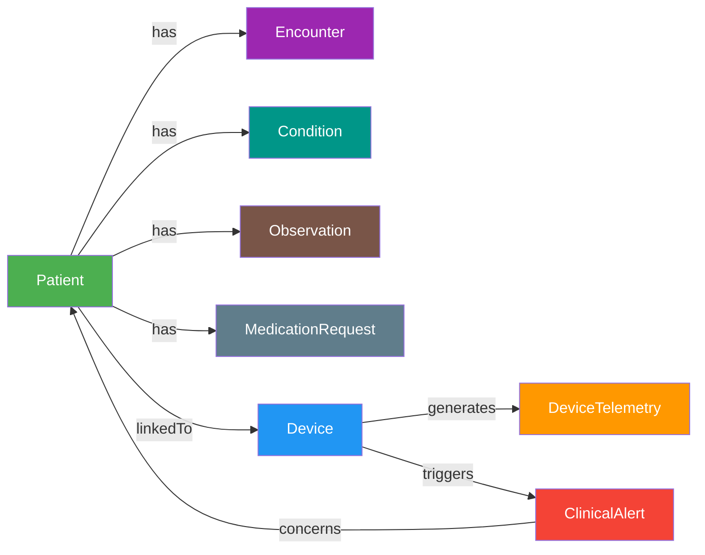

# Fabric IQ / Ontology Integration Plan

## Overview

Add a **Fabric IQ Ontology** to the Medical Device FHIR Integration Platform that creates a unified semantic layer across the **KQL Eventhouse** (real-time telemetry + alerts) and **Silver Lakehouse** (FHIR clinical data). This enables cross-domain reasoning, consistent business vocabulary, and AI-agent grounding for clinical workflows.

---

## Ontology Name

**`ClinicalDeviceOntology`** — created in the existing `med-device-rti-hds` workspace.

---

## Entity Types

The ontology models the core clinical and device concepts. Each entity type maps to an existing data source (Lakehouse table or Eventhouse table).

### 1. Patient (Static — Lakehouse)
| Property | Source Column | Type | Notes |
|----------|--------------|------|-------|
| `patientId` (KEY) | `idOrig` | string | FHIR Patient resource ID |
| `name` | `name_text` / `name_given` + `name_family` | string | Display name |
| `gender` | `gender` | string | |
| `birthDate` | `birthDate` | string | |
| `address` | `address_*` columns | string | City/state |
| **Source** | `dbo.Patient` in Silver Lakehouse | | |

### 2. Device (Static — Lakehouse)
| Property | Source Column | Type | Notes |
|----------|--------------|------|-------|
| `deviceId` (KEY) | identifier value | string | e.g. `MASIMO-RADIUS7-0001` |
| `type` | `type_string` | string | Device type/model |
| `status` | `status` | string | active/inactive |
| `patientReference` | `patient_reference` | string | Link to assigned patient |
| **Source** | `dbo.Device` in Silver Lakehouse | | |

### 3. Encounter (Static — Lakehouse)
| Property | Source Column | Type | Notes |
|----------|--------------|------|-------|
| `encounterId` (KEY) | `idOrig` | string | FHIR Encounter ID |
| `class` | `class_string` | string | ambulatory, emergency, etc. |
| `status` | `status` | string | |
| `periodStart` | `period_start` | datetime | |
| `periodEnd` | `period_end` | datetime | |
| `patientRef` | subject_string → msftSourceReference | string | FK to Patient |
| **Source** | `dbo.Encounter` in Silver Lakehouse | | |

### 4. Condition (Static — Lakehouse)
| Property | Source Column | Type | Notes |
|----------|--------------|------|-------|
| `conditionId` (KEY) | `idOrig` | string | FHIR Condition ID |
| `code` | code_string → coding[0].code | string | SNOMED-CT code |
| `displayName` | code_string → coding[0].display | string | Human-readable name |
| `clinicalStatus` | `clinicalStatus_string` | string | active, resolved, etc. |
| `patientRef` | subject_string → msftSourceReference | string | FK to Patient |
| **Source** | `dbo.Condition` in Silver Lakehouse | | |

### 5. MedicationRequest (Static — Lakehouse)
| Property | Source Column | Type | Notes |
|----------|--------------|------|-------|
| `medicationRequestId` (KEY) | `idOrig` | string | |
| `medication` | `medicationCodeableConcept_string` | string | Drug name |
| `status` | `status` | string | active, completed, stopped |
| `authoredOn` | `authoredOn` | datetime | |
| `patientRef` | subject_string → msftSourceReference | string | FK to Patient |
| **Source** | `dbo.MedicationRequest` in Silver Lakehouse | | |

### 6. Observation (Static — Lakehouse)
| Property | Source Column | Type | Notes |
|----------|--------------|------|-------|
| `observationId` (KEY) | `idOrig` | string | |
| `code` | code_string (LOINC) | string | |
| `value` | `valueQuantity_value` | double | |
| `unit` | `valueQuantity_unit` | string | |
| `effectiveDateTime` | `effectiveDateTime` | datetime | |
| `patientRef` | subject_string → msftSourceReference | string | FK to Patient |
| **Source** | `dbo.Observation` in Silver Lakehouse | | |

### 7. DeviceAssociation (Static — Lakehouse)
| Property | Source Column | Type | Notes |
|----------|--------------|------|-------|
| `associationId` (KEY) | `id` | string | |
| `deviceRef` | extension[0].valueReference.reference | string | `Device/MASIMO-RADIUS7-NNNN` |
| `patientName` | subject_string → display | string | |
| `patientId` | subject_string → idOrig | string | FK to Patient |
| **Source** | `DeviceAssociation` managed table in Silver Lakehouse | | Created via Spark SQL from `dbo.Basic` |

### 8. DeviceTelemetry (Time Series — Eventhouse)
| Property | Source Column | Type | Notes |
|----------|--------------|------|-------|
| `deviceId` (KEY, static) | `device_id` | string | Links to Device entity |
| `timestamp` (TS column) | `timestamp` | datetime | Time series timestamp |
| `spo2` | `telemetry.spo2` | double | Blood oxygen saturation |
| `pr` | `telemetry.pr` | int | Pulse rate (bpm) |
| `pi` | `telemetry.pi` | double | Perfusion index |
| `pvi` | `telemetry.pvi` | int | Pleth variability index |
| `sphb` | `telemetry.sphb` | double | Total hemoglobin |
| `signalIq` | `telemetry.signal_iq` | int | Signal quality (0–100) |
| **Source** | `TelemetryRaw` in MasimoKQLDB (Eventhouse) | | |

### 9. ClinicalAlert (Static — Eventhouse)
| Property | Source Column | Type | Notes |
|----------|--------------|------|-------|
| `alertId` (KEY) | `alert_id` | string | |
| `alertTime` | `alert_time` | datetime | |
| `deviceId` | `device_id` | string | FK to Device |
| `patientId` | `patient_id` | string | FK to Patient |
| `patientName` | `patient_name` | string | |
| `alertTier` | `alert_tier` | string | WARNING, URGENT, CRITICAL |
| `alertType` | `alert_type` | string | SPO2_LOW, PR_HIGH, etc. |
| `metricName` | `metric_name` | string | |
| `metricValue` | `metric_value` | real | |
| `thresholdValue` | `threshold_value` | real | |
| `message` | `message` | string | |
| `acknowledged` | `acknowledged` | bool | |
| **Source** | `AlertHistory` in MasimoKQLDB (Eventhouse) | | |

---

## Relationship Types

These capture the clinical graph connections. Each relationship needs a source data table that contains foreign keys linking the two entity types.

| Relationship | Source Entity | Target Entity | Join Logic |
|-------------|--------------|---------------|------------|
| **Patient has Encounter** | Patient | Encounter | `Patient.patientId = Encounter.patientRef` |
| **Patient has Condition** | Patient | Condition | `Patient.patientId = Condition.patientRef` |
| **Patient has Observation** | Patient | Observation | `Patient.patientId = Observation.patientRef` |
| **Patient has MedicationRequest** | Patient | MedicationRequest | `Patient.patientId = MedicationRequest.patientRef` |
| **Patient linkedTo Device** | Patient | Device | via `DeviceAssociation.patientId` ↔ `DeviceAssociation.deviceRef` |
| **Device generates DeviceTelemetry** | Device | DeviceTelemetry | `Device.deviceId = DeviceTelemetry.deviceId` |
| **Device triggers ClinicalAlert** | Device | ClinicalAlert | `Device.deviceId = ClinicalAlert.deviceId` |
| **ClinicalAlert concerns Patient** | ClinicalAlert | Patient | `ClinicalAlert.patientId = Patient.patientId` |

---

## Data Binding Summary

| Entity Type | Binding Type | Data Source | Source Item |
|------------|-------------|------------|-------------|
| Patient | Static | Lakehouse | `dbo.Patient` |
| Device | Static | Lakehouse | `dbo.Device` |
| Encounter | Static | Lakehouse | `dbo.Encounter` |
| Condition | Static | Lakehouse | `dbo.Condition` |
| MedicationRequest | Static | Lakehouse | `dbo.MedicationRequest` |
| Observation | Static | Lakehouse | `dbo.Observation` |
| DeviceAssociation | Static | Lakehouse | `DeviceAssociation` (managed table) |
| DeviceTelemetry | **Time Series** | Eventhouse | `TelemetryRaw` (MasimoKQLDB) |
| ClinicalAlert | Static | Eventhouse | `AlertHistory` (MasimoKQLDB) |

---

## Implementation Steps

### Phase 0 — Prerequisites
1. Ensure the Fabric tenant has the **Ontology item (preview)** enabled in admin portal settings
2. Ensure the Fabric tenant has **Graph (preview)** enabled (created automatically with ontology)
3. Verify the Silver Lakehouse tables are **managed** tables (not external) — required for ontology binding
4. Verify the Silver Lakehouse does **not** have OneLake security enabled (ontology limitation)

### Phase 1 — Create Ontology Item (Automated via REST API)

Run the deployment script:

```powershell
.\phase-4\deploy-ontology.ps1
```

This creates the ontology with all 9 entity types, data bindings, and 8 relationship types in a single API call. Alternatively, follow the manual portal steps in [ONTOLOGY-SETUP-GUIDE.md](ONTOLOGY-SETUP-GUIDE.md).

### Phase 2 — Define Entity Types + Static Bindings (Lakehouse)
Create each entity type and bind to Lakehouse tables:

1. **Patient** — Add entity type → Bindings tab → Add data → select Silver Lakehouse → `Patient` table → Static binding → map columns → set `idOrig` as entity type key → set `name_text` as instance display name
2. **Device** — Same flow → `Device` table → set identifier value as key
3. **Encounter** — Same flow → `Encounter` table → set `idOrig` as key
4. **Condition** — Same flow → `Condition` table → set `idOrig` as key
5. **MedicationRequest** — Same flow → `MedicationRequest` table → set `idOrig` as key
6. **Observation** — Same flow → `Observation` table → set `idOrig` as key
7. **DeviceAssociation** — Same flow → `Basic` table → set `id` as key
   - Note: This entity sources from `dbo.Basic` which contains mixed resource types. You may need a view or filtered table that only contains `device-assoc` records.

### Phase 3 — Define Entity Types + Time Series Binding (Eventhouse)

1. **DeviceTelemetry** — Add entity type → Properties tab → add `deviceId` (string, static) → Bindings tab → Add data → select `MasimoEventhouse` → `TelemetryRaw` table → **Time Series** binding → set `timestamp` as timestamp column → map `spo2`, `pr`, `pi`, `pvi`, `sphb`, `signal_iq` as time series properties → bind `device_id` as static key
2. **ClinicalAlert** — Add entity type → Bindings tab → select `MasimoEventhouse` → `AlertHistory` table → **Static** binding → map columns → set `alert_id` as key

### Phase 4 — Define Relationship Types
Create relationships using the table in the **Relationship Types** section above. For each:
1. Select **Add relationship** from ribbon
2. Set source/target entity types
3. Select the source data table that contains the foreign key columns
4. Map source/target key columns

### Phase 5 — Validate in Preview Experience
1. Switch to the **Preview** tab in the ontology item
2. Verify entity instances are populated (Patient count ≈ 7,800, Device count ≈ 100, etc.)
3. Explore the auto-generated **Graph** view — verify relationships are traversable
4. Test cross-domain queries:
   - Navigate from a Patient → their Conditions → their Device → recent Telemetry
   - Navigate from a ClinicalAlert → the Device → the Patient → their Encounter history

### Phase 6 — Connect Data Agents to Ontology
1. Open the existing **Patient 360** Data Agent
2. Add the `ClinicalDeviceOntology` as a datasource (Fabric IQ supports ontology as an agent datasource)
3. The agent now has access to the unified business vocabulary — entity types and relationships ground the agent's responses in consistent terminology
4. Repeat for the **Clinical Triage** Data Agent
5. Test agent queries like:
   - *"Show me Patient John Smith's conditions, linked devices, and recent SpO2 readings"*
   - *"Which critical alerts are associated with patients who have COPD?"*

### Phase 7 — Documentation & Automation Prep
1. Add a setup guide under `docs/ONTOLOGY-SETUP-GUIDE.md` with screenshots of each portal step
2. Update the `README.md` with an "IQ / Ontology" section describing the semantic layer
3. Update `TODO-ITEMS.MD` to mark ontology work as in-progress/completed
4. Monitor for Fabric REST API support for ontology item definitions — once available, add to `deploy-fabric-rti.ps1` as a Phase 3

---

## File Changes Required

| File | Change |
|------|--------|
| `phase-4/deploy-ontology.ps1` | **New file** — Automated ontology deployment via REST API |
| `README.md` | Add Fabric IQ / Ontology section to architecture overview |
| `TODO-ITEMS.MD` | Add ontology TODO items under a new priority section |
| `docs/ONTOLOGY-SETUP-GUIDE.md` | **New file** — Step-by-step portal setup guide |
| `deploy-fabric-rti.ps1` | Future: Add Phase 3 for ontology deployment via REST API (when available) |
| `phase-2/deploy-data-agents.ps1` | Future: Add ontology as agent datasource |

---

## Data Model Diagram (Ontology Graph)



---

## Key Considerations

1. **`dbo.Basic` filtering** — The `Basic` table contains multiple resource types. For the `DeviceAssociation` entity, a separate **managed Delta table** (`DeviceAssociation`) is created via Spark SQL in a notebook attached to the Silver Lakehouse. The Lakehouse SQL analytics endpoint is read-only, so views/tables cannot be created there. Re-run the notebook if the `Basic` table is refreshed with new device associations.

2. **Time series binding requires a static key match** — When binding `TelemetryRaw` as time series data to `DeviceTelemetry`, the `device_id` column in the eventhouse must exactly match a static property already defined on the entity type. Ensure `device_id` values are consistent between Eventhouse and Lakehouse.

3. **Column mapping limitation** — Lakehouse tables with special characters in column names (commas, semicolons, spaces) automatically get column mapping enabled, which is **not supported** by ontology bindings. Verify Silver Lakehouse column names are clean.

4. **Managed tables only** — Ontology only supports managed Lakehouse tables. The Silver Lakehouse tables from HDS should be managed by default, but confirm before binding.

5. **OneLake security** — If OneLake security is enabled on the Silver Lakehouse, ontology bindings will fail. Verify this setting.

6. **Refresh cadence** — Ontology graph data does not auto-refresh. After new data arrives (e.g., new patients, new telemetry), use the **Refresh graph model** action in the preview experience.

7. **No programmatic API yet** — ~~As of the current preview, ontology creation is portal-only.~~ **UPDATE:** The Fabric REST API now supports ontology creation with full definitions. See `deploy-ontology.ps1`.
