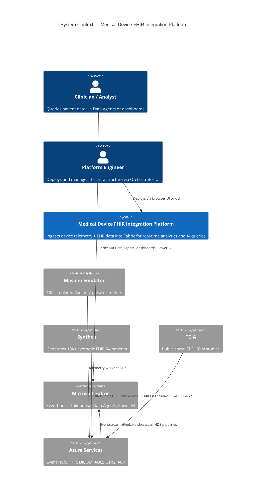
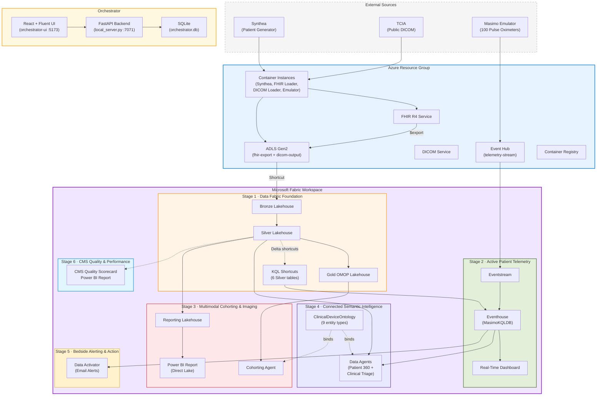
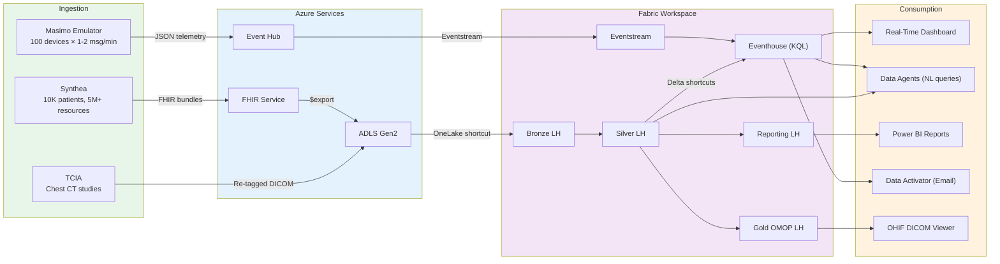
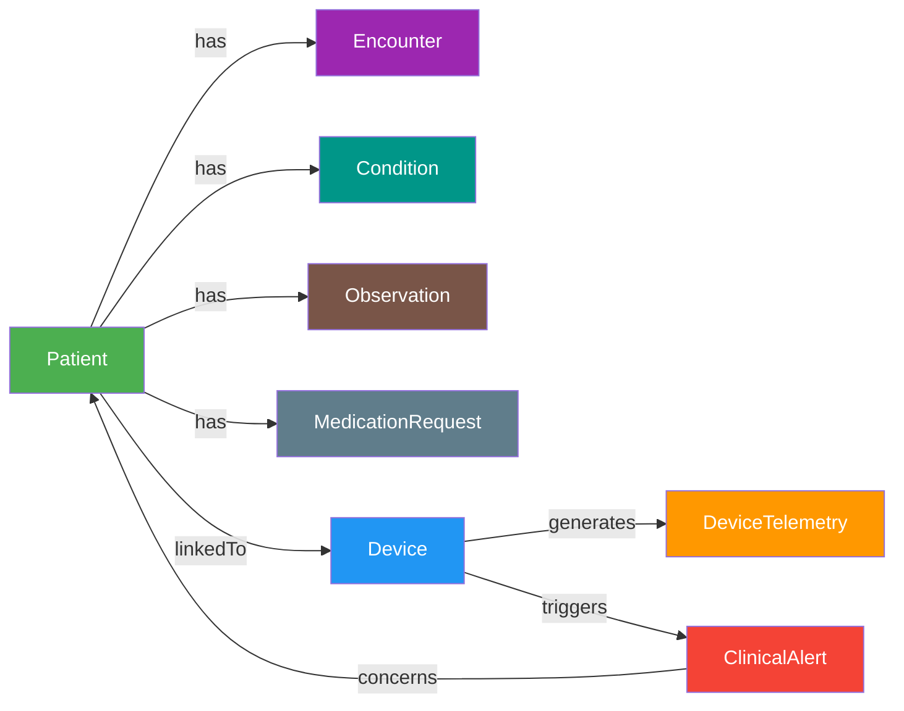
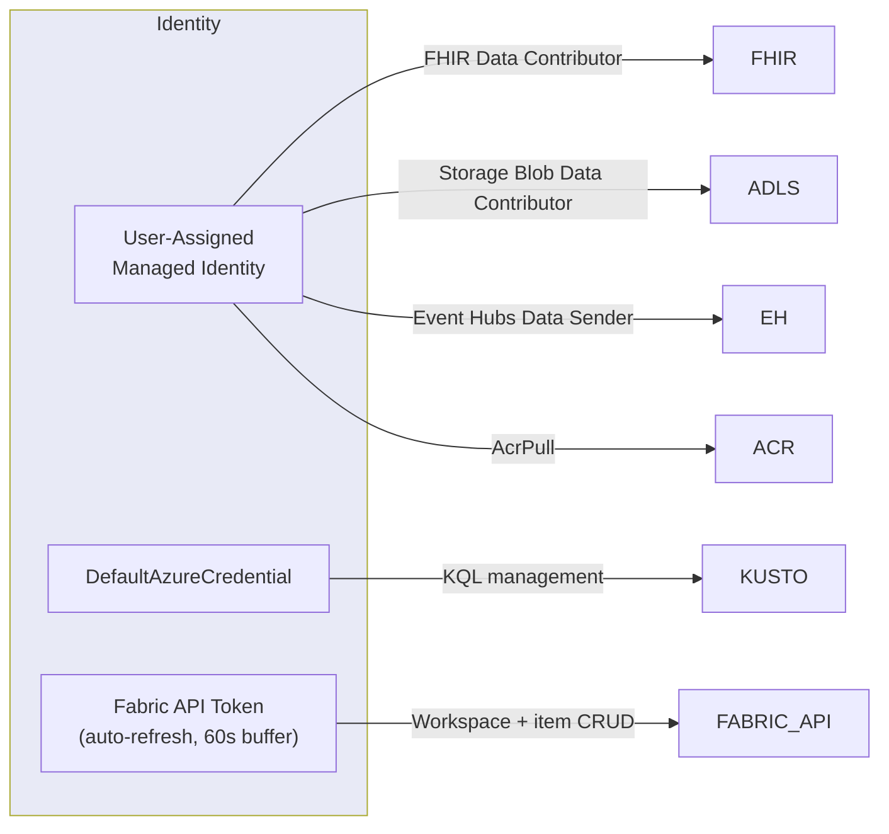
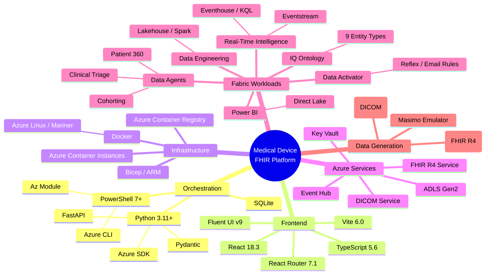

# Project Architecture Blueprint — Medical Device FHIR Integration Platform

> **Generated using the architecture-blueprint-generator skill**
> A comprehensive architectural walkthrough of the `med-device-fabric-emulator` repository — a production-grade reference architecture that unifies healthcare EHR data and real-time medical device telemetry on Microsoft Fabric.

---

## 1. Architectural Overview

### What This Solution Does

This platform deploys an end-to-end clinical alert system that ingests real-time pulse oximeter telemetry from Masimo medical devices, enriches it with 10,000+ synthetic FHIR R4 patient records and real TCIA DICOM imaging studies, and surfaces the combined data through AI-powered Data Agents, real-time dashboards, ontology-driven semantic queries, and automated clinical email alerts — all within a single Microsoft Fabric workspace.

### Guiding Principles

| Principle | How It's Enforced |
|-----------|-------------------|
| **Single Copy of Data** | OneLake serves as the unified data lake; KQL shortcuts bridge Lakehouse → Eventhouse without duplication |
| **Zero Secrets in Code** | User-Assigned Managed Identities for all service-to-service auth; no connection strings stored |
| **Phased Deployment** | 6 stages of Clinical Value Chain & Outcomes Model allow highly resilient and structured execution |
| **Idempotent Operations** | State tracked in SQLite + JSON snapshots; steps detect existing resources and skip gracefully |
| **Browser-First UX** | Orchestrator UI (React + Fluent UI) provides visual deployment, monitoring, and teardown — CLI also supported |

### Architecture Pattern

**Multi-phase event-driven deployment orchestrator** with a microservices-inspired activity model. The system uses an orchestration layer (FastAPI backend + React frontend) to invoke modular PowerShell deployment scripts via subprocess, with structured phase markers (`@@PHASE|N|Label|Count@@`) enabling real-time UI synchronization.

---

## 2. Architecture Visualization

### High-Level System Context (C4 — Level 1)



### Container Diagram (C4 — Level 2)



### Data Flow Diagram



---

## 3. Core Architectural Components

### 3.1 Orchestrator Backend (`orchestrator/`)

| Aspect | Details |
|--------|---------|
| **Framework** | FastAPI 0.115.0 + uvicorn (port 7071) |
| **Language** | Python 3.11+ |
| **State** | SQLite (deployments, locks, form history) |
| **Auth** | Azure DefaultAzureCredential, Fabric token management |

**Key Endpoints:**

| Endpoint | Method | Purpose |
|----------|--------|---------|
| `/api/deploy/start` | POST | Initiate deployment (returns instanceId) |
| `/api/deploy/{id}/status` | GET | Poll phase progression |
| `/api/deploy/{id}/logs` | WS | Real-time log streaming |
| `/api/teardown/scan` | POST | Discover deployed resources |
| `/api/teardown/start` | POST | Start teardown orchestration |
| `/api/preflight` | POST | Validate prerequisites |

**Activity Layer** (`orchestrator/activities/`):

Each activity wraps a deployment step with retry logic (3 attempts, 60s backoff):

| Activity | Script Invoked | Phase |
|----------|----------------|-------|
| `provision_workspace` | Fabric REST API (inline) | 1 |
| `deploy_azure_infra` | `phase-1/deploy.ps1` | 1 |
| `deploy_fhir` | `phase-1/deploy-fhir.ps1` | 1 |
| `deploy_dicom` | `phase-1/deploy-fhir.ps1 -RunDicom` | 1 |
| `deploy_fabric_rti` | `deploy-fabric-rti.ps1` | 1 |
| `deploy_rti_phase2` | `deploy-fabric-rti.ps1 -Phase2` | 2 |
| `deploy_hds_pipelines` | `phase-2/storage-access-trusted-workspace.ps1` | 2 |
| `deploy_data_agents` | `phase-2/deploy-data-agents.ps1` | 2 |
| `deploy_ontology` | `phase-4/deploy-ontology.ps1` | 4 |
| `teardown` | `Teardown-All.ps1` | — |

**Shared Layer** (`orchestrator/shared/`):
- `fabric_client.py` — Fabric REST API wrapper with 429 backoff + 202 LRO polling
- `kusto_client.py` — KQL table/function management via Azure SDK
- `database.py` — SQLite persistence (deployments, locks, dismissed teardowns)
- `models.py` — Pydantic schemas for deployment config, phase results, state

### 3.2 Orchestrator Frontend (`orchestrator-ui/`)

| Aspect | Details |
|--------|---------|
| **Framework** | React 18.3 + TypeScript 5.6 |
| **Design System** | Fluent UI React Components v9.54 |
| **Router** | React Router 7.1 |
| **Build** | Vite 6.0 (dev: 5173, prod: static bundle) |

**Pages:**

| Page | Purpose |
|------|---------|
| `DeployWizard.tsx` | Multi-step deployment form with validation |
| `PhaseMonitor.tsx` | Real-time progress with phase cards + step timeline |
| `TeardownView.tsx` | Resource scanner + deletion wizard |
| `TeardownMonitor.tsx` | Teardown progress tracker |
| `DeploymentHistory.tsx` | Past deployments from SQLite |

**State Management:** React Context (`AppState.tsx`) + localStorage (`formHistory.ts`) for form persistence.

### 3.3 Device Emulator (`emulator.py`)

A Python application (containerized via Docker + ACR) that simulates 100 Masimo Radius-7 pulse oximeters:

- **Device IDs**: `MASIMO-RADIUS7-0001` through `MASIMO-RADIUS7-0100` (deterministic)
- **Vital Signs**: SpO2 (%), PR (bpm), PI (%), PVI (%), SpHb (g/dL), signal quality
- **Frequency**: 1–2 readings per minute per device
- **Transport**: Azure Event Hub via Managed Identity (no secrets)
- **Container**: Multi-stage Dockerfile (Azure Linux / Mariner base)

### 3.4 FHIR Pipeline (`phase-1/deploy-fhir.ps1` + `fhir-loader/` + `synthea/`)

1. **Synthea** generates 10K+ synthetic FHIR R4 patients (demographics, conditions, medications, encounters, observations, immunizations, procedures)
2. **FHIR Loader** (Container Instance) uploads bundles to Azure FHIR Service via HTTP POST
3. **Device Associations** (`create-device-associations.py`) — links Masimo devices to patients via FHIR `Basic` resources with `device-assoc` coding
4. **FHIR $export** — bulk data export to ADLS Gen2 blobs for Fabric ingestion

### 3.5 DICOM Pipeline (`dicom-loader/`)

1. Downloads real chest CT studies from TCIA (The Cancer Imaging Archive)
2. Re-tags DICOM instances with Synthea patient identifiers (preserving image data)
3. Uploads to ADLS Gen2 (`dicom-output` container)
4. Fabric HDS imaging pipeline ingests via OneLake shortcut

### 3.6 Fabric Real-Time Intelligence (`fabric-rti/`)

**Stage 1 & 2 (Foundation & Telemetry):**
- Eventstream → Eventhouse ingestion (sub-second latency)
- KQL tables: `TelemetryRaw`, `AlertHistory`
- KQL functions: `fn_SpO2Alerts`, `fn_PulseRateAnomalies`, `fn_ClinicalAlerts`
- Real-time dashboard with SpO2 trend lines, alert heat maps

**Stage 3 & 4 (Cohorting, Imaging & Semantic Layer):**
- 6 KQL shortcuts from Silver Lakehouse (Patient, Condition, Encounter, MedicationRequest, Observation, DeviceAssociation)
- Enriched alert functions that correlate telemetry with clinical context
- Clinical alerts map (device → patient → conditions → medications)

### 3.7 Data Agents (`phase-2/deploy-data-agents.ps1`)

| Agent | Purpose | Data Sources |
|-------|---------|-------------|
| **Patient 360** | "Show all patients with SpO2 < 90 and their active conditions" | Eventhouse (KQL) + Silver Lakehouse (SQL) |
| **Clinical Triage** | "Which CHF patients currently have abnormal vitals?" | Eventhouse (KQL) + Silver Lakehouse (SQL) |
| **Cohorting Agent** (Phase 3) | "Find patients with pneumonia and low SpO2 who have chest CTs" | Gold OMOP Lakehouse + Imaging metadata |

### 3.8 Fabric IQ Ontology (`phase-4/deploy-ontology.ps1`)

A 9-entity semantic layer deployed programmatically:



5 relationships connect entities across Eventhouse and Lakehouse, enabling Data Agents to resolve natural language queries against the full clinical + telemetry graph.

### 3.9 Data Activator (`Deploy-All.ps1 -Phase4`)

- **Reflex item** sourced from KQL function `fn_ClinicalAlerts`
- **Device object** with 6 attributes: PatientId, DeviceId, SpO2, PR, AlertTier, Timestamp
- **Email rule**: Triggers on CRITICAL/URGENT tiers → sends alert to configured address
- **Cooldown**: 15-minute suppression per device to prevent alert fatigue
- Deployed entirely via Fabric REST API (no portal clicks)

---

## 4. Infrastructure as Code (`bicep/`)

| Template | Provisions |
|----------|-----------|
| `infra.bicep` | Primary resource orchestration (Event Hub, ACR, Storage, Key Vault) |
| `emulator.bicep` | Container Instance for Masimo device simulator |
| `fhir-infra.bicep` | Azure Health Data Services FHIR workspace + storage |
| `fhir-loader-job.bicep` | Container Instance for FHIR bundle loader |
| `dicom-infra.bicep` | DICOM Service integration |
| `dicom-loader-job.bicep` | Container Instance for TCIA DICOM pipeline |
| `synthea-job.bicep` | Container Instance for Synthea patient generator |
| `orchestrator-infra.bicep` | Azure Durable Functions app + storage (production) |

All templates use User-Assigned Managed Identities with least-privilege RBAC assignments:
- `FHIR Data Contributor` — read/write FHIR Service
- `Storage Blob Data Contributor` — access Synthea output + $export blobs
- `Azure Event Hubs Data Sender` — emulator → Event Hub
- `AcrPull` — pull container images from ACR

---

## 5. Deployment Sequence

### Phase Timeline

```mermaid
gantt
    title Deployment Phases (~2 Hours Total)
    dateFormat HH:mm
    axisFormat %H:%M

    section Stage 1: Data Fabric Foundation
    Workspace + Identity          :p1a, 00:00, 5min
    Base Azure (EH, ACR, Storage) :p1b, after p1a, 10min
    FHIR + Synthea (10K patients) :p1c, after p1b, 15min
    DICOM (TCIA + re-tag)         :p1d, after p1b, 30min
    HDS Setup                     :crit, manual, after p1e, 45min

    section Stage 2: Active Patient Telemetry
    Fabric RTI Telemetry          :p1e, after p1c, 15min
    RTI Shortcuts                 :p2a, after manual, 15min

    section Stage 3: Multimodal Cohorting & Imaging
    HDS Pipelines                 :p2b, after p2a, 25min
    Cohorting + DICOM Viewer + PBI :p3, after p2c, 20min

    section Stage 4: Connected Semantic Intelligence
    Ontology + Agent Binding      :p4a, after p3, 10min
    Data Agents                   :p2c, after p2b, 10min

    section Stage 5: Bedside Alerting & Action
    Data Activator (Reflex)       :p4b, after p4a, 5min

    section Stage 6: CMS Quality & Performance
    CMS Star Schema + measures    :p5, after p4b, 15min
```



### Step-by-Step Deployment Table

| Step | Script | Phase | What It Deploys | Duration |
|------|--------|-------|----------------|----------|
| 1a | Fabric REST API (inline) | 1 | Workspace, capacity assignment, managed identity | ~3 min |
| 1b | `phase-1/deploy.ps1` | 1 | Event Hub, ACR, Key Vault, Storage, emulator ACI | ~10 min |
| 2 | `phase-1/deploy-fhir.ps1` | 1 | FHIR Service, Synthea (10K patients), FHIR Loader, Device Associations | ~15 min |
| 2b | `phase-1/deploy-fhir.ps1 -RunDicom` | 1 | TCIA download, DICOM re-tag, ADLS upload | ~30 min |
| 3 | `deploy-fabric-rti.ps1` | 1 | Eventhouse, Eventstream, KQL tables/functions, dashboard | ~15 min |
| 4 | **Manual** (Fabric portal) | — | Healthcare Data Solutions + DICOM modality | ~45 min |
| 5 | `deploy-fabric-rti.ps1 -Phase2` | 2 | KQL shortcuts (6 Silver tables), enriched alert functions | ~15 min |
| 5b | `phase-2/storage-access-trusted-workspace.ps1` | 2 | DICOM shortcut + HDS pipeline triggers (clinical, imaging, OMOP) | ~25 min |
| 6 | `phase-2/deploy-data-agents.ps1` | 2 | Patient 360 + Clinical Triage agents | ~10 min |
| 7 | `FabricDicomCohortingToolkit` | 3 | Cohorting Agent, OHIF Viewer, materialization notebook, PBI report | ~20 min |
| 8 | `phase-4/deploy-ontology.ps1` | 4 | ClinicalDeviceOntology (9 entities, 5 relationships) | ~10 min |
| 9 | `Deploy-All.ps1 -Phase4` | 4 | Agent ontology binding + Data Activator (Reflex + email rule) | ~5 min |

---

## 6. Cross-Cutting Concerns

### Authentication & Authorization



- **No secrets in code** — all service-to-service communication uses Managed Identity
- **Fabric Client** auto-refreshes tokens with 60-second buffer before expiry
- **CORS** configured for frontend → backend (dev: `localhost:5173` → `localhost:7071`)

### Error Handling & Resilience

| Layer | Strategy |
|-------|----------|
| **Activity Retry** | 3 attempts with 60-second exponential backoff |
| **Fabric API (429)** | Automatic backoff on rate limiting |
| **Fabric LRO (202)** | Polling loop until operation completes |
| **PowerShell Steps** | Regex parser captures `✓`/`✗` markers + duration per step |
| **HDS Pipelines** | Failures logged as warnings (non-blocking) |
| **Subprocess Crash** | Python captures stderr, triggers rollback guidance |

### State Management

| Store | Scope | Purpose |
|-------|-------|---------|
| **SQLite** (`orchestrator.db`) | Persistent | Deployments, locks, form history, dismissed teardowns |
| **JSON Snapshots** (`state-tracking/`) | Per-deployment | Recovery checkpoints, resource inventories |
| **React Context** (`AppState.tsx`) | Session | Active deployment state, phase progression |
| **localStorage** (`formHistory.ts`) | Browser | Previous form inputs for convenience |

### Logging & Observability

- **Backend**: Structured logging to `orchestrator.log` + console
- **Frontend**: Error boundaries + API error toast notifications
- **Real-Time**: WebSocket stream of PowerShell stdout/stderr
- **Audit**: All deployments recorded in SQLite with timestamps + full logs
- **Phase Markers**: `@@PHASE|N|Label|Count@@` enables parser synchronization between PowerShell and Python

---

## 7. Technology Stack Summary



---

## 8. KQL Analytics Layer

### Functions Deployed

| Script | Function | Purpose |
|--------|----------|---------|
| `01-alert-history-table.kql` | — | Creates `AlertHistory` table with update policy |
| `02-telemetry-functions.kql` | `fn_SpO2Alerts`, `fn_PulseRateAnomalies` | Detect SpO2 < 90%, abnormal pulse rates |
| `03-clinical-alert-functions.kql` | `fn_ClinicalAlerts` | Context-aware alerts (vital + condition correlation) |
| `04-hds-enrichment-example.kql` | — | Example queries using Silver Lakehouse shortcuts |
| `05-dashboard-queries.kql` | — | Real-time dashboard base queries |
| `06-agent-wrapper-functions.kql` | — | Helper functions for Data Agent query federation |

### Shortcut Architecture (Phase 2)

```
Eventhouse (MasimoKQLDB)
├── TelemetryRaw          ← Eventstream (real-time)
├── AlertHistory           ← Update policy (derived)
├── Patient                ← KQL shortcut → Silver LH
├── Condition              ← KQL shortcut → Silver LH
├── Encounter              ← KQL shortcut → Silver LH
├── MedicationRequest      ← KQL shortcut → Silver LH
├── Observation            ← KQL shortcut → Silver LH
└── DeviceAssociation      ← KQL shortcut → Silver LH
```

---

## 9. Testing & Validation

| Approach | Implementation |
|----------|---------------|
| **Preflight Checks** | `Preflight-Check.ps1` — validates PS 7+, Az module, Azure CLI, Bicep, login state, Python, Git, Fabric capacity (paid F-SKU), admin security group |
| **Mock Data** | `mockDeployment.ts` — simulated phase progression for frontend development without backend |
| **Phase Isolation** | `-Phase2`, `-Phase3`, `-Phase4` flags allow individual phase testing |
| **FHIR Validation** | Post-$export blob verification (blobs may not exist despite HTTP 200) |
| **DICOM Validation** | Re-tag verification (patient IDs match Synthea identifiers) |
| **KQL Smoke Tests** | Manual queries against Eventhouse after deployment |
| **Agent Verification** | Ontology entity reference validation post-binding |
| **Diagnostics** | `Write-Phase3Diagnostics` — queries lakehouse tables for row counts at checkpoints |

---

## 10. Extension Points

### Adding a New Data Source

1. Create a new Bicep template in `bicep/` for the Azure resource
2. Add a new activity in `orchestrator/activities/` (Python wrapper)
3. Create a PowerShell deployment script in the appropriate phase folder
4. Register the step in `Deploy-All.ps1` with `Invoke-Step`
5. Add phase marker (`@@PHASE@@`) for orchestrator UI synchronization

### Adding a New Fabric Workload

1. Add KQL scripts in `fabric-rti/kql/` for Eventhouse artifacts
2. Add SQL templates in `fabric-rti/sql/` for Lakehouse/Warehouse artifacts
3. Extend the appropriate phase in `deploy-fabric-rti.ps1`
4. Add ontology entity in `phase-4/deploy-ontology.ps1` if semantics needed
5. Bind to Data Agents via ontology relationship definitions

### Adding a New Data Agent

1. Define agent instructions (natural language prompt) and lakehouse/eventhouse bindings
2. Add deployment logic in `phase-2/deploy-data-agents.ps1`
3. Add ontology binding in `Deploy-All.ps1` Phase 4 section
4. Register in the orchestrator activity layer for UI integration

---

## 11. Deployment Topology

### Local Development

```
┌─────────────────────────────────────────────────┐
│ Developer Machine                                │
│                                                   │
│  Terminal 1:  orchestrator/.venv → python          │
│               local_server.py (port 7071)         │
│                                                   │
│  Terminal 2:  orchestrator-ui/ → npm run dev       │
│               Vite (port 5173)                    │
│                                                   │
│  Browser:     http://localhost:5173               │
│               Deploy Wizard → Phase Monitor       │
│                                                   │
│  PowerShell:  Invoked via subprocess by backend   │
│               Deploy-All.ps1 with phase flags     │
└─────────────────────────────────────────────────┘
         │
         ▼
┌─────────────────────────────────────────────────┐
│ Azure Subscription                               │
│  └─ Resource Group (rg-medtech-rti-fhir)        │
│      ├─ Event Hub Namespace                      │
│      ├─ FHIR Service                             │
│      ├─ DICOM Service                            │
│      ├─ ADLS Gen2 Storage                        │
│      ├─ Container Registry                       │
│      └─ Container Instances (batch jobs)         │
└─────────────────────────────────────────────────┘
         │
         ▼
┌─────────────────────────────────────────────────┐
│ Microsoft Fabric                                 │
│  └─ Workspace (med-device-rti-hds)              │
│      ├─ Eventhouse + KQL Database                │
│      ├─ Eventstream                              │
│      ├─ Bronze / Silver / Gold Lakehouses        │
│      ├─ Data Agents (3)                          │
│      ├─ ClinicalDeviceOntology                   │
│      ├─ Data Activator Reflex                    │
│      ├─ Power BI Reports                         │
│      └─ Real-Time Dashboard                      │
└─────────────────────────────────────────────────┘
```

### Production (Azure Durable Functions)

The orchestrator backend can deploy as an Azure Durable Functions app (`orchestrator-infra.bicep`) with:
- Automatic checkpointing and replay
- Activity retry policies (3x, 60s backoff)
- Human intervention gates (for manual HDS step)
- Persistent state in Azure Storage (replaces local SQLite)

---

## 12. Project Structure Reference

```
med-device-fabric-emulator/
├── Deploy-All.ps1                  # Master orchestrator (all phases)
├── Teardown-All.ps1                # Cleanup orchestrator
├── deploy-fabric-rti.ps1           # Phase 1 + 2: Fabric RTI
├── Preflight-Check.ps1             # Pre-deployment validation
├── setup-prereqs.ps1               # Environment setup (Windows)
├── setup-prereqs.sh                # Environment setup (macOS/Linux)
├── emulator.py                     # Masimo device simulator
├── create-device-associations.py   # FHIR device → patient linking
├── Dockerfile                      # Emulator container (multi-stage)
│
├── orchestrator/                   # Deployment backend
│   ├── local_server.py             # FastAPI dev server (:7071)
│   ├── function_app.py             # Durable Functions (prod)
│   ├── requirements.txt            # Python dependencies
│   ├── activities/                 # Deployment step implementations
│   └── shared/                     # Fabric/Kusto/Azure clients, DB, models
│
├── orchestrator-ui/                # Deployment frontend
│   ├── package.json                # React + Fluent UI + Vite
│   └── src/
│       ├── pages/                  # Wizard, Monitor, History, Teardown
│       └── components/             # PhaseCard, LogStream, Resources
│
├── phase-1/                        # Azure infrastructure scripts
│   ├── deploy.ps1                  # Event Hub, ACR, Storage, emulator
│   └── deploy-fhir.ps1            # FHIR + DICOM pipeline
│
├── phase-2/                        # HDS enrichment scripts
│   ├── deploy-data-agents.ps1      # Patient 360 + Clinical Triage
│   └── storage-access-trusted-workspace.ps1  # HDS pipeline triggers
│
├── phase-4/                        # Semantic layer
│   └── deploy-ontology.ps1         # Fabric IQ Ontology (9 entities)
│
├── bicep/                          # ARM/Bicep IaC templates (8 files)
├── fabric-rti/                     # KQL scripts, SQL templates, dashboard
│   ├── kql/                        # 6 KQL script files
│   ├── sql/                        # SQL analytics templates
│   └── dashboard/                  # Real-time dashboard config
├── dicom-loader/                   # TCIA download + DICOM re-tagging
├── fhir-loader/                    # FHIR bundle loader
├── synthea/                        # Patient generator config
├── state-tracking/                 # Deployment JSON snapshots
├── cleanup/                        # Granular teardown scripts
├── utilities/                      # Helper scripts (KQL, agents)
├── .ai/                            # Planning (PRD, spec, ontology design)
└── docs/                           # Phase guides + architecture images
```

---

## 13. Architecture Governance

| Mechanism | How It Works |
|-----------|-------------|
| **Phase Isolation** | Each phase is independently deployable and testable via CLI flags |
| **Preflight Validation** | `Preflight-Check.ps1` enforces prerequisites before any deployment |
| **State File Auditing** | JSON snapshots in `state-tracking/` provide full deployment history |
| **Resource Locks** | SQLite locks prevent concurrent operations on the same RG/Workspace |
| **Managed Identity Only** | No connection strings or secrets in code; all auth via Azure RBAC |
| **Structured Logging** | Phase markers (`@@PHASE@@`) ensure parseable output across all scripts |
| **Modular Activities** | Each deployment step is a self-contained Python activity with retries |
| **Planning Documents** | `.ai/` directory contains PRD, OpenSpec, ontology design, and backlog |
