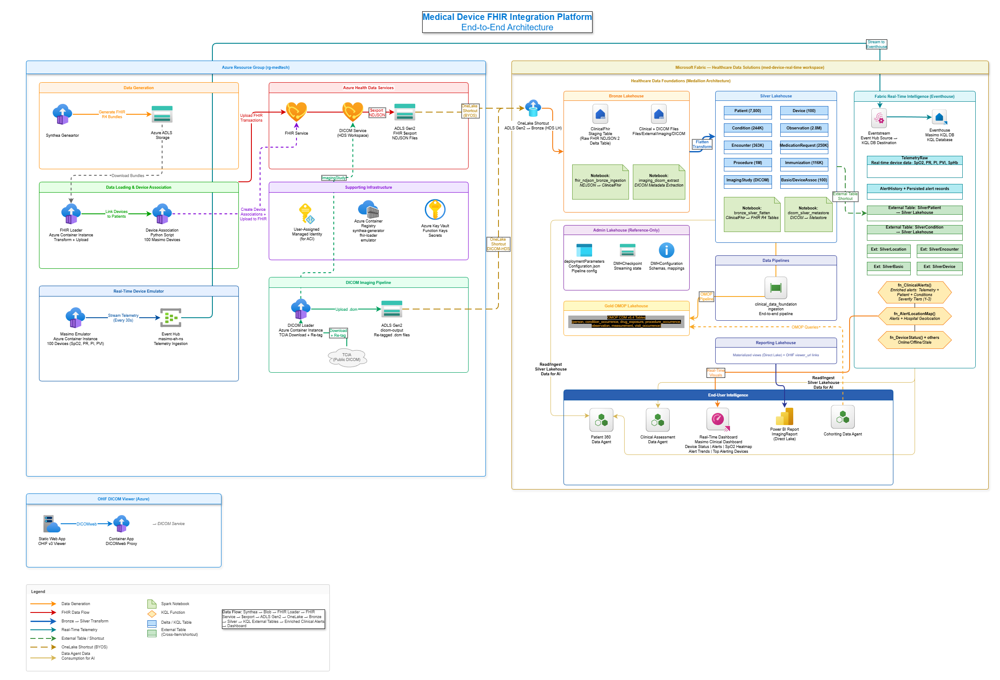
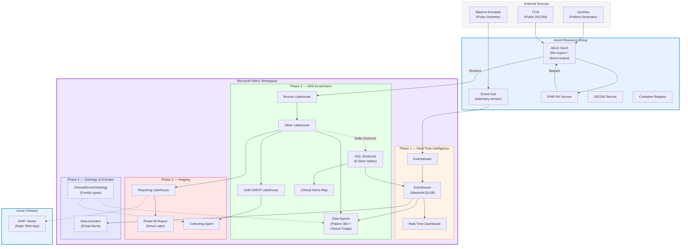
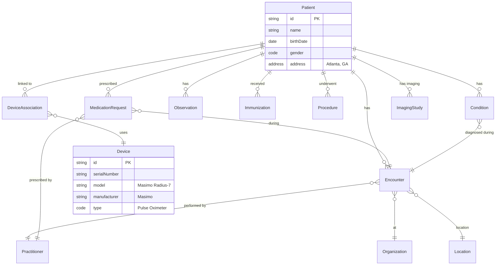
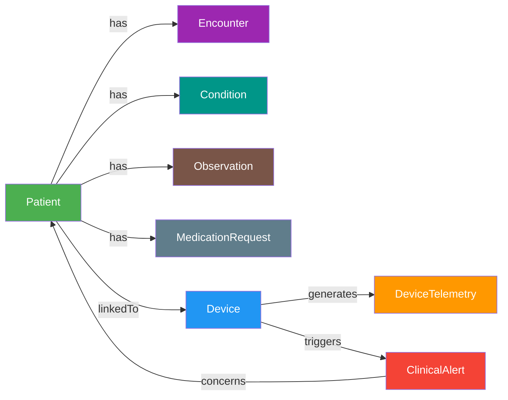

# Medical Device FHIR Integration Platform

A complete, deployable reference architecture that unifies healthcare EHR data and real-time medical device telemetry on Microsoft Fabric — from ingestion to AI-powered clinical queries in a single workspace.


<details>
<summary><strong>🔍 View detailed end-to-end architecture diagram</strong></summary>



</details>

**▶ [Watch the video explainer](https://aka.ms/fabrichlsrti)**

**What this solution demonstrates:**
- **Real-Time Intelligence** — Masimo pulse oximeter telemetry streams through Eventstream into Eventhouse with KQL-based clinical alert detection (SpO2 drops, abnormal pulse rates) in seconds
- **Healthcare Data Solutions** — 10K synthetic FHIR R4 patients (5M+ clinical resources) flow into a Silver Lakehouse via Fabric's native HDS connector with zero custom ETL
- **DICOM Medical Imaging** — Real TCIA chest CT studies are downloaded, re-tagged with Synthea patient identifiers, stored in ADLS Gen2, and ingested into Fabric HDS via a OneLake shortcut and the imaging pipeline
- **Data Agents** — Two natural-language AI agents (Patient 360 + Clinical Triage) let users ask questions like *"Show me all patients with SpO2 below 90 and their active conditions"* — federating across KQL telemetry and Lakehouse clinical data in one response
- **Cohorting Toolkit** — Power BI imaging report (Direct Lake) + OHIF DICOM Viewer + Cohorting Data Agent deployed via the companion [FabricDicomCohortingToolkit](../FabricDicomCohortingToolkit/) repo
- **Fabric IQ Ontology** — A 9-entity semantic layer (Patient, Device, Encounter, Condition, MedicationRequest, Observation, DeviceAssociation, ClinicalAlert, DeviceTelemetry) with relationships across Lakehouse and Eventhouse, bound to all Data Agents
- **Data Activator** — A Reflex item with KQL source (`fn_ClinicalAlerts`), Device object, 6 attributes, and an email rule that alerts on CRITICAL/URGENT SpO2 events — deployed fully programmatically via the Fabric REST API
- **OneLake** — One copy of the data, queryable from KQL, Spark, SQL, and Power BI without duplication

The entire solution deploys in under 2 hours with a single command (`Deploy-All.ps1`) and touches seven Fabric workloads: Real-Time Intelligence, Data Engineering, Data Warehouse, Data Science, Data Agents, Data Activator, and Power BI.

---

## 📑 Table of Contents

| Phase | Description | Guide |
|-------|-------------|-------|
| **Phase 1** | Azure infrastructure, FHIR + DICOM data generation, Fabric RTI pipeline, manual HDS deployment | [Phase 1 — Infrastructure & Ingestion](docs/phase-1-infrastructure-and-ingestion.md) |
| **Phase 2** | HDS Silver Lakehouse shortcuts, enriched clinical alerts, HDS pipelines, Data Agents | [Phase 2 — HDS Enrichment & Data Agents](docs/phase-2-hds-enrichment-and-agents.md) |
| **Phase 3** | Cohorting Agent, OHIF DICOM Viewer, materialization notebook, Power BI report | [Phase 3 — Imaging & Cohorting](docs/phase-3-imaging-and-cohorting.md) |
| **Phase 4** | Ontology deployment, agent ontology binding, Data Activator (email alerts) | [Phase 4 — Ontology & Activator](docs/phase-4-ontology-and-activator.md) |

**Additional guides:**
- [HDS Setup Guide](fabric-rti/HDS-SETUP-GUIDE.md) — Manual HDS deployment walkthrough
- [Dashboard Guide](fabric-rti/dashboard/DASHBOARD-GUIDE.md) — Real-time dashboard details
- [Ontology Setup Guide](docs/ONTOLOGY-SETUP-GUIDE.md) — Fabric IQ Ontology configuration
- [Ontology Design Plan](docs/FABRIC-IQ-ONTOLOGY-PLAN.md) — Data model and entity relationships

---

## 🏗️ Architecture

### Platform Architecture Overview


### End-to-End Data Flow


```mermaid
flowchart TB
    subgraph EXT["External Sources"]
        SYNTH["Synthea\n(Patient Generator)"]
        TCIA["TCIA\n(Public DICOM)"]
        EMUL["Masimo Emulator\n(Pulse Oximeter)"]
    end

    subgraph AZ["Azure Resource Group"]
        EH["Event Hub\n(telemetry-stream)"]
        FHIR_SVC["FHIR R4 Service"]
        DICOM_SVC["DICOM Service"]
        ADLS["ADLS Gen2\n(fhir-export +\ndicom-output)"]
        ACR["Container Registry"]
    end

    subgraph FAB["Microsoft Fabric Workspace"]
        direction TB

        subgraph P1["Phase 1 — Real-Time Intelligence"]
            ES["Eventstream"]
            EVH["Eventhouse\n(MasimoKQLDB)"]
            DASH1["Real-Time Dashboard"]
        end

        subgraph P2["Phase 2 — HDS Enrichment"]
            BZ["Bronze Lakehouse"]
            SLV["Silver Lakehouse"]
            GOLD["Gold OMOP Lakehouse"]
            SC["KQL Shortcuts\n(6 Silver tables)"]
            MAP["Clinical Alerts Map"]
            DA["Data Agents\n(Patient 360 +\nClinical Triage)"]
        end

        subgraph P3["Phase 3 — Imaging"]
            RPT["Reporting Lakehouse"]
            PBI["Power BI Report\n(Direct Lake)"]
            COHORT["Cohorting Agent"]
        end

        subgraph P4["Phase 4 — Ontology & Activator"]
            ONT["ClinicalDeviceOntology\n(9 entity types)"]
            ACT["Data Activator\n(Email Alerts)"]
        end
    end

    subgraph VIEWER["Azure (Viewer)"]
        OHIF["OHIF Viewer\n(Static Web App)"]
    end

    EMUL --> EH --> ES --> EVH --> DASH1
    SYNTH --> ADLS --> FHIR_SVC
    TCIA --> ADLS
    FHIR_SVC -->|"$export"| ADLS
    ADLS -->|"Shortcut"| BZ --> SLV --> GOLD
    SLV -.->|"Delta shortcuts"| SC --> EVH
    SC --> MAP
    EVH --> DA
    SLV --> DA
    GOLD --> COHORT
    SLV --> RPT --> PBI
    RPT -.-> OHIF
    ONT -.-> DA
    ONT -.-> COHORT
    EVH --> ACT

    style EXT fill:#f5f5f5,stroke:#999,stroke-dasharray:5
    style AZ fill:#e6f3ff,stroke:#0078d4,stroke-width:2px
    style FAB fill:#f0e6ff,stroke:#8000d4,stroke-width:2px
    style VIEWER fill:#e6f3ff,stroke:#0078d4,stroke-width:2px
    style P1 fill:#fff3e6,stroke:#ff8c00
    style P2 fill:#e6ffe6,stroke:#00a000
    style P3 fill:#ffe6e6,stroke:#d40000
    style P4 fill:#e6e6ff,stroke:#4040d4
```

### Deployment Sequence

| Step | Script | Phase | What It Does |
|------|--------|-------|--------------|
| 1 | `deploy.ps1` | 1 | Event Hub, ACR, Key Vault, emulator ACI |
| 1b | Fabric API (inline) | 1 | Fabric workspace, capacity, managed identity |
| 2 | `deploy-fhir.ps1 -SkipDicom` | 1 | FHIR Service, Synthea, FHIR Loader, Device Associations |
| 2b | `deploy-fhir.ps1 -RunDicom` | 1 | DICOM loader, TCIA download, re-tag, ADLS upload |
| 3 | `deploy-fabric-rti.ps1` | 1 | Eventhouse, Eventstream, KQL, dashboard, FHIR $export |
| 4 | **Manual** (Fabric portal) | — | Deploy HDS + add scipy + run pipelines |
| 5 | `deploy-fabric-rti.ps1 -Phase2` | 2 | Silver shortcuts, enriched alerts, alerts map |
| 5b | `storage-access-trusted-workspace.ps1` | 2 | DICOM shortcut + HDS clinical/imaging/OMOP pipelines |
| 6 | `deploy-data-agents.ps1` | 2 | Patient 360 + Clinical Triage agents |
| 7 | FabricDicomCohortingToolkit | 3 | Cohorting Agent, DICOM Viewer, reporting notebook, PBI report |
| 8 | `deploy-ontology.ps1` | 4 | ClinicalDeviceOntology (9 entity types, 5 relationships) |
| 9 | `Deploy-All.ps1 -Phase4` | 4 | Ontology binding to agents, Data Activator (Reflex) with email rule |

### FHIR Resource Relationships


```mermaid
erDiagram
    Patient ||--o{ Encounter : "has"
    Patient ||--o{ Condition : "has"
    Patient ||--o{ MedicationRequest : "prescribed"
    Patient ||--o{ Observation : "has"
    Patient ||--o{ Immunization : "received"
    Patient ||--o{ Procedure : "underwent"
    Patient ||--o{ DeviceAssociation : "linked to"
    Patient ||--o{ ImagingStudy : "has imaging"
    
    Encounter }o--|| Practitioner : "performed by"
    Encounter }o--|| Organization : "at"
    Encounter }o--|| Location : "location"
    
    MedicationRequest }o--|| Practitioner : "prescribed by"
    MedicationRequest }o--|| Encounter : "during"
    
    Condition }o--|| Encounter : "diagnosed during"
    
    DeviceAssociation }o--|| Device : "uses"
    
    Device {
        string id PK
        string serialNumber
        string model "Masimo Radius-7"
        string manufacturer "Masimo"
        code type "Pulse Oximeter"
    }
    
    Patient {
        string id PK
        string name
        date birthDate
        code gender
        address address "Atlanta, GA"
    }
```

### Fabric IQ Ontology (Semantic Layer)


```mermaid
graph LR
    Patient -->|has| Encounter
    Patient -->|has| Condition
    Patient -->|has| Observation
    Patient -->|has| MedicationRequest
    Patient -->|linkedTo| Device
    Device -->|generates| DeviceTelemetry
    Device -->|triggers| ClinicalAlert
    ClinicalAlert -->|concerns| Patient

    style Patient fill:#4CAF50,color:#fff
    style Device fill:#2196F3,color:#fff
    style DeviceTelemetry fill:#FF9800,color:#fff
    style ClinicalAlert fill:#f44336,color:#fff
    style Encounter fill:#9C27B0,color:#fff
    style Condition fill:#009688,color:#fff
    style Observation fill:#795548,color:#fff
    style MedicationRequest fill:#607D8B,color:#fff
```

---

## 🚀 Quick Start

### Prerequisites

- **PowerShell 7+** (`pwsh`) with the **Az module** installed (`Install-Module Az`)
- **Azure CLI** installed and logged in (`az login`) with **Bicep** (`az bicep install`)
- **Git** (for cloning the companion [FabricDicomCohortingToolkit](../FabricDicomCohortingToolkit/) repo used in Phase 3)
- **Python 3.10+** (for `create-device-associations.py` — device-patient linking)
- **Azure Bicep** for deploying Azure-based idempotent resources
- Azure subscription with permissions to create resource groups, Health Data Services, ACR, ACI, Storage, and Managed Identities
- Microsoft Fabric capacity (**paid F-SKU** such as F2 or F64 — trial capacities cannot deploy Healthcare Data Solutions) with the ability to create workspaces and assign the capacity
- **NOTE:** If you do not use a paid F-SKU, you will not be able to deploy Healthcare Data Solutions which is core to the entire solution. Have at least an F2 deployed and your account able to use that SKU either as a Capacity Administrator or via Azure RBAC.
- Fabric tenant settings enabled: **Data Activator**, **Copilot**, and **Azure OpenAI Service**

### Deploy

```powershell
# Full deploy (all phases, ~90 min):
.\Deploy-All.ps1 `
    -ResourceGroupName "rg-medtech-rti-fhir" `
    -Location "eastus" `
    -FabricWorkspaceName "med-device-rti-hds" `
    -AdminSecurityGroup "sg-azure-admins" `
    -PatientCount 100 `
    -AlertEmail "nurse@hospital.com" `
    -Tags @{SecurityControl='Ignore'}

# ── Or run individual phases: ──

# Phase 1: Azure infra + FHIR data + Fabric RTI (~25 min)
.\Deploy-All.ps1 `
    -ResourceGroupName "rg-medtech-rti-fhir" `
    -Location "eastus" `
    -FabricWorkspaceName "med-device-rti-hds" `
    -AdminSecurityGroup "sg-azure-admins" `
    -PatientCount 100 `
    -Tags @{SecurityControl='Ignore'}

# ── Manual: Deploy HDS in Fabric portal (see Phase 1 guide) ──

# Phase 2: HDS enrichment + Data Agents (~35 min)
.\Deploy-All.ps1 -Phase2 `
    -ResourceGroupName "rg-medtech-rti-fhir" `
    -Location "eastus" `
    -FabricWorkspaceName "med-device-rti-hds" `
    -Tags @{SecurityControl='Ignore'}

# Phase 3: Imaging toolkit (~10 min)
.\Deploy-All.ps1 -Phase3 `
    -FabricWorkspaceName "med-device-rti-hds" `
    -Location "eastus" `
    -ResourceGroupName "rg-medtech-rti-fhir" `
    -DicomToolkitPath "C:\git\FabricDicomCohortingToolkit"

# Phase 4: Ontology + Data Activator (~5 min)
.\Deploy-All.ps1 -Phase4 `
    -FabricWorkspaceName "med-device-rti-hds" `
    -Location "eastus" `
    -AlertEmail "nurse@hospital.com" `
    -AlertTierThreshold "URGENT" `
    -AlertCooldownMinutes 15
```

### Teardown

```powershell
# Full teardown: Azure RGs + Fabric workspace + DICOM viewer
.\Teardown-All.ps1 -FabricWorkspaceName "med-device-rti-hds" `
    -ResourceGroupName "rg-med-device-rti" -Force -Wait
```

---

## 📁 Project Structure

```
med-device-fabric-emulator/
├── Deploy-All.ps1              # Full orchestrator (all phases)
├── deploy.ps1                  # Phase 1: Emulator infrastructure
├── deploy-fhir.ps1             # Phase 1: FHIR + DICOM pipeline
├── deploy-fabric-rti.ps1       # Phase 1 + 2: Fabric RTI
├── deploy-data-agents.ps1      # Phase 2: Data Agents
├── deploy-ontology.ps1         # Phase 4: Fabric IQ Ontology
├── storage-access-trusted-workspace.ps1  # Phase 2: HDS pipeline triggers
├── update-agents-inline.ps1    # Quick-update agent definitions
├── create-device-associations.py  # Link devices to patients (requires FHIR_SERVICE_URL env var)
├── emulator.py                 # Masimo device emulator
├── Dockerfile                  # Emulator container
├── Teardown-All.ps1            # Cleanup orchestrator
├── bicep/                      # ARM/Bicep templates
├── cleanup/                    # Teardown scripts
├── dicom-loader/               # TCIA download + DICOM re-tagging
├── docs/
│   ├── phase-1-infrastructure-and-ingestion.md
│   ├── phase-2-hds-enrichment-and-agents.md
│   ├── phase-3-imaging-and-cohorting.md
│   ├── phase-4-ontology-and-activator.md
│   ├── FABRIC-IQ-ONTOLOGY-PLAN.md
│   ├── ONTOLOGY-SETUP-GUIDE.md
│   └── images/
├── fabric-rti/                 # KQL scripts, dashboards, HDS guide
├── fhir-loader/                # FHIR bundle loader
└── synthea/                    # Patient generator config
```

---

## 🔐 Authentication & Security

The solution uses **User-Assigned Managed Identities** for all service-to-service communication:
- `FHIR Data Contributor` — read/write FHIR Service
- `Storage Blob Data Contributor` — access Synthea output + $export blobs
- `Azure Event Hubs Data Sender` — emulator → Event Hub
- `AcrPull` — pull container images from ACR

No connection strings or secrets are stored in code. The Fabric workspace uses a provisioned managed identity for trusted workspace access to ADLS Gen2.

---

## 🤝 Contributing

1. Fork the repository
2. Create a feature branch
3. Make your changes
4. Submit a pull request

## 📄 License

This project is licensed under the MIT License - see the [LICENSE](LICENSE) file for details.

## 🙏 Acknowledgments

- [Synthea](https://synthetichealth.github.io/synthea/) - Synthetic patient generator
- [Azure Health Data Services](https://azure.microsoft.com/en-us/products/health-data-services/) - FHIR platform emulating an EHR integration
- [Masimo](https://www.masimo.com/) - Medical device specifications reference
- [Microsoft Fabric](https://www.microsoft.com/en-us/microsoft-fabric) - Real-Time Intelligence, Analytics and Full Data Estate Managmement platform
- [Healthcare Data Solutions](https://learn.microsoft.com/en-us/industry/healthcare/healthcare-data-solutions/overview) - FHIR data foundations on Fabric
- [Fabric IQ](https://learn.microsoft.com/fabric/iq/overview) - Unified semantic layer and ontology workload
- [Ontology (preview)](https://learn.microsoft.com/fabric/iq/ontology/overview) - Enterprise vocabulary and data binding
- [OHIF Viewer](https://ohif.org) - Open-source DICOM viewer (MIT)
- [TCIA](https://www.cancerimagingarchive.net/) - The Cancer Imaging Archive (public DICOM studies)