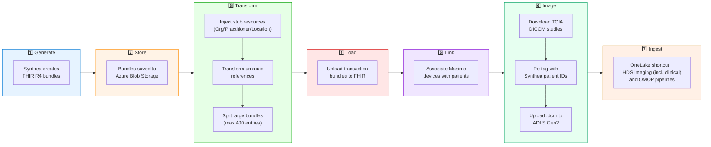
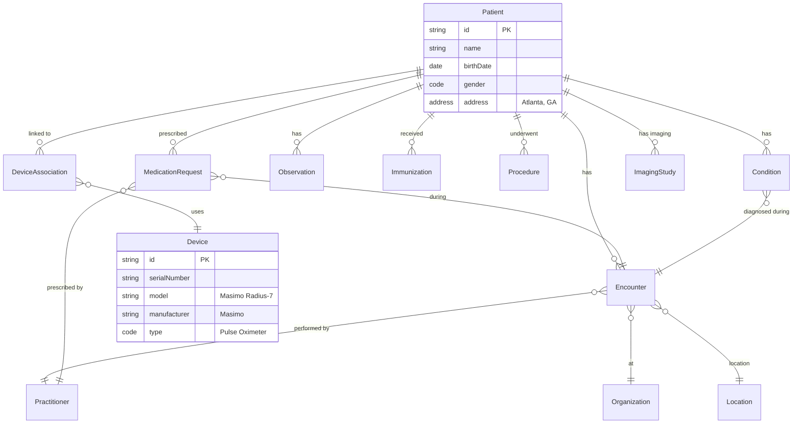
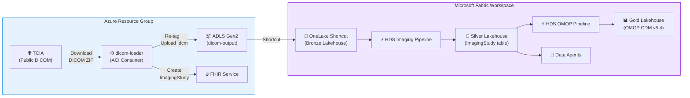
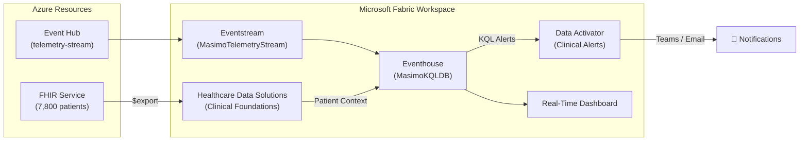
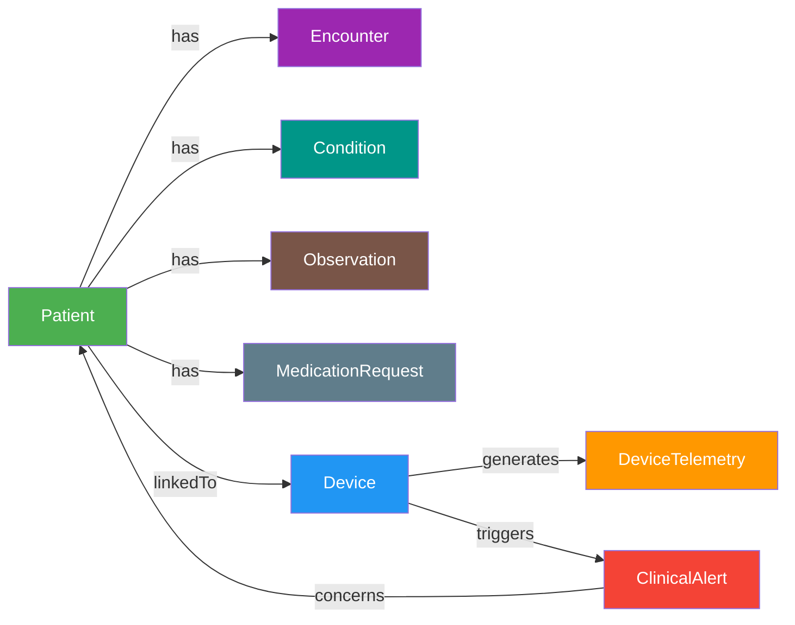

# Medical Device FHIR Integration Platform

A complete, deployable reference architecture that unifies healthcare EHR data and real-time medical device telemetry on Microsoft Fabric — from ingestion to AI-powered clinical queries in a single workspace.


**What this solution demonstrates:**
- **Real-Time Intelligence** — Masimo pulse oximeter telemetry streams through Eventstream into Eventhouse with KQL-based clinical alert detection (SpO2 drops, abnormal pulse rates) in seconds
- **Healthcare Data Solutions** — 10K synthetic FHIR R4 patients (5M+ clinical resources) flow into a Silver Lakehouse via Fabric's native HDS connector with zero custom ETL
- **DICOM Medical Imaging** — Real TCIA chest CT studies are downloaded, re-tagged with Synthea patient identifiers, stored in ADLS Gen2, and ingested into Fabric HDS via a OneLake shortcut and the imaging pipeline
- **Data Agents** — Two natural-language AI agents (Patient 360 + Clinical Triage) let users ask questions like *"Show me all patients with SpO2 below 90 and their active conditions"* — federating across KQL telemetry and Lakehouse clinical data in one response
- **Cohorting Toolkit** — Power BI imaging report (Direct Lake) + OHIF DICOM Viewer + Cohorting Data Agent deployed via the companion [FabricDicomCohortingToolkit](../FabricDicomCohortingToolkit/) repo
- **OneLake** — One copy of the data, queryable from KQL, Spark, SQL, and Power BI without duplication

The entire solution deploys in under 2 hours with a single command (`Deploy-All.ps1`) and touches six Fabric workloads: Real-Time Intelligence, Data Engineering, Data Warehouse, Data Science, Data Agents, and Power BI.

## 🏗️ Architecture

### Data Flow


```mermaid
flowchart LR
    subgraph Step1["1️⃣ Generate"]
        S1["Synthea creates<br/>FHIR R4 bundles"]
    end
    
    subgraph Step2["2️⃣ Store"]
        S2["Bundles saved to<br/>Azure Blob Storage"]
    end
    
    subgraph Step3["3️⃣ Transform"]
        S3A["Inject stub resources<br/>(Org/Practitioner/Location)"]
        S3B["Transform urn:uuid<br/>references"]
        S3C["Split large bundles<br/>(max 400 entries)"]
    end
    
    subgraph Step4["4️⃣ Load"]
        S4["Upload transaction<br/>bundles to FHIR"]
    end
    
    subgraph Step5["5️⃣ Link"]
        S5["Associate Masimo<br/>devices with patients"]
    end
    
    subgraph Step6["6️⃣ Image"]
        S6A["Download TCIA<br/>DICOM studies"]
        S6B["Re-tag with<br/>Synthea patient IDs"]
        S6C["Upload .dcm to<br/>ADLS Gen2"]
    end
    
    subgraph Step7["7️⃣ Ingest"]
        S7["OneLake shortcut +<br/>HDS imaging (incl. clinical)<br/>and OMOP pipelines"]
    end
    
    Step1 --> Step2 --> Step3 --> Step4 --> Step5 --> Step6 --> Step7
    S6A --> S6B --> S6C
    S3A --> S3B --> S3C

    style Step1 fill:#e6f3ff,stroke:#0078d4
    style Step2 fill:#fff3e6,stroke:#ff8c00
    style Step3 fill:#e6ffe6,stroke:#00a000
    style Step4 fill:#ffe6e6,stroke:#d40000
    style Step5 fill:#f0e6ff,stroke:#8000d4
    style Step6 fill:#e6fff0,stroke:#00a060
    style Step7 fill:#fff0e6,stroke:#d48000
```

### FHIR Resource Relationships


```mermaid
erDiagram
    Patient ||--o{ Encounter : "has"
    Patient ||--o{ Condition : "has"
    Patient ||--o{ MedicationRequest : "prescribed"
    Patient ||--o{ Observation : "has"
    Patient ||--o{ Immunization : "received"
    Patient ||--o{ Procedure : "underwent"
    Patient ||--o{ DeviceAssociation : "linked to"
    Patient ||--o{ ImagingStudy : "has imaging"
    
    Encounter }o--|| Practitioner : "performed by"
    Encounter }o--|| Organization : "at"
    Encounter }o--|| Location : "location"
    
    MedicationRequest }o--|| Practitioner : "prescribed by"
    MedicationRequest }o--|| Encounter : "during"
    
    Condition }o--|| Encounter : "diagnosed during"
    
    DeviceAssociation }o--|| Device : "uses"
    
    Device {
        string id PK
        string serialNumber
        string model "Masimo Radius-7"
        string manufacturer "Masimo"
        code type "Pulse Oximeter"
    }
    
    Patient {
        string id PK
        string name
        date birthDate
        code gender
        address address "Atlanta, GA"
    }
```

## 📋 What This Solution Does

### 1. **Synthetic Patient Generation** (Synthea)
- Generates **10,000 realistic patient records** for the Atlanta, Georgia metropolitan area
- Includes complete medical histories: conditions, medications, encounters, observations, immunizations
- Configurable demographics matching real-world population distributions

### 2. **FHIR Data Loading** (fhir-loader)
- Downloads Synthea FHIR bundles from Azure Blob Storage
- **Injects stub resources** for externally-referenced Organizations, Practitioners, and Locations
- Transforms `urn:uuid:` references to server-assigned IDs
- Splits large bundles (>400 entries) to avoid FHIR server limits
- Uploads transaction bundles with retry logic

### 3. **Atlanta Healthcare Providers**
Pre-loaded Organization resources for major Atlanta healthcare systems:
- Emory Healthcare
- Piedmont Healthcare
- Grady Health System
- Northside Hospital
- WellStar Health System
- Children's Healthcare of Atlanta (CHOA)
- Atlanta VA Medical Center

### 4. **Medical Device Integration** (Masimo Pulse Oximeters)
- Creates **100 Masimo Radius-7 pulse oximeter** Device resources
- Identifies patients with qualifying conditions for remote monitoring:
  - **SNOMED CT codes** (used by Synthea): Asthma (195967001), Diabetes (44054006), Hypertension (59621000), COPD (13645005), Heart failure (84114007)
  - **ICD-10 codes** (for real EHR data): J40-J47 (respiratory), I50 (heart failure), G47.3 (sleep apnea)
- Links devices to qualifying patients via DeviceAssociation (Basic) resources
- Supports both Synthea-generated synthetic data and real-world EHR data

### 5. **DICOM Medical Imaging** (dicom-loader + storage-access-trusted-workspace)

Adds real medical imaging to the platform using public DICOM studies from [The Cancer Imaging Archive (TCIA)](https://www.cancerimagingarchive.net/):


```mermaid
flowchart LR
    subgraph Azure["Azure Resource Group"]
        TCIA["🌐 TCIA\n(Public DICOM)"]
        DicomLoader["⚙️ dicom-loader\n(ACI Container)"]
        ADLS["📦 ADLS Gen2\n(dicom-output)"]
        FHIR["🔥 FHIR Service"]
    end

    subgraph Fabric["Microsoft Fabric Workspace"]
        Shortcut["🔗 OneLake Shortcut\n(Bronze Lakehouse)"]
        Pipeline["⚡ HDS Imaging Pipeline"]
        Silver["🏥 Silver Lakehouse\n(ImagingStudy table)"]
        OMOP["⚡ HDS OMOP Pipeline"]
        Gold["📊 Gold Lakehouse\n(OMOP CDM v5.4)"]
        Agents["🤖 Data Agents"]
    end

    TCIA -->|"Download\nDICOM ZIP"| DicomLoader
    DicomLoader -->|"Re-tag +\nUpload .dcm"| ADLS
    DicomLoader -->|"Create\nImagingStudy"| FHIR
    ADLS -->|"Shortcut"| Shortcut
    Shortcut --> Pipeline --> Silver
    Silver --> OMOP --> Gold
    Silver --> Agents

    style Azure fill:#e6f3ff,stroke:#0078d4
    style Fabric fill:#f0e6ff,stroke:#8000d4
```

- Downloads chest CT studies from **LIDC-IDRI** collection (or RSNA Pneumonia for CR modality)
- **Re-tags** DICOM files with Synthea patient identifiers using pydicom — preserves pixel data, replaces patient demographics and UIDs
- Compatible with **Python 3.9** runtime (Azure Container Instances); uses `Optional[str]` / `Tuple` syntax, `from __future__ import annotations` at file top
- Matches imaging modality to patient conditions via SNOMED code mapping (COPD→CT, Asthma→CR, etc.)
- Uploads re-tagged `.dcm` files to **ADLS Gen2** (`dicom-output` container), organized by `{patientId}/{studyUID}/{seriesUID}/`
- Creates **FHIR ImagingStudy** resources linking each study to the Synthea patient
- **OneLake shortcut** connects the ADLS container to the Bronze Lakehouse at `/Files/Ingest/Imaging/DICOM/DICOM-HDS/`
- Triggers the **HDS imaging ingestion pipeline** to flow DICOM metadata into the Silver `ImagingStudy` table
- Triggers the **HDS OMOP analytics pipeline** to populate the Gold OMOP CDM tables

```powershell
# Deploy DICOM loader (build container, download TCIA, re-tag, upload to ADLS Gen2)
.\deploy-fhir.ps1 -RunDicom

# Create OneLake shortcut + invoke HDS imaging and OMOP pipelines
.\storage-access-trusted-workspace.ps1 -FabricWorkspaceName "med-device-rti-hds"
```

## 📊 FHIR Resources Created

| Resource Type | Approximate Count | Description |
|---------------|-------------------|-------------|
| Patient | ~10,000 | Synthetic Atlanta patients |
| Encounter | ~250,000+ | Office visits, hospitalizations, etc. |
| Condition | ~300,000+ | Diagnoses and medical conditions |
| Observation | ~3,000,000+ | Vital signs, lab results |
| MedicationRequest | ~150,000+ | Prescriptions |
| Procedure | ~100,000+ | Medical procedures |
| Immunization | ~50,000+ | Vaccination records |
| Practitioner | ~500+ | Healthcare providers |
| Organization | ~300+ | Healthcare organizations |
| Location | ~300+ | Care delivery locations |
| Device | 100 | Masimo pulse oximeters |
| Basic (DeviceAssociation) | Up to 100 | Device-patient linkages |
| ImagingStudy | Up to 100 | DICOM study references (TCIA re-tagged) |

## 🚀 Deployment

### Prerequisites
- Azure CLI installed and logged in
- PowerShell 7+
- Azure subscription with permissions to create:
  - Resource groups
  - Azure Health Data Services (FHIR)
  - Azure Container Registry
  - Azure Container Instances
  - Storage Accounts
  - User-assigned Managed Identities

### Quick Start

```powershell
# Full end-to-end deployment (Phase 1: Azure infra + FHIR data + Fabric RTI)
.\Deploy-All.ps1 `
    -ResourceGroupName "rg-medtech-rti-fhir" `
    -Location "eastus" `
    -FabricWorkspaceName "med-device-rti-hds" `
    -AdminSecurityGroup "sg-azure-admins" `
    -Tags @{SecurityControl='Ignore'}

# Phase 2 (after HDS is deployed manually in the Fabric portal)
.\Deploy-All.ps1 -Phase2Only `
    -Location "eastus" `
    -FabricWorkspaceName "med-device-rti-hds" `
    -Tags @{SecurityControl='Ignore'}
```

### Step-by-Step Deployment

```powershell
# 1. Deploy infrastructure only
.\deploy-fhir.ps1 -ResourceGroupName "rg-medtech-demo" -Location "eastus" -InfraOnly

# 2. Run Synthea to generate patient data
.\deploy-fhir.ps1 -ResourceGroupName "rg-medtech-demo" -Location "eastus" -RunSynthea

# 3. Load data into FHIR
.\deploy-fhir.ps1 -ResourceGroupName "rg-medtech-demo" -Location "eastus" -RunLoader

# 4. Teardown all resources (Azure + Fabric workspace)
.\cleanup\Remove-AllResources.ps1 -Force -Wait -DeleteWorkspace `
    -FabricWorkspaceName "med-device-rti-hds"
```

### Configuration Options

| Parameter | Default | Required | Description |
|-----------|---------|----------|-------------|
| `-ResourceGroupName` | `rg-medtech-rti-fhir` | **Yes** | Azure resource group name |
| `-Location` | — | **Yes** | Azure region (e.g. `eastus`, `westus3`) |
| `-FabricWorkspaceName` | — | **Yes** | Fabric workspace name (created if missing) |
| `-AdminSecurityGroup` | — | **Yes**¹ | Azure AD security group for admin access (e.g. `sg-azure-admins`) |
| `-PatientCount` | `500` | No | Number of patients to generate |
| `-Tags` | `@{}` | No | Resource tags (e.g. `@{SecurityControl='Ignore'}`) |
| `-InfraOnly` | `false` | No | Deploy FHIR infrastructure only, skip data generation |
| `-RunSynthea` | `false` | No | Generate patients only (infra must already exist) |
| `-RunLoader` | `false` | No | Load FHIR data only (infra + blobs must exist) |
| `-RunDicom` | `false` | No | DICOM only: build container, download TCIA, re-tag, upload to ADLS Gen2 |
| `-SkipDicom` | `false` | No | Skip DICOM steps in full deployment |

> ¹ `-AdminSecurityGroup` is not required when using `-Teardown` or `-Phase2Only`.

## 🔐 Authentication & Security

### Managed Identity
The solution uses a **User-Assigned Managed Identity** with the following RBAC roles:
- `FHIR Data Contributor` - Read/write access to FHIR Service
- `Storage Blob Data Contributor` - Access to Synthea output blobs
- `AcrPull` - Pull container images from ACR

### API Access
To access the FHIR API:

```powershell
# Get access token using Azure CLI
$token = az account get-access-token `
    --resource "https://<workspace>-<fhir>.fhir.azurehealthcareapis.com" `
    --query accessToken -o tsv

# Query patients
Invoke-RestMethod -Uri "https://<workspace>-<fhir>.fhir.azurehealthcareapis.com/Patient?_count=10" `
    -Headers @{Authorization="Bearer $token"; Accept="application/fhir+json"}
```

### Using Postman/Bruno
1. Get token via Azure CLI (recommended)
2. Or configure OAuth 2.0 with your Azure AD tenant
3. Set headers:
   - `Authorization: Bearer <token>`
   - `Content-Type: application/fhir+json`
   - `Accept: application/fhir+json`

## 📁 Project Structure

```
med-device-fabric-emulator/
├── Deploy-All.ps1           # Full orchestrator (infra + FHIR + Fabric RTI + agents)
├── deploy-fhir.ps1          # FHIR infrastructure & data pipeline
├── deploy-fabric-rti.ps1    # Fabric RTI deployment (Phase 1 + Phase 2)
├── deploy-data-agents.ps1   # Fabric Data Agents (Patient 360 + Clinical Triage)
├── update-agents-inline.ps1 # Quick-update agent definitions (hardcoded IDs)
├── deploy-ontology.ps1       # Fabric IQ Ontology deployment (REST API)
├── storage-access-trusted-workspace.ps1  # DICOM OneLake shortcut + HDS pipeline trigger (imaging, OMOP)
├── deploy.ps1               # Legacy emulator-only deployment
├── run-kql-scripts.ps1      # Standalone KQL script runner
├── create-device-associations.py  # Link Masimo devices to FHIR patients
├── emulator.py              # Masimo device emulator (streams to Event Hub)
├── Dockerfile               # Emulator container image
├── bicep/
│   ├── infra.bicep          # Event Hub, ACR, Key Vault
│   ├── emulator.bicep       # Emulator ACI container
│   ├── fhir-infra.bicep     # FHIR Service, Storage, Managed Identity
│   ├── fhir-loader-job.bicep # FHIR loader ACI job
│   ├── dicom-loader-job.bicep # DICOM loader ACI job
│   └── synthea-job.bicep    # Synthea generator ACI job
├── cleanup/
│   ├── Remove-AzureInfra.ps1    # Tear down Azure resource group
│   ├── Remove-FabricWorkspace.ps1 # Delete Fabric workspace & items
│   └── Remove-FhirData.ps1     # Purge FHIR + DICOM data
├── dicom-loader/
│   ├── Dockerfile           # DICOM loader container
│   ├── load_dicom.py        # TCIA download, re-tag, ADLS upload, ImagingStudy creation
│   ├── tcia_client.py       # TCIA REST API client
│   ├── dicom_retagger.py    # pydicom re-tagging (patient IDs, UIDs)
│   ├── condition_modality_map.json # SNOMED → TCIA collection/modality mapping
│   └── requirements.txt
├── docs/
│   ├── images/
│   ├── FABRIC-IQ-ONTOLOGY-PLAN.md  # Ontology design plan & data model
│   └── ONTOLOGY-SETUP-GUIDE.md     # Step-by-step ontology setup guide
├── fabric-rti/
│   ├── HDS-SETUP-GUIDE.md   # Healthcare Data Solutions setup guide
│   ├── sql/
│   │   └── create-device-association-table.ipynb  # Spark SQL notebook for ontology binding
│   ├── kql/
│   │   ├── 01-alert-history-table.kql    # AlertHistory table & policies
│   │   ├── 02-telemetry-functions.kql    # Telemetry analytics functions
│   │   ├── 03-clinical-alert-functions.kql # Alert detection functions
│   │   ├── 04-hds-enrichment-example.kql # Silver LH shortcuts + enriched alerts
│   │   └── 05-dashboard-queries.kql      # Dashboard panel queries
│   └── dashboard/
│       ├── DASHBOARD-GUIDE.md
│       └── masimo-clinical-dashboard.json
├── fhir-loader/
│   ├── Dockerfile           # FHIR loader container
│   ├── load_fhir.py         # Main loader logic
│   ├── device_registry.json # Masimo device definitions
│   ├── atlanta_providers.json # Atlanta healthcare orgs
│   └── requirements.txt
└── synthea/
    ├── Dockerfile           # Synthea container
    ├── run-synthea.sh       # Synthea execution script
    ├── synthea.properties   # Synthea configuration
    └── atlanta_providers.json
```

## 🔧 Key Components

### FHIR Loader (`fhir-loader/load_fhir.py`)

The FHIR loader handles several complex scenarios:

1. **Conditional Reference Injection**: Synthea bundles reference external Practitioners, Organizations, and Locations via conditional references (e.g., `Practitioner?identifier=http://hl7.org/fhir/sid/us-npi|1234567890`). The loader creates stub resources with deterministic UUIDs so these references resolve.

2. **Bundle Splitting**: Large patient bundles are split into smaller transaction bundles (max 400 entries) to avoid FHIR server timeouts.

3. **Reference Transformation**: Converts `urn:uuid:` references to server-assigned resource IDs.

4. **Retry Logic**: Handles transient failures and RBAC propagation delays.

### Synthea Configuration (`synthea/synthea.properties`)

Configured for Atlanta demographics:
- State: Georgia
- City: Atlanta
- Age distribution matching Atlanta population
- Payer mix reflecting Georgia insurance landscape

## 📈 Monitoring

### Verify Eventstream is Active

After Phase 1 deployment, confirm telemetry is flowing:

1. Open the Fabric portal → workspace → **MasimoTelemetryStream** (Eventstream)
2. Verify the pipeline shows: `EventHubSource` (Active ✅) → `MasimoTelemetryStream` → `EventhouseDestination` (Active ✅)
3. Click **Data preview** to see live telemetry rows with `device_id`, `timestamp`, `telemetry` (SpO2, PR, PI)

Or verify via KQL:
```kql
// Run in MasimoEventhouse → MasimoEventhouse_queryset
TelemetryRaw | count

// Latest readings per device
fn_LatestReadings() | take 10

// Check for active alerts
fn_ClinicalAlerts(5)
```

### Check Container Logs

```powershell
# Synthea generator logs
az container logs -g <resource-group> -n synthea-generator-job

# FHIR loader logs
az container logs -g <resource-group> -n fhir-loader-job

# DICOM loader logs
az container logs -g <resource-group> -n dicom-loader-job

# Emulator logs (streaming telemetry)
az container logs -g <resource-group> -n masimo-emulator-grp --tail 10
```

### Query FHIR Counts

```powershell
$token = az account get-access-token --resource "<fhir-url>" --query accessToken -o tsv
$types = @("Patient","Encounter","Condition","Observation","MedicationRequest","Device")
foreach ($type in $types) {
    $result = Invoke-RestMethod -Uri "<fhir-url>/$type`?_summary=count" `
        -Headers @{Authorization="Bearer $token"}
    Write-Host "$type : $($result.total)"
}
```

## 📡 Real-Time Intelligence — Clinical Alert System

This project includes a **Microsoft Fabric Real-Time Intelligence (RTI)** layer that streams Masimo telemetry into Fabric for clinical alerting, enriched with FHIR patient context via Healthcare Data Solutions.

### Architecture


```mermaid
flowchart LR
    subgraph Azure["Azure Resources"]
        EH["Event Hub<br/>(telemetry-stream)"]
        FHIR["FHIR Service<br/>(7,800 patients)"]
    end

    subgraph Fabric["Microsoft Fabric Workspace"]
        ES["Eventstream<br/>(MasimoTelemetryStream)"]
        EVH["Eventhouse<br/>(MasimoKQLDB)"]
        HDS["Healthcare Data Solutions<br/>(Clinical Foundations)"]
        DA["Data Activator<br/>(Clinical Alerts)"]
        DASH["Real-Time Dashboard"]
    end

    EH --> ES --> EVH
    FHIR -->|"$export"| HDS
    EVH -->|"KQL Alerts"| DA
    HDS -->|"Patient Context"| EVH
    EVH --> DASH
    DA -->|"Teams / Email"| Notify["🔔 Notifications"]
```

### Quick Start

```powershell
# Phase 1: Deploy Fabric RTI resources (workspace, Eventhouse, Eventstream, base KQL)
.\deploy-fabric-rti.ps1

# --- Manual steps required here (see below) ---

# Phase 2: After HDS is deployed and pipeline has run
.\deploy-fabric-rti.ps1 -Phase2
```

### Two-Phase Deployment

The RTI deployment is split into two phases because Healthcare Data Solutions (HDS) must be deployed manually through the Fabric portal:

| Phase | Method | What It Does |
|-------|--------|-------------|
| **Phase 1** | `.\deploy-fabric-rti.ps1` | Creates workspace, Eventhouse, KQL Database, Eventstream, cloud connection, AlertHistory table, base KQL functions (01-03), and runs FHIR `$export` to ADLS Gen2 |
| **Manual** | Fabric Portal | Deploy HDS, add scipy 1.11.4, create OneLake shortcut, update config, run pipeline |
| **Phase 2** | `.\deploy-fabric-rti.ps1 -Phase2` | Creates KQL shortcuts to 6 Silver tables, deploys enriched `fn_ClinicalAlerts`, `fn_AlertLocationMap`, and Clinical Alerts Map dashboard |

### Parameters

| Parameter | Default | Description |
|-----------|---------|-------------|
| `-FabricWorkspaceName` | `med-device-real-time` | Fabric workspace name (created if missing) |
| `-ResourceGroupName` | `rg-medtech-sys-identity` | Azure RG with existing deployment |
| `-EventHubNamespace` | *(auto-detected)* | Event Hub namespace |
| `-EventHubName` | `telemetry-stream` | Event Hub name |
| `-FhirServiceUrl` | *(auto-detected)* | FHIR service endpoint |
| `-SkipHdsGuidance` | `$false` | Skip HDS manual-step output |
| `-SkipFhirExport` | `$false` | Skip the automated FHIR $export step |
| `-Phase2` | `$false` | Run Phase 2 only (post-HDS shortcuts + enrichment) |
| `-SilverLakehouseId` | *(auto-detected)* | Silver Lakehouse ID (Phase 2; auto-discovered if blank) |

### What Gets Deployed

| Component | Phase | Method | Description |
|-----------|-------|--------|-------------|
| Fabric Workspace | 1 | Automated | Created/validated via REST API |
| Eventhouse + KQL DB | 1 | Automated | Stores real-time telemetry |
| Eventstream | 1 | Automated | Routes Event Hub → Eventhouse |
| AlertHistory Table | 1 | Automated | Clinical alert storage with 90-day retention |
| KQL Functions (×7) | 1 | Automated | Telemetry analytics & clinical alert detection |
| FHIR $export → ADLS Gen2 | 1 | Automated | Direct FHIR `$export` API call to storage |
| Healthcare Data Solutions | — | **Manual** | FHIR patient context (Silver Lakehouse) |
| scipy 1.11.4 | — | **Manual** | Must be added to HDS Spark environment |
| SilverPatient shortcut | 2 | Automated | KQL external table → Silver Patient delta table |
| SilverCondition shortcut | 2 | Automated | KQL external table → Silver Condition delta table |
| SilverDevice shortcut | 2 | Automated | KQL external table → Silver Device delta table |
| SilverLocation shortcut | 2 | Automated | KQL external table → Silver Location delta table |
| SilverEncounter shortcut | 2 | Automated | KQL external table → Silver Encounter delta table |
| SilverBasic shortcut | 2 | Automated | KQL external table → Silver Basic (DeviceAssociation) delta table |
| Enriched fn_ClinicalAlerts | 2 | Automated | Alerts with patient context via DeviceAssociation + severity escalation |
| fn_AlertLocationMap | 2 | Automated | Alerts joined with Encounter → Location for map (unknown → Nashville, TN) |
| Clinical Alerts Map | 2 | Automated | Map dashboard showing alert locations by hospital (4 tiles) |
| Patient 360 Agent | 2 | Automated | AI Data Agent for unified patient views (KQL + Lakehouse) |
| Clinical Triage Agent | 2 | Automated | AI Data Agent for alert-based clinical triage (KQL + Lakehouse) |
| Real-Time Dashboard | 1 | Automated | 7-tile clinical monitoring dashboard (kusto-trident, auto-refresh 30s, device filter) |
| Eventstream Start | 1 | Automated | Ensures Eventstream is running after deployment |
| Data Activator | — | Manual | Clinical alert triggers |

### Clinical Alert Tiers

| Tier | SpO₂ | Pulse Rate | Condition Modifier |
|------|------|------------|--------------------|
| ⚠️ Warning | < 94% | > 110 or < 50 bpm | Any patient |
| 🔶 Urgent | < 90% | > 130 or < 45 bpm | OR patient has COPD/CHF |
| 🔴 Critical | < 85% | > 150 or < 40 bpm | AND patient has COPD/CHF |

### KQL Functions

Located in `fabric-rti/kql/`:

| File | Functions | Purpose |
|------|-----------|---------|
| `01-alert-history-table.kql` | AlertHistory table | Stores triggered alerts |
| `02-telemetry-functions.kql` | `fn_VitalsTrend`, `fn_DeviceStatus`, `fn_LatestReadings`, `fn_TelemetryByDevice` | Telemetry analytics |
| `03-clinical-alert-functions.kql` | `fn_SpO2Alerts`, `fn_PulseRateAlerts`, `fn_ClinicalAlerts` | Alert detection |
| `04-hds-enrichment-example.kql` | External tables + enriched alerts | HDS Silver Lakehouse integration (6 tables) |
| `05-dashboard-queries.kql` | 7 dashboard panels | Real-Time Dashboard queries |

### Real-Time Dashboard

The dashboard is **automatically deployed** by `deploy-fabric-rti.ps1` (Step 7b) using the `kusto-trident` data source kind. It includes a device filter (single-select with "All") and 30-second auto-refresh.

| Tile | Visual Type | Data Source | Filterable |
|------|-------------|-------------|------------|
| Active Devices | Card | `fn_DeviceStatus()` where `ONLINE` | No |
| Active Alerts | Card | `fn_ClinicalAlerts(60)` count | No |
| Clinical Alerts | Table | `fn_ClinicalAlerts(60)` (last 50) | No |
| SpO2 Trend | Line chart | `TelemetryRaw` (60 min, 30s bins) | Yes — `_selectedDevices` |
| Pulse Rate Trend | Line chart | `TelemetryRaw` (60 min, 30s bins) | Yes — `_selectedDevices` |
| Device Status | Table | `fn_DeviceStatus()` | No |
| Latest Readings | Table | `fn_LatestReadings()` | No |

See [fabric-rti/dashboard/DASHBOARD-GUIDE.md](fabric-rti/dashboard/DASHBOARD-GUIDE.md) for manual setup details.

### Clinical Alerts Map Dashboard (Phase 2)

A second dashboard, **Clinical Alerts Map**, is deployed by Phase 2 with 30-second auto-refresh. It requires `fn_AlertLocationMap` (Silver Lakehouse joins).

| Tile | Visual Type | Data Source |
|------|-------------|-------------|
| Alert Locations | Map (bubble) | `fn_AlertLocationMap(60)` — grouped by hospital, sized by alert count |
| Alerts by Hospital | Bar chart | `fn_AlertLocationMap(60)` — severity breakdown per hospital |
| Total Active Alerts | Card | `fn_AlertLocationMap(60)` count |
| Alert Detail | Table | `fn_AlertLocationMap(60)` — device, patient, tier, vitals, location |

> Patients without a mapped Encounter → Location default to **Nashville, TN** (36.1627°N, 86.7816°W) and appear as "Unknown (Nashville)".

### Fabric IQ — Ontology (Semantic Layer)

The project includes a **Fabric IQ Ontology** (`ClinicalDeviceOntology`) that creates a unified semantic layer across the Eventhouse and Silver Lakehouse. The ontology defines shared business concepts (entity types), their properties, and cross-domain relationships so that Data Agents, Power BI, and graph queries share the same clinical vocabulary.


```mermaid
graph LR
    Patient -->|has| Encounter
    Patient -->|has| Condition
    Patient -->|has| Observation
    Patient -->|has| MedicationRequest
    Patient -->|linkedTo| Device
    Device -->|generates| DeviceTelemetry
    Device -->|triggers| ClinicalAlert
    ClinicalAlert -->|concerns| Patient

    style Patient fill:#4CAF50,color:#fff
    style Device fill:#2196F3,color:#fff
    style DeviceTelemetry fill:#FF9800,color:#fff
    style ClinicalAlert fill:#f44336,color:#fff
    style Encounter fill:#9C27B0,color:#fff
    style Condition fill:#009688,color:#fff
    style Observation fill:#795548,color:#fff
    style MedicationRequest fill:#607D8B,color:#fff
```

| Entity Type | Binding | Source | Approx Rows |
|-------------|---------|--------|-------------|
| Patient | Static | Silver Lakehouse | ~7,800 |
| Device | Static | Silver Lakehouse | ~100 |
| Encounter | Static | Silver Lakehouse | ~363,000 |
| Condition | Static | Silver Lakehouse | ~244,000 |
| MedicationRequest | Static | Silver Lakehouse | ~250,000 |
| Observation | Static | Silver Lakehouse | ~2,800,000 |
| DeviceAssociation | Static | Silver Lakehouse (`DeviceAssociation`) | ~100 |
| DeviceTelemetry | **Time Series** | Eventhouse (`TelemetryRaw`) | Streaming |
| ClinicalAlert | Static | Eventhouse (`AlertHistory`) | Varies |

**Setup:** Run `deploy-ontology.ps1` to create the ontology with all entity types, data bindings, and relationships via REST API. Or follow the manual [setup guide](docs/ONTOLOGY-SETUP-GUIDE.md) for portal-based creation.

```powershell
# Automated: Create ontology via Fabric REST API
.\deploy-ontology.ps1

# Or with a custom workspace name
.\deploy-ontology.ps1 -FabricWorkspaceName "my-workspace"
```

**Prerequisite:** Run the `DeviceAssociation` table creation notebook (`fabric-rti/sql/create-device-association-table.ipynb`) in a Spark session attached to the Silver Lakehouse before creating the ontology. The Lakehouse SQL analytics endpoint is read-only.

> **Note:** Fabric IQ Ontology is currently a **preview** feature. The ontology can be created automatically via `deploy-ontology.ps1` (REST API) or manually via the Fabric portal. The ontology requires the Silver Lakehouse to use **managed** tables with OneLake security **disabled**.

### Healthcare Data Solutions Integration

The system uses **HDS Clinical Foundations** instead of custom tables for FHIR data. The Silver Lakehouse provides normalized FHIR R4 tables (Patient, Device, Condition, Encounter, Location, Basic) with built-in identity management and update handling.

> **Note:** The HDS Silver Lakehouse stores FHIR resources as nested JSON objects (not flattened columns). Device-patient associations are stored as `Basic` (DeviceAssociation) resources in `SilverBasic`, with device references in the `extension` array. Cross-resource joins use `idOrig` (original FHIR UUID) and `msftSourceReference` fields.

> **⚠️ CRITICAL:** After deploying HDS, you **must** manually add `scipy==1.11.4` to the HDS Spark environment's **External repositories** before running any pipeline. Without it, the bronze-to-silver flattening will fail. See the [HDS Setup Guide](fabric-rti/HDS-SETUP-GUIDE.md#step-2b-add-scipy-to-hds-spark-environment-required) for details and screenshot.

After the Silver Lakehouse is populated, run **Phase 2** to create KQL shortcuts:

```powershell
.\deploy-fabric-rti.ps1 -Phase2
```

This creates 6 KQL external tables (`SilverPatient`, `SilverCondition`, `SilverDevice`, `SilverLocation`, `SilverEncounter`, `SilverBasic`) via OneLake shortcuts, and deploys:
- **`fn_ClinicalAlerts`** — enriched alerts that join telemetry with patient demographics via `SilverBasic` (DeviceAssociation) resources, with severity escalation for high-risk conditions (COPD, CHF, asthma, hypertension)
- **`fn_AlertLocationMap`** — joins alerts with `SilverEncounter` → `SilverLocation` for hospital-level geolocation; patients without a mapped location default to Nashville, TN (36.1627°N, 86.7816°W)
- **Clinical Alerts Map** — a 4-tile KQL dashboard with a bubble map, alerts-by-hospital bar chart, alert count card, and detail table

See [fabric-rti/HDS-SETUP-GUIDE.md](fabric-rti/HDS-SETUP-GUIDE.md) for the complete setup walkthrough.

### Fabric Data Agents

After Phase 2 completes, deploy **two AI-powered Data Agents** that combine real-time telemetry with FHIR clinical data:

```powershell
# Deploy both agents
.\deploy-data-agents.ps1

# Or deploy individually
.\deploy-data-agents.ps1 -Patient360Only
.\deploy-data-agents.ps1 -TriageOnly

# Quick-update agent definitions (after agents already exist)
.\update-agents-inline.ps1
```

#### Agent Architecture

Both agents use a **dual-datasource architecture**:
- **KQL datasource** — `TelemetryRaw` + `AlertHistory` native tables only (no functions, no external tables)
- **Lakehouse datasource** — Silver Lakehouse SQL tables (`dbo.Patient`, `dbo.Condition`, `dbo.Basic`, etc.)

Agents use **inline KQL query patterns** in their instructions and **SQL queries** for the Lakehouse, with a **cross-datasource workflow** for questions spanning both telemetry and clinical data.

#### Patient 360 Agent

Provides a unified patient view across FHIR clinical data and real-time telemetry:
- Latest vital signs per device (SpO2, pulse rate, perfusion index)
- Device status (online/stale/offline)
- Patient demographics, conditions, and device assignments
- Cross-datasource lookups: "Show patient info for device MASIMO-RADIUS7-0033"

#### Clinical Triage Agent

Supports rapid triage decisions with alert prioritization:
- Multi-metric alert detection (SpO2 + pulse rate combined)
- Alert severity tiers: CRITICAL / URGENT / WARNING
- Cross-datasource patient identification for alerting devices
- Sample queries: "Run a clinical triage", "Which devices have low SpO2? Look up the patients."

#### Key Data Patterns

| Table | Access | Key Fields |
|-------|--------|------------|
| `TelemetryRaw` | KQL | `device_id`, `timestamp` (string!), `telemetry.spo2`, `telemetry.pr` |
| `AlertHistory` | KQL | Historical alert records (may be stale) |
| `dbo.Basic` | Lakehouse SQL | Device-patient associations via `code_string`, `extension`, `subject_string` |
| `dbo.Condition` | Lakehouse SQL | Patient diagnoses via `code_string`, `subject_string` |
| `dbo.Patient` | Lakehouse SQL | Demographics via `name_string`, `idOrig` |

> **Critical:** Device associations in `dbo.Basic` use code `'device-assoc'` (not `'ASSIGNED'`). The `code_string` column is a JSON **object** (not array), so use `JSON_VALUE(code_string, '$.coding[0].code')`, not `$[0].coding[0].code`.

## 🚀 Deploy-All Orchestrator

The `Deploy-All.ps1` script orchestrates the complete end-to-end deployment:

```powershell
# Phase 1: Azure infra + FHIR data + Fabric RTI
.\Deploy-All.ps1 `
    -ResourceGroupName "rg-medtech-rti-fhir" `
    -Location "eastus" `
    -FabricWorkspaceName "med-device-rti-hds" `
    -AdminSecurityGroup "sg-azure-admins" `
    -Tags @{SecurityControl='Ignore'}

# Phase 2 (after deploying HDS manually in Fabric portal)
.\Deploy-All.ps1 -Phase2Only `
    -Location "eastus" `
    -FabricWorkspaceName "med-device-rti-hds" `
    -Tags @{SecurityControl='Ignore'}
```

| Step | Script Called | What It Does |
|------|-------------|---------------|
| 1 | `deploy.ps1` | Deploys Event Hub, ACR, Key Vault, builds + deploys emulator ACI |
| 1b | Fabric API (inline) | Creates Fabric workspace, assigns capacity, provisions identity |
| 2 | `deploy-fhir.ps1 -SkipDicom` | Deploys FHIR Service, runs Synthea + FHIR Loader (no DICOM) |
| 2b | `deploy-fhir.ps1 -RunDicom` | Builds DICOM loader container, downloads TCIA, re-tags, uploads to ADLS Gen2 |
| 3 | `deploy-fabric-rti.ps1` | Creates Eventhouse, Eventstream, KQL schema, dashboard, FHIR $export |
| 3b | `storage-access-trusted-workspace.ps1` | Creates OneLake shortcut + invokes HDS imaging (incl. clinical) and OMOP pipelines |
| 4 | `deploy-fabric-rti.ps1 -Phase2` | Creates Silver Lakehouse shortcuts + enriched alerts |
| 5 | `deploy-data-agents.ps1` | Creates Patient 360 + Clinical Triage Data Agents |
| 6 | `deploy-ontology.ps1` | Creates ClinicalDeviceOntology (9 entity types, 8 relationships) |
| 7 | Phase 3: FabricDicomCohortingToolkit | Cohorting Agent + DICOM Viewer + Imaging Report (see [FabricDicomCohortingToolkit README](../FabricDicomCohortingToolkit/README.md)) |

### Phase 3: Imaging Report & DICOM Viewer

After Phase 2 completes and Silver Lakehouse tables are populated, deploy the Cohorting Toolkit from the companion repo. **Deploy in this order** — the viewer must be deployed first so its URL flows into the reporting data:

```powershell
cd ../FabricDicomCohortingToolkit

# 1. Deploy DICOM Viewer (must be first — generates the OHIF URL)
cd dicom-viewer
.\Deploy-DicomViewer.ps1 -ResourceGroup rg-hds-dicom-viewer -FabricWorkspaceName "med-device-rti-hds"
cd ..

# 2. Deploy materialization notebook (auto-discovers OHIF URL from Azure)
.\deploy-notebook.ps1 -FabricWorkspaceName "med-device-rti-hds"

# 3. Deploy Power BI report (Direct Lake — no PBI Desktop needed)
.\Deploy-ImagingReport.ps1 -FabricWorkspaceName "med-device-rti-hds"
```

The materialization notebook uses `notebookutils` to dynamically resolve workspace and lakehouse IDs — no hardcoded GUIDs required. The `deploy-notebook.ps1` script auto-discovers the OHIF Viewer URL from Azure and patches it into the notebook before upload.

## 🧹 Cleanup

Teardown scripts are in the `cleanup/` folder:

```powershell
# Full teardown: Azure RG + Fabric items + workspace identity + workspace
.\cleanup\Remove-AllResources.ps1 -Force -Wait -DeleteWorkspace `
    -FabricWorkspaceName "med-device-rti-hds"

# Azure only (keep Fabric workspace)
.\cleanup\Remove-AllResources.ps1 -SkipFabric -Force -Wait

# Fabric only (keep Azure resources)
.\cleanup\Remove-AllResources.ps1 -SkipAzure -Force `
    -FabricWorkspaceName "med-device-rti-hds"

# Purge FHIR data only (keep infrastructure)
.\cleanup\Remove-FhirData.ps1
```

## 🤝 Contributing

1. Fork the repository
2. Create a feature branch
3. Make your changes
4. Submit a pull request

## 📄 License

This project is licensed under the MIT License - see the [LICENSE](LICENSE) file for details.

## 🙏 Acknowledgments

- [Synthea](https://synthetichealth.github.io/synthea/) - Synthetic patient generator
- [Azure Health Data Services](https://azure.microsoft.com/en-us/products/health-data-services/) - FHIR platform
- [Masimo](https://www.masimo.com/) - Medical device specifications reference
- [Microsoft Fabric](https://www.microsoft.com/en-us/microsoft-fabric) - Real-Time Intelligence platform
- [Healthcare Data Solutions](https://learn.microsoft.com/en-us/industry/healthcare/healthcare-data-solutions/overview) - FHIR data foundations on Fabric
- [Fabric IQ](https://learn.microsoft.com/fabric/iq/overview) - Unified semantic layer and ontology workload
- [Ontology (preview)](https://learn.microsoft.com/fabric/iq/ontology/overview) - Enterprise vocabulary and data binding
- [OHIF Viewer](https://ohif.org) - Open-source DICOM viewer (MIT)
- [TCIA](https://www.cancerimagingarchive.net/) - The Cancer Imaging Archive (public DICOM studies)