# Medical Device FHIR Integration Platform

A complete solution for generating synthetic patient data, loading it into Azure FHIR Service, and associating patients with medical devices (Masimo pulse oximeters) for remote patient monitoring scenarios.

## 🏗️ Architecture

```mermaid
flowchart TB
    subgraph Azure["Azure Resource Group"]
        subgraph Generation["Data Generation"]
            Synthea["🏥 Synthea Generator<br/>(Azure Container Instance)"]
            Blob["📦 Azure Blob Storage<br/>(synthea-output container)"]
        end
        
        subgraph Loading["Data Loading"]
            Loader["⚙️ FHIR Loader<br/>(Azure Container Instance)"]
        end
        
        subgraph FHIR["Azure Health Data Services"]
            FHIRService["🔥 FHIR Service (R4)<br/>- Patients<br/>- Encounters<br/>- Conditions<br/>- Observations<br/>- Devices"]
        end
        
        subgraph Infrastructure["Supporting Infrastructure"]
            ACR["📦 Azure Container Registry<br/>- synthea-generator<br/>- fhir-loader"]
            Identity["🔐 User-Assigned<br/>Managed Identity"]
        end
        
        Synthea -->|"Generate 10K<br/>patient bundles"| Blob
        Blob -->|"Download<br/>bundles"| Loader
        Loader -->|"Upload FHIR<br/>transactions"| FHIRService
        
        Identity -.->|"FHIR Data Contributor"| FHIRService
        Identity -.->|"Storage Blob Data Contributor"| Blob
        Identity -.->|"AcrPull"| ACR
        
        ACR -->|"Pull images"| Synthea
        ACR -->|"Pull images"| Loader
    end
    
    subgraph Clients["External Clients"]
        Postman["🧪 Postman/Bruno"]
        Apps["📱 Applications"]
    end
    
    Clients -->|"REST API<br/>(OAuth 2.0)"| FHIRService

    style Azure fill:#e6f3ff,stroke:#0078d4
    style Generation fill:#fff3e6,stroke:#ff8c00
    style Loading fill:#e6ffe6,stroke:#00a000
    style FHIR fill:#ffe6e6,stroke:#d40000
    style Infrastructure fill:#f0e6ff,stroke:#8000d4
    style Clients fill:#f5f5f5,stroke:#666666
```



### Data Flow

```mermaid
flowchart LR
    subgraph Step1["1️⃣ Generate"]
        S1["Synthea creates<br/>FHIR R4 bundles"]
    end
    
    subgraph Step2["2️⃣ Store"]
        S2["Bundles saved to<br/>Azure Blob Storage"]
    end
    
    subgraph Step3["3️⃣ Transform"]
        S3A["Inject stub resources<br/>(Org/Practitioner/Location)"]
        S3B["Transform urn:uuid<br/>references"]
        S3C["Split large bundles<br/>(max 400 entries)"]
    end
    
    subgraph Step4["4️⃣ Load"]
        S4["Upload transaction<br/>bundles to FHIR"]
    end
    
    subgraph Step5["5️⃣ Link"]
        S5["Associate Masimo<br/>devices with patients"]
    end
    
    Step1 --> Step2 --> Step3 --> Step4 --> Step5
    S3A --> S3B --> S3C

    style Step1 fill:#e6f3ff,stroke:#0078d4
    style Step2 fill:#fff3e6,stroke:#ff8c00
    style Step3 fill:#e6ffe6,stroke:#00a000
    style Step4 fill:#ffe6e6,stroke:#d40000
    style Step5 fill:#f0e6ff,stroke:#8000d4
```



### FHIR Resource Relationships


## 📋 What This Solution Does

### 1. **Synthetic Patient Generation** (Synthea)
- Generates **10,000 realistic patient records** for the Atlanta, Georgia metropolitan area
- Includes complete medical histories: conditions, medications, encounters, observations, immunizations
- Configurable demographics matching real-world population distributions

### 2. **FHIR Data Loading** (fhir-loader)
- Downloads Synthea FHIR bundles from Azure Blob Storage
- **Injects stub resources** for externally-referenced Organizations, Practitioners, and Locations
- Transforms `urn:uuid:` references to server-assigned IDs
- Splits large bundles (>400 entries) to avoid FHIR server limits
- Uploads transaction bundles with retry logic

### 3. **Atlanta Healthcare Providers**
Pre-loaded Organization resources for major Atlanta healthcare systems:
- Emory Healthcare
- Piedmont Healthcare
- Grady Health System
- Northside Hospital
- WellStar Health System
- Children's Healthcare of Atlanta (CHOA)
- Atlanta VA Medical Center

### 4. **Medical Device Integration** (Masimo Pulse Oximeters)
- Creates **100 Masimo Radius-7 pulse oximeter** Device resources
- Identifies patients with qualifying conditions for remote monitoring:
  - **SNOMED CT codes** (used by Synthea): Asthma (195967001), Diabetes (44054006), Hypertension (59621000), COPD (13645005), Heart failure (84114007)
  - **ICD-10 codes** (for real EHR data): J40-J47 (respiratory), I50 (heart failure), G47.3 (sleep apnea)
- Links devices to qualifying patients via DeviceAssociation (Basic) resources
- Supports both Synthea-generated synthetic data and real-world EHR data

## 📊 FHIR Resources Created

| Resource Type | Approximate Count | Description |
|---------------|-------------------|-------------|
| Patient | ~10,000 | Synthetic Atlanta patients |
| Encounter | ~250,000+ | Office visits, hospitalizations, etc. |
| Condition | ~300,000+ | Diagnoses and medical conditions |
| Observation | ~3,000,000+ | Vital signs, lab results |
| MedicationRequest | ~150,000+ | Prescriptions |
| Procedure | ~100,000+ | Medical procedures |
| Immunization | ~50,000+ | Vaccination records |
| Practitioner | ~500+ | Healthcare providers |
| Organization | ~300+ | Healthcare organizations |
| Location | ~300+ | Care delivery locations |
| Device | 100 | Masimo pulse oximeters |
| Basic (DeviceAssociation) | Up to 100 | Device-patient linkages |

## 🚀 Deployment

### Prerequisites
- Azure CLI installed and logged in
- PowerShell 7+
- Azure subscription with permissions to create:
  - Resource groups
  - Azure Health Data Services (FHIR)
  - Azure Container Registry
  - Azure Container Instances
  - Storage Accounts
  - User-assigned Managed Identities

### Quick Start

```powershell
# Full end-to-end deployment (Azure infra + FHIR data + Fabric RTI)
.\Deploy-All.ps1

# Or deploy just FHIR infrastructure and data
.\deploy-fhir.ps1 -ResourceGroupName "rg-medtech-demo" -Location "eastus"
```

### Step-by-Step Deployment

```powershell
# 1. Deploy infrastructure only
.\deploy-fhir.ps1 -ResourceGroupName "rg-medtech-demo" -InfraOnly

# 2. Run Synthea to generate patient data
.\deploy-fhir.ps1 -ResourceGroupName "rg-medtech-demo" -RunSynthea

# 3. Load data into FHIR
.\deploy-fhir.ps1 -ResourceGroupName "rg-medtech-demo" -RunLoader
```

### Configuration Options

| Parameter | Default | Description |
|-----------|---------|-------------|
| `-ResourceGroupName` | Required | Azure resource group name |
| `-Location` | `eastus` | Azure region |
| `-PatientCount` | `10000` | Number of patients to generate |
| `-InfraOnly` | `false` | Deploy FHIR infrastructure only, skip data generation |
| `-RunSynthea` | `false` | Generate patients only (infra must already exist) |
| `-RunLoader` | `false` | Load FHIR data only (infra + blobs must exist) |

## 🔐 Authentication & Security

### Managed Identity
The solution uses a **User-Assigned Managed Identity** with the following RBAC roles:
- `FHIR Data Contributor` - Read/write access to FHIR Service
- `Storage Blob Data Contributor` - Access to Synthea output blobs
- `AcrPull` - Pull container images from ACR

### API Access
To access the FHIR API:

```powershell
# Get access token using Azure CLI
$token = az account get-access-token `
    --resource "https://<workspace>-<fhir>.fhir.azurehealthcareapis.com" `
    --query accessToken -o tsv

# Query patients
Invoke-RestMethod -Uri "https://<workspace>-<fhir>.fhir.azurehealthcareapis.com/Patient?_count=10" `
    -Headers @{Authorization="Bearer $token"; Accept="application/fhir+json"}
```

### Using Postman/Bruno
1. Get token via Azure CLI (recommended)
2. Or configure OAuth 2.0 with your Azure AD tenant
3. Set headers:
   - `Authorization: Bearer <token>`
   - `Content-Type: application/fhir+json`
   - `Accept: application/fhir+json`

## 📁 Project Structure

```
med-device-fabric-emulator/
├── Deploy-All.ps1           # Full orchestrator (infra + FHIR + Fabric RTI + agents)
├── deploy-fhir.ps1          # FHIR infrastructure & data pipeline
├── deploy-fabric-rti.ps1    # Fabric RTI deployment (Phase 1 + Phase 2)
├── deploy-data-agents.ps1   # Fabric Data Agents (Patient 360 + Clinical Triage)
├── update-agents-inline.ps1 # Quick-update agent definitions (hardcoded IDs)
├── deploy.ps1               # Legacy emulator-only deployment
├── run-kql-scripts.ps1      # Standalone KQL script runner
├── create-device-associations.py  # Link Masimo devices to FHIR patients
├── emulator.py              # Masimo device emulator (streams to Event Hub)
├── Dockerfile               # Emulator container image
├── bicep/
│   ├── infra.bicep          # Event Hub, ACR, Key Vault
│   ├── emulator.bicep       # Emulator ACI container
│   ├── fhir-infra.bicep     # FHIR Service, Storage, Managed Identity
│   ├── fhir-loader-job.bicep # FHIR loader ACI job
│   └── synthea-job.bicep    # Synthea generator ACI job
├── cleanup/
│   ├── Remove-AzureInfra.ps1    # Tear down Azure resource group
│   ├── Remove-FabricWorkspace.ps1 # Delete Fabric workspace & items
│   └── Remove-FhirData.ps1     # Purge FHIR data
├── docs/
│   └── images/
├── fabric-rti/
│   ├── HDS-SETUP-GUIDE.md   # Healthcare Data Solutions setup guide
│   ├── kql/
│   │   ├── 01-alert-history-table.kql    # AlertHistory table & policies
│   │   ├── 02-telemetry-functions.kql    # Telemetry analytics functions
│   │   ├── 03-clinical-alert-functions.kql # Alert detection functions
│   │   ├── 04-hds-enrichment-example.kql # Silver LH shortcuts + enriched alerts
│   │   └── 05-dashboard-queries.kql      # Dashboard panel queries
│   └── dashboard/
│       ├── DASHBOARD-GUIDE.md
│       └── masimo-clinical-dashboard.json
├── fhir-loader/
│   ├── Dockerfile           # FHIR loader container
│   ├── load_fhir.py         # Main loader logic
│   ├── device_registry.json # Masimo device definitions
│   ├── atlanta_providers.json # Atlanta healthcare orgs
│   └── requirements.txt
└── synthea/
    ├── Dockerfile           # Synthea container
    ├── run-synthea.sh       # Synthea execution script
    ├── synthea.properties   # Synthea configuration
    └── atlanta_providers.json
```

## 🔧 Key Components

### FHIR Loader (`fhir-loader/load_fhir.py`)

The FHIR loader handles several complex scenarios:

1. **Conditional Reference Injection**: Synthea bundles reference external Practitioners, Organizations, and Locations via conditional references (e.g., `Practitioner?identifier=http://hl7.org/fhir/sid/us-npi|1234567890`). The loader creates stub resources with deterministic UUIDs so these references resolve.

2. **Bundle Splitting**: Large patient bundles are split into smaller transaction bundles (max 400 entries) to avoid FHIR server timeouts.

3. **Reference Transformation**: Converts `urn:uuid:` references to server-assigned resource IDs.

4. **Retry Logic**: Handles transient failures and RBAC propagation delays.

### Synthea Configuration (`synthea/synthea.properties`)

Configured for Atlanta demographics:
- State: Georgia
- City: Atlanta
- Age distribution matching Atlanta population
- Payer mix reflecting Georgia insurance landscape

## 📈 Monitoring

### Check Container Logs

```powershell
# Synthea generator logs
az container logs -g <resource-group> -n synthea-generator-job

# FHIR loader logs
az container logs -g <resource-group> -n fhir-loader-job
```

### Query FHIR Counts

```powershell
$token = az account get-access-token --resource "<fhir-url>" --query accessToken -o tsv
$types = @("Patient","Encounter","Condition","Observation","MedicationRequest","Device")
foreach ($type in $types) {
    $result = Invoke-RestMethod -Uri "<fhir-url>/$type`?_summary=count" `
        -Headers @{Authorization="Bearer $token"}
    Write-Host "$type : $($result.total)"
}
```

## 📡 Real-Time Intelligence — Clinical Alert System

This project includes a **Microsoft Fabric Real-Time Intelligence (RTI)** layer that streams Masimo telemetry into Fabric for clinical alerting, enriched with FHIR patient context via Healthcare Data Solutions.

### Architecture

```mermaid
flowchart LR
    subgraph Azure["Azure Resources"]
        EH["Event Hub<br/>(telemetry-stream)"]
        FHIR["FHIR Service<br/>(7,800 patients)"]
    end

    subgraph Fabric["Microsoft Fabric Workspace"]
        ES["Eventstream<br/>(MasimoTelemetryStream)"]
        EVH["Eventhouse<br/>(MasimoKQLDB)"]
        HDS["Healthcare Data Solutions<br/>(Clinical Foundations)"]
        DA["Data Activator<br/>(Clinical Alerts)"]
        DASH["Real-Time Dashboard"]
    end

    EH --> ES --> EVH
    FHIR -->|"$export"| HDS
    EVH -->|"KQL Alerts"| DA
    HDS -->|"Patient Context"| EVH
    EVH --> DASH
    DA -->|"Teams / Email"| Notify["🔔 Notifications"]
```



### Quick Start

```powershell
# Phase 1: Deploy Fabric RTI resources (workspace, Eventhouse, Eventstream, base KQL)
.\deploy-fabric-rti.ps1

# --- Manual steps required here (see below) ---

# Phase 2: After HDS is deployed and pipeline has run
.\deploy-fabric-rti.ps1 -Phase2
```

### Two-Phase Deployment

The RTI deployment is split into two phases because Healthcare Data Solutions (HDS) must be deployed manually through the Fabric portal:

| Phase | Method | What It Does |
|-------|--------|-------------|
| **Phase 1** | `.\deploy-fabric-rti.ps1` | Creates workspace, Eventhouse, KQL Database, Eventstream, cloud connection, AlertHistory table, base KQL functions (01-03), and runs FHIR `$export` to ADLS Gen2 |
| **Manual** | Fabric Portal | Deploy HDS, add scipy 1.11.4, create OneLake shortcut, update config, run pipeline |
| **Phase 2** | `.\deploy-fabric-rti.ps1 -Phase2` | Creates KQL shortcuts to 6 Silver tables, deploys enriched `fn_ClinicalAlerts`, `fn_AlertLocationMap`, and Clinical Alerts Map dashboard |

### Parameters

| Parameter | Default | Description |
|-----------|---------|-------------|
| `-FabricWorkspaceName` | `med-device-real-time` | Fabric workspace name (created if missing) |
| `-ResourceGroupName` | `rg-medtech-sys-identity` | Azure RG with existing deployment |
| `-EventHubNamespace` | *(auto-detected)* | Event Hub namespace |
| `-EventHubName` | `telemetry-stream` | Event Hub name |
| `-FhirServiceUrl` | *(auto-detected)* | FHIR service endpoint |
| `-SkipHdsGuidance` | `$false` | Skip HDS manual-step output |
| `-SkipFhirExport` | `$false` | Skip the automated FHIR $export step |
| `-Phase2` | `$false` | Run Phase 2 only (post-HDS shortcuts + enrichment) |
| `-SilverLakehouseId` | *(auto-detected)* | Silver Lakehouse ID (Phase 2; auto-discovered if blank) |

### What Gets Deployed

| Component | Phase | Method | Description |
|-----------|-------|--------|-------------|
| Fabric Workspace | 1 | Automated | Created/validated via REST API |
| Eventhouse + KQL DB | 1 | Automated | Stores real-time telemetry |
| Eventstream | 1 | Automated | Routes Event Hub → Eventhouse |
| AlertHistory Table | 1 | Automated | Clinical alert storage with 90-day retention |
| KQL Functions (×7) | 1 | Automated | Telemetry analytics & clinical alert detection |
| FHIR $export → ADLS Gen2 | 1 | Automated | Direct FHIR `$export` API call to storage |
| Healthcare Data Solutions | — | **Manual** | FHIR patient context (Silver Lakehouse) |
| scipy 1.11.4 | — | **Manual** | Must be added to HDS Spark environment |
| SilverPatient shortcut | 2 | Automated | KQL external table → Silver Patient delta table |
| SilverCondition shortcut | 2 | Automated | KQL external table → Silver Condition delta table |
| SilverDevice shortcut | 2 | Automated | KQL external table → Silver Device delta table |
| SilverLocation shortcut | 2 | Automated | KQL external table → Silver Location delta table |
| SilverEncounter shortcut | 2 | Automated | KQL external table → Silver Encounter delta table |
| SilverBasic shortcut | 2 | Automated | KQL external table → Silver Basic (DeviceAssociation) delta table |
| Enriched fn_ClinicalAlerts | 2 | Automated | Alerts with patient context via DeviceAssociation + severity escalation |
| fn_AlertLocationMap | 2 | Automated | Alerts joined with Encounter → Location for map (unknown → Nashville, TN) |
| Clinical Alerts Map | 2 | Automated | Map dashboard showing alert locations by hospital (4 tiles) |
| Patient 360 Agent | 2 | Automated | AI Data Agent for unified patient views (KQL + Lakehouse) |
| Clinical Triage Agent | 2 | Automated | AI Data Agent for alert-based clinical triage (KQL + Lakehouse) |
| Real-Time Dashboard | 1 | Automated | 7-tile clinical monitoring dashboard (kusto-trident, auto-refresh 30s, device filter) |
| Eventstream Start | 1 | Automated | Ensures Eventstream is running after deployment |
| Data Activator | — | Manual | Clinical alert triggers |

### Clinical Alert Tiers

| Tier | SpO₂ | Pulse Rate | Condition Modifier |
|------|------|------------|--------------------|
| ⚠️ Warning | < 94% | > 110 or < 50 bpm | Any patient |
| 🔶 Urgent | < 90% | > 130 or < 45 bpm | OR patient has COPD/CHF |
| 🔴 Critical | < 85% | > 150 or < 40 bpm | AND patient has COPD/CHF |

### KQL Functions

Located in `fabric-rti/kql/`:

| File | Functions | Purpose |
|------|-----------|---------|
| `01-alert-history-table.kql` | AlertHistory table | Stores triggered alerts |
| `02-telemetry-functions.kql` | `fn_VitalsTrend`, `fn_DeviceStatus`, `fn_LatestReadings`, `fn_TelemetryByDevice` | Telemetry analytics |
| `03-clinical-alert-functions.kql` | `fn_SpO2Alerts`, `fn_PulseRateAlerts`, `fn_ClinicalAlerts` | Alert detection |
| `04-hds-enrichment-example.kql` | External tables + enriched alerts | HDS Silver Lakehouse integration (6 tables) |
| `05-dashboard-queries.kql` | 7 dashboard panels | Real-Time Dashboard queries |

### Real-Time Dashboard

The dashboard is **automatically deployed** by `deploy-fabric-rti.ps1` (Step 7b) using the `kusto-trident` data source kind. It includes a device filter (single-select with "All") and 30-second auto-refresh.

| Tile | Visual Type | Data Source | Filterable |
|------|-------------|-------------|------------|
| Active Devices | Card | `fn_DeviceStatus()` where `ONLINE` | No |
| Active Alerts | Card | `fn_ClinicalAlerts(60)` count | No |
| Clinical Alerts | Table | `fn_ClinicalAlerts(60)` (last 50) | No |
| SpO2 Trend | Line chart | `TelemetryRaw` (60 min, 30s bins) | Yes — `_selectedDevices` |
| Pulse Rate Trend | Line chart | `TelemetryRaw` (60 min, 30s bins) | Yes — `_selectedDevices` |
| Device Status | Table | `fn_DeviceStatus()` | No |
| Latest Readings | Table | `fn_LatestReadings()` | No |

See [fabric-rti/dashboard/DASHBOARD-GUIDE.md](fabric-rti/dashboard/DASHBOARD-GUIDE.md) for manual setup details.

### Clinical Alerts Map Dashboard (Phase 2)

A second dashboard, **Clinical Alerts Map**, is deployed by Phase 2 with 30-second auto-refresh. It requires `fn_AlertLocationMap` (Silver Lakehouse joins).

| Tile | Visual Type | Data Source |
|------|-------------|-------------|
| Alert Locations | Map (bubble) | `fn_AlertLocationMap(60)` — grouped by hospital, sized by alert count |
| Alerts by Hospital | Bar chart | `fn_AlertLocationMap(60)` — severity breakdown per hospital |
| Total Active Alerts | Card | `fn_AlertLocationMap(60)` count |
| Alert Detail | Table | `fn_AlertLocationMap(60)` — device, patient, tier, vitals, location |

> Patients without a mapped Encounter → Location default to **Nashville, TN** (36.1627°N, 86.7816°W) and appear as "Unknown (Nashville)".

### Healthcare Data Solutions Integration

The system uses **HDS Clinical Foundations** instead of custom tables for FHIR data. The Silver Lakehouse provides normalized FHIR R4 tables (Patient, Device, Condition, Encounter, Location, Basic) with built-in identity management and update handling.

> **Note:** The HDS Silver Lakehouse stores FHIR resources as nested JSON objects (not flattened columns). Device-patient associations are stored as `Basic` (DeviceAssociation) resources in `SilverBasic`, with device references in the `extension` array. Cross-resource joins use `idOrig` (original FHIR UUID) and `msftSourceReference` fields.

> **⚠️ CRITICAL:** After deploying HDS, you **must** manually add `scipy==1.11.4` to the HDS Spark environment's **External repositories** before running any pipeline. Without it, the bronze-to-silver flattening will fail. See the [HDS Setup Guide](fabric-rti/HDS-SETUP-GUIDE.md#step-2b-add-scipy-to-hds-spark-environment-required) for details and screenshot.

After the Silver Lakehouse is populated, run **Phase 2** to create KQL shortcuts:

```powershell
.\deploy-fabric-rti.ps1 -Phase2
```

This creates 6 KQL external tables (`SilverPatient`, `SilverCondition`, `SilverDevice`, `SilverLocation`, `SilverEncounter`, `SilverBasic`) via OneLake shortcuts, and deploys:
- **`fn_ClinicalAlerts`** — enriched alerts that join telemetry with patient demographics via `SilverBasic` (DeviceAssociation) resources, with severity escalation for high-risk conditions (COPD, CHF, asthma, hypertension)
- **`fn_AlertLocationMap`** — joins alerts with `SilverEncounter` → `SilverLocation` for hospital-level geolocation; patients without a mapped location default to Nashville, TN (36.1627°N, 86.7816°W)
- **Clinical Alerts Map** — a 4-tile KQL dashboard with a bubble map, alerts-by-hospital bar chart, alert count card, and detail table

See [fabric-rti/HDS-SETUP-GUIDE.md](fabric-rti/HDS-SETUP-GUIDE.md) for the complete setup walkthrough.

### Fabric Data Agents

After Phase 2 completes, deploy **two AI-powered Data Agents** that combine real-time telemetry with FHIR clinical data:

```powershell
# Deploy both agents
.\deploy-data-agents.ps1

# Or deploy individually
.\deploy-data-agents.ps1 -Patient360Only
.\deploy-data-agents.ps1 -TriageOnly

# Quick-update agent definitions (after agents already exist)
.\update-agents-inline.ps1
```

#### Agent Architecture

Both agents use a **dual-datasource architecture**:
- **KQL datasource** — `TelemetryRaw` + `AlertHistory` native tables only (no functions, no external tables)
- **Lakehouse datasource** — Silver Lakehouse SQL tables (`dbo.Patient`, `dbo.Condition`, `dbo.Basic`, etc.)

Agents use **inline KQL query patterns** in their instructions and **SQL queries** for the Lakehouse, with a **cross-datasource workflow** for questions spanning both telemetry and clinical data.

#### Patient 360 Agent

Provides a unified patient view across FHIR clinical data and real-time telemetry:
- Latest vital signs per device (SpO2, pulse rate, perfusion index)
- Device status (online/stale/offline)
- Patient demographics, conditions, and device assignments
- Cross-datasource lookups: "Show patient info for device MASIMO-RADIUS7-0033"

#### Clinical Triage Agent

Supports rapid triage decisions with alert prioritization:
- Multi-metric alert detection (SpO2 + pulse rate combined)
- Alert severity tiers: CRITICAL / URGENT / WARNING
- Cross-datasource patient identification for alerting devices
- Sample queries: "Run a clinical triage", "Which devices have low SpO2? Look up the patients."

#### Key Data Patterns

| Table | Access | Key Fields |
|-------|--------|------------|
| `TelemetryRaw` | KQL | `device_id`, `timestamp` (string!), `telemetry.spo2`, `telemetry.pr` |
| `AlertHistory` | KQL | Historical alert records (may be stale) |
| `dbo.Basic` | Lakehouse SQL | Device-patient associations via `code_string`, `extension`, `subject_string` |
| `dbo.Condition` | Lakehouse SQL | Patient diagnoses via `code_string`, `subject_string` |
| `dbo.Patient` | Lakehouse SQL | Demographics via `name_string`, `idOrig` |

> **Critical:** Device associations in `dbo.Basic` use code `'device-assoc'` (not `'ASSIGNED'`). The `code_string` column is a JSON **object** (not array), so use `JSON_VALUE(code_string, '$.coding[0].code')`, not `$[0].coding[0].code`.

## 🚀 Deploy-All Orchestrator

The `Deploy-All.ps1` script orchestrates the complete end-to-end deployment:

```powershell
# Full deploy: Azure infra + FHIR data + Fabric RTI
.\Deploy-All.ps1

# Phase 2 only (after HDS pipeline completes)
.\Deploy-All.ps1 -Phase2Only
```

| Step | Script Called | What It Does |
|------|-------------|---------------|
| 1 | `deploy.ps1` | Deploys Event Hub, ACR, Key Vault, builds + deploys emulator ACI |
| 2 | `deploy-fhir.ps1` | Deploys FHIR Service, runs Synthea + FHIR Loader |
| 3 | `deploy-fabric-rti.ps1` | Creates Fabric workspace, Eventhouse, Eventstream, KQL schema, dashboard |
| 4 | `deploy-fabric-rti.ps1 -Phase2` | Creates Silver Lakehouse shortcuts + enriched alerts |
| 5 | `deploy-data-agents.ps1` | Creates Patient 360 + Clinical Triage Data Agents |

## 🧹 Cleanup

Teardown scripts are in the `cleanup/` folder:

```powershell
# Remove all Azure resources (resource group + contents)
.\cleanup\Remove-AzureInfra.ps1

# Delete the Fabric workspace and all items
.\cleanup\Remove-FabricWorkspace.ps1

# Purge FHIR data only (keep infrastructure)
.\cleanup\Remove-FhirData.ps1
```

## 🤝 Contributing

1. Fork the repository
2. Create a feature branch
3. Make your changes
4. Submit a pull request

## 📄 License

This project is licensed under the MIT License - see the [LICENSE](LICENSE) file for details.

## 🙏 Acknowledgments

- [Synthea](https://synthetichealth.github.io/synthea/) - Synthetic patient generator
- [Azure Health Data Services](https://azure.microsoft.com/en-us/products/health-data-services/) - FHIR platform
- [Masimo](https://www.masimo.com/) - Medical device specifications reference
- [Microsoft Fabric](https://www.microsoft.com/en-us/microsoft-fabric) - Real-Time Intelligence platform
- [Healthcare Data Solutions](https://learn.microsoft.com/en-us/industry/healthcare/healthcare-data-solutions/overview) - FHIR data foundations on Fabric