# Medical Device FHIR Integration Platform

A complete solution for generating synthetic patient data, loading it into Azure FHIR Service, and associating patients with medical devices (Masimo pulse oximeters) for remote patient monitoring scenarios.

## 🏗️ Architecture

```mermaid
flowchart TB
    subgraph Azure["Azure Resource Group"]
        subgraph Generation["Data Generation"]
            Synthea["🏥 Synthea Generator<br/>(Azure Container Instance)"]
            Blob["📦 Azure Blob Storage<br/>(synthea-output container)"]
        end
        
        subgraph Loading["Data Loading"]
            Loader["⚙️ FHIR Loader<br/>(Azure Container Instance)"]
        end
        
        subgraph FHIR["Azure Health Data Services"]
            FHIRService["🔥 FHIR Service (R4)<br/>- Patients<br/>- Encounters<br/>- Conditions<br/>- Observations<br/>- Devices"]
        end
        
        subgraph Infrastructure["Supporting Infrastructure"]
            ACR["📦 Azure Container Registry<br/>- synthea-generator<br/>- fhir-loader"]
            Identity["🔐 User-Assigned<br/>Managed Identity"]
        end
        
        Synthea -->|"Generate 10K<br/>patient bundles"| Blob
        Blob -->|"Download<br/>bundles"| Loader
        Loader -->|"Upload FHIR<br/>transactions"| FHIRService
        
        Identity -.->|"FHIR Data Contributor"| FHIRService
        Identity -.->|"Storage Blob Data Contributor"| Blob
        Identity -.->|"AcrPull"| ACR
        
        ACR -->|"Pull images"| Synthea
        ACR -->|"Pull images"| Loader
    end
    
    subgraph Clients["External Clients"]
        Postman["🧪 Postman/Bruno"]
        Apps["📱 Applications"]
    end
    
    Clients -->|"REST API<br/>(OAuth 2.0)"| FHIRService

    style Azure fill:#e6f3ff,stroke:#0078d4
    style Generation fill:#fff3e6,stroke:#ff8c00
    style Loading fill:#e6ffe6,stroke:#00a000
    style FHIR fill:#ffe6e6,stroke:#d40000
    style Infrastructure fill:#f0e6ff,stroke:#8000d4
    style Clients fill:#f5f5f5,stroke:#666666
```



### Data Flow

```mermaid
flowchart LR
    subgraph Step1["1️⃣ Generate"]
        S1["Synthea creates<br/>FHIR R4 bundles"]
    end
    
    subgraph Step2["2️⃣ Store"]
        S2["Bundles saved to<br/>Azure Blob Storage"]
    end
    
    subgraph Step3["3️⃣ Transform"]
        S3A["Inject stub resources<br/>(Org/Practitioner/Location)"]
        S3B["Transform urn:uuid<br/>references"]
        S3C["Split large bundles<br/>(max 400 entries)"]
    end
    
    subgraph Step4["4️⃣ Load"]
        S4["Upload transaction<br/>bundles to FHIR"]
    end
    
    subgraph Step5["5️⃣ Link"]
        S5["Associate Masimo<br/>devices with patients"]
    end
    
    Step1 --> Step2 --> Step3 --> Step4 --> Step5
    S3A --> S3B --> S3C

    style Step1 fill:#e6f3ff,stroke:#0078d4
    style Step2 fill:#fff3e6,stroke:#ff8c00
    style Step3 fill:#e6ffe6,stroke:#00a000
    style Step4 fill:#ffe6e6,stroke:#d40000
    style Step5 fill:#f0e6ff,stroke:#8000d4
```



### FHIR Resource Relationships


## 📋 What This Solution Does

### 1. **Synthetic Patient Generation** (Synthea)
- Generates **10,000 realistic patient records** for the Atlanta, Georgia metropolitan area
- Includes complete medical histories: conditions, medications, encounters, observations, immunizations
- Configurable demographics matching real-world population distributions

### 2. **FHIR Data Loading** (fhir-loader)
- Downloads Synthea FHIR bundles from Azure Blob Storage
- **Injects stub resources** for externally-referenced Organizations, Practitioners, and Locations
- Transforms `urn:uuid:` references to server-assigned IDs
- Splits large bundles (>400 entries) to avoid FHIR server limits
- Uploads transaction bundles with retry logic

### 3. **Atlanta Healthcare Providers**
Pre-loaded Organization resources for major Atlanta healthcare systems:
- Emory Healthcare
- Piedmont Healthcare
- Grady Health System
- Northside Hospital
- WellStar Health System
- Children's Healthcare of Atlanta (CHOA)
- Atlanta VA Medical Center

### 4. **Medical Device Integration** (Masimo Pulse Oximeters)
- Creates **100 Masimo Radius-7 pulse oximeter** Device resources
- Identifies patients with qualifying conditions for remote monitoring:
  - **SNOMED CT codes** (used by Synthea): Asthma (195967001), Diabetes (44054006), Hypertension (59621000), COPD (13645005), Heart failure (84114007)
  - **ICD-10 codes** (for real EHR data): J40-J47 (respiratory), I50 (heart failure), G47.3 (sleep apnea)
- Links devices to qualifying patients via DeviceAssociation (Basic) resources
- Supports both Synthea-generated synthetic data and real-world EHR data

## 📊 FHIR Resources Created

| Resource Type | Approximate Count | Description |
|---------------|-------------------|-------------|
| Patient | ~10,000 | Synthetic Atlanta patients |
| Encounter | ~250,000+ | Office visits, hospitalizations, etc. |
| Condition | ~300,000+ | Diagnoses and medical conditions |
| Observation | ~3,000,000+ | Vital signs, lab results |
| MedicationRequest | ~150,000+ | Prescriptions |
| Procedure | ~100,000+ | Medical procedures |
| Immunization | ~50,000+ | Vaccination records |
| Practitioner | ~500+ | Healthcare providers |
| Organization | ~300+ | Healthcare organizations |
| Location | ~300+ | Care delivery locations |
| Device | 100 | Masimo pulse oximeters |
| Basic (DeviceAssociation) | Up to 100 | Device-patient linkages |

## 🚀 Deployment

### Prerequisites
- Azure CLI installed and logged in
- PowerShell 7+
- Azure subscription with permissions to create:
  - Resource groups
  - Azure Health Data Services (FHIR)
  - Azure Container Registry
  - Azure Container Instances
  - Storage Accounts
  - User-assigned Managed Identities

### Quick Start

```powershell
# Deploy all infrastructure and run data generation
.\deploy-fhir.ps1 -ResourceGroupName "rg-medtech-demo" -Location "eastus"
```

### Step-by-Step Deployment

```powershell
# 1. Deploy infrastructure only
.\deploy-fhir.ps1 -ResourceGroupName "rg-medtech-demo" -InfraOnly

# 2. Run Synthea to generate patient data
.\deploy-fhir.ps1 -ResourceGroupName "rg-medtech-demo" -RunSynthea

# 3. Load data into FHIR
.\deploy-fhir.ps1 -ResourceGroupName "rg-medtech-demo" -RunLoader
```

### Configuration Options

| Parameter | Default | Description |
|-----------|---------|-------------|
| `-ResourceGroupName` | Required | Azure resource group name |
| `-Location` | `eastus` | Azure region |
| `-PatientCount` | `10000` | Number of patients to generate |
| `-DeviceCount` | `100` | Number of Masimo devices |

## 🔐 Authentication & Security

### Managed Identity
The solution uses a **User-Assigned Managed Identity** with the following RBAC roles:
- `FHIR Data Contributor` - Read/write access to FHIR Service
- `Storage Blob Data Contributor` - Access to Synthea output blobs
- `AcrPull` - Pull container images from ACR

### API Access
To access the FHIR API:

```powershell
# Get access token using Azure CLI
$token = az account get-access-token `
    --resource "https://<workspace>-<fhir>.fhir.azurehealthcareapis.com" `
    --query accessToken -o tsv

# Query patients
Invoke-RestMethod -Uri "https://<workspace>-<fhir>.fhir.azurehealthcareapis.com/Patient?_count=10" `
    -Headers @{Authorization="Bearer $token"; Accept="application/fhir+json"}
```

### Using Postman/Bruno
1. Get token via Azure CLI (recommended)
2. Or configure OAuth 2.0 with your Azure AD tenant
3. Set headers:
   - `Authorization: Bearer <token>`
   - `Content-Type: application/fhir+json`
   - `Accept: application/fhir+json`

## 📁 Project Structure

```
med-device-fabric-emulator/
├── deploy-fhir.ps1          # Main deployment script
├── deploy.ps1               # Legacy deployment script
├── fhir-infra.bicep         # FHIR infrastructure (Bicep)
├── fhir-loader-job.bicep    # FHIR loader container job
├── synthea-job.bicep        # Synthea generator container job
├── fhir-loader/
│   ├── Dockerfile           # FHIR loader container
│   ├── load_fhir.py         # Main loader logic
│   ├── device_registry.json # Masimo device definitions
│   ├── atlanta_providers.json # Atlanta healthcare orgs
│   └── requirements.txt
└── synthea/
    ├── Dockerfile           # Synthea container
    ├── run-synthea.sh       # Synthea execution script
    ├── synthea.properties   # Synthea configuration
    └── atlanta_providers.json
```

## 🔧 Key Components

### FHIR Loader (`fhir-loader/load_fhir.py`)

The FHIR loader handles several complex scenarios:

1. **Conditional Reference Injection**: Synthea bundles reference external Practitioners, Organizations, and Locations via conditional references (e.g., `Practitioner?identifier=http://hl7.org/fhir/sid/us-npi|1234567890`). The loader creates stub resources with deterministic UUIDs so these references resolve.

2. **Bundle Splitting**: Large patient bundles are split into smaller transaction bundles (max 400 entries) to avoid FHIR server timeouts.

3. **Reference Transformation**: Converts `urn:uuid:` references to server-assigned resource IDs.

4. **Retry Logic**: Handles transient failures and RBAC propagation delays.

### Synthea Configuration (`synthea/synthea.properties`)

Configured for Atlanta demographics:
- State: Georgia
- City: Atlanta
- Age distribution matching Atlanta population
- Payer mix reflecting Georgia insurance landscape

## 📈 Monitoring

### Check Container Logs

```powershell
# Synthea generator logs
az container logs -g <resource-group> -n synthea-generator-job

# FHIR loader logs
az container logs -g <resource-group> -n fhir-loader-job
```

### Query FHIR Counts

```powershell
$token = az account get-access-token --resource "<fhir-url>" --query accessToken -o tsv
$types = @("Patient","Encounter","Condition","Observation","MedicationRequest","Device")
foreach ($type in $types) {
    $result = Invoke-RestMethod -Uri "<fhir-url>/$type`?_summary=count" `
        -Headers @{Authorization="Bearer $token"}
    Write-Host "$type : $($result.total)"
}
```

## 📡 Real-Time Intelligence — Clinical Alert System

This project includes a **Microsoft Fabric Real-Time Intelligence (RTI)** layer that streams Masimo telemetry into Fabric for clinical alerting, enriched with FHIR patient context via Healthcare Data Solutions.

### Architecture

```mermaid
flowchart LR
    subgraph Azure["Azure Resources"]
        EH["Event Hub<br/>(telemetry-stream)"]
        FHIR["FHIR Service<br/>(7,800 patients)"]
    end

    subgraph Fabric["Microsoft Fabric Workspace"]
        ES["Eventstream<br/>(MasimoTelemetryStream)"]
        EVH["Eventhouse<br/>(MasimoKQLDB)"]
        HDS["Healthcare Data Solutions<br/>(Clinical Foundations)"]
        DA["Data Activator<br/>(Clinical Alerts)"]
        DASH["Real-Time Dashboard"]
    end

    EH --> ES --> EVH
    FHIR -->|"$export"| HDS
    EVH -->|"KQL Alerts"| DA
    HDS -->|"Patient Context"| EVH
    EVH --> DASH
    DA -->|"Teams / Email"| Notify["🔔 Notifications"]
```



### Quick Start

```powershell
# Deploy Fabric RTI resources (workspace, Eventhouse, Eventstream)
.\deploy-fabric-rti.ps1

# Or with custom workspace name
.\deploy-fabric-rti.ps1 -FabricWorkspaceName "my-clinical-workspace"
```

### Parameters

| Parameter | Default | Description |
|-----------|---------|-------------|
| `-FabricWorkspaceName` | `med-device-real-time` | Fabric workspace name (created if missing) |
| `-ResourceGroupName` | `rg-medtech-sys-identity` | Azure RG with existing deployment |
| `-EventHubNamespace` | *(auto-detected)* | Event Hub namespace |
| `-EventHubName` | `telemetry-stream` | Event Hub name |
| `-FhirServiceUrl` | *(auto-detected)* | FHIR service endpoint |
| `-SkipHdsGuidance` | `$false` | Skip HDS manual-step output |

### What Gets Deployed

| Component | Method | Description |
|-----------|--------|-------------|
| Fabric Workspace | Automated | Created/validated via REST API |
| Eventhouse + KQL DB | Automated | Stores real-time telemetry |
| Eventstream | Automated | Routes Event Hub → Eventhouse |
| AlertHistory Table | Automated | Clinical alert storage with 90-day retention |
| KQL Functions (×7) | Automated | Telemetry analytics & clinical alert detection |
| Real-Time Dashboard | Manual | 7-panel clinical monitoring dashboard |
| Healthcare Data Solutions | Manual | FHIR patient context (Silver Lakehouse) |
| AHDS Data Export | Manual | Azure Marketplace offer for FHIR $export |
| Data Activator | Manual | Clinical alert triggers |

### Clinical Alert Tiers

| Tier | SpO₂ | Pulse Rate | Condition Modifier |
|------|------|------------|--------------------|
| ⚠️ Warning | < 94% | > 110 or < 50 bpm | Any patient |
| 🔶 Urgent | < 90% | > 130 or < 45 bpm | OR patient has COPD/CHF |
| 🔴 Critical | < 85% | > 150 or < 40 bpm | AND patient has COPD/CHF |

### KQL Functions

Located in `fabric-rti/kql/`:

| File | Functions | Purpose |
|------|-----------|---------|
| `01-alert-history-table.kql` | AlertHistory table | Stores triggered alerts |
| `02-telemetry-functions.kql` | `fn_VitalsTrend`, `fn_DeviceStatus`, `fn_LatestReadings`, `fn_TelemetryByDevice` | Telemetry analytics |
| `03-clinical-alert-functions.kql` | `fn_SpO2Alerts`, `fn_PulseRateAlerts`, `fn_ClinicalAlerts` | Alert detection |
| `04-hds-enrichment-example.kql` | External tables + enriched alerts | HDS Silver Lakehouse integration |
| `05-dashboard-queries.kql` | 7 dashboard panels | Real-Time Dashboard queries |

### Real-Time Dashboard

A 7-panel clinical monitoring dashboard is defined in `fabric-rti/dashboard/`:

| Panel | Visual Type | Data Source |
|-------|-------------|-------------|
| Device Status | Donut chart | `fn_DeviceStatus()` |
| Active Clinical Alerts | Table (color-coded) | `fn_ClinicalAlerts(5)` |
| SpO2 Heatmap | Multi-line chart | `TelemetryRaw` (30 min) |
| Alert Trend (24h) | Stacked bar chart | `AlertHistory` |
| Top Alerting Devices | Bar chart | `AlertHistory` |
| Vital Signs Snapshot | Table with indicators | `fn_LatestReadings()` |
| Degraded Signal Quality | Table (filtered) | `fn_LatestReadings()` |

See [fabric-rti/dashboard/DASHBOARD-GUIDE.md](fabric-rti/dashboard/DASHBOARD-GUIDE.md) for step-by-step setup.

### Healthcare Data Solutions Integration

The system uses **HDS Clinical Foundations** instead of custom tables for FHIR data. The Silver Lakehouse provides pre-flattened FHIR R4 tables (Patient, Device, Condition, etc.) with built-in identity management and update handling.

See [fabric-rti/HDS-SETUP-GUIDE.md](fabric-rti/HDS-SETUP-GUIDE.md) for the complete setup walkthrough.

## 🤝 Contributing

1. Fork the repository
2. Create a feature branch
3. Make your changes
4. Submit a pull request

## 📄 License

This project is licensed under the MIT License - see the [LICENSE](LICENSE) file for details.

## 🙏 Acknowledgments

- [Synthea](https://synthetichealth.github.io/synthea/) - Synthetic patient generator
- [Azure Health Data Services](https://azure.microsoft.com/en-us/products/health-data-services/) - FHIR platform
- [Masimo](https://www.masimo.com/) - Medical device specifications reference
- [Microsoft Fabric](https://www.microsoft.com/en-us/microsoft-fabric) - Real-Time Intelligence platform
- [Healthcare Data Solutions](https://learn.microsoft.com/en-us/industry/healthcare/healthcare-data-solutions/overview) - FHIR data foundations on Fabric