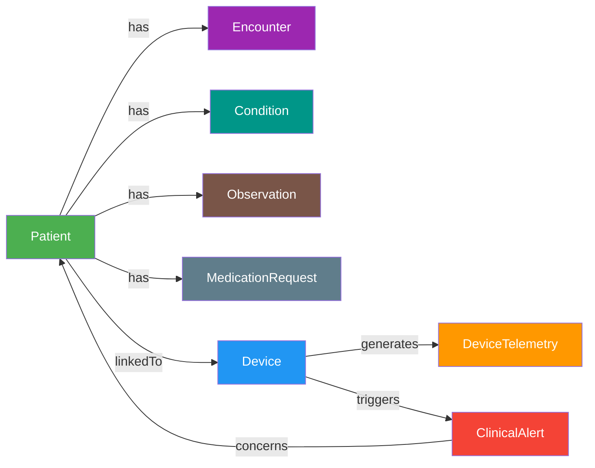

# Fabric IQ — Ontology Setup Guide

This guide walks through creating a **Fabric IQ Ontology** (`ClinicalDeviceOntology`) that provides a unified semantic layer across the Eventhouse (real-time telemetry + alerts) and Silver Lakehouse (FHIR clinical data).

## Prerequisites

| Requirement | Status |
|-------------|--------|
| Phase 1 + Phase 2 deployed (`deploy-fabric-rti.ps1`) | ✅ |
| Silver Lakehouse populated (HDS pipeline complete) | ✅ |
| Data Agents deployed (`deploy-data-agents.ps1`) | ✅ |
| Ontology item (preview) enabled on Fabric tenant | ✅ |
| Graph (preview) enabled on Fabric tenant | ✅ |
| Silver Lakehouse has OneLake security **disabled** | Required |
| Silver Lakehouse tables are **managed** (not external) | Required |

> **Limitation:** Ontology does not support lakehouses with OneLake security enabled, external tables, or delta tables with column mapping enabled. Verify these settings before proceeding.

## Ontology Data Model



### Entity Types

| Entity Type | Binding Type | Data Source | Source Table | Key Property |
|-------------|-------------|------------|-------------|--------------|
| Patient | Static | Silver Lakehouse | `dbo.Patient` | `idOrig` |
| Device | Static | Silver Lakehouse | `dbo.Device` | identifier value |
| Encounter | Static | Silver Lakehouse | `dbo.Encounter` | `idOrig` |
| Condition | Static | Silver Lakehouse | `dbo.Condition` | `idOrig` |
| MedicationRequest | Static | Silver Lakehouse | `dbo.MedicationRequest` | `idOrig` |
| Observation | Static | Silver Lakehouse | `dbo.Observation` | `idOrig` |
| DeviceAssociation | Static | Silver Lakehouse | `DeviceAssociation` | `id` |
| DeviceTelemetry | **Time Series** | MasimoEventhouse | `TelemetryRaw` | `device_id` |
| ClinicalAlert | Static | MasimoEventhouse | `AlertHistory` | `alert_id` |

### Relationship Types

| Relationship | Source → Target | Join Logic |
|-------------|----------------|------------|
| Patient **has** Encounter | Patient → Encounter | `Patient.idOrig = Encounter.patientRef` |
| Patient **has** Condition | Patient → Condition | `Patient.idOrig = Condition.patientRef` |
| Patient **has** Observation | Patient → Observation | `Patient.idOrig = Observation.patientRef` |
| Patient **has** MedicationRequest | Patient → MedicationRequest | `Patient.idOrig = MedicationRequest.patientRef` |
| Patient **linkedTo** Device | Patient → Device | via DeviceAssociation FK join |
| Device **generates** DeviceTelemetry | Device → DeviceTelemetry | `Device.deviceId = DeviceTelemetry.device_id` |
| Device **triggers** ClinicalAlert | Device → ClinicalAlert | `Device.deviceId = ClinicalAlert.device_id` |
| ClinicalAlert **concerns** Patient | ClinicalAlert → Patient | `ClinicalAlert.patient_id = Patient.idOrig` |

---

## Automated Deployment (Recommended)

The fastest way to create the ontology is via the REST API:

```powershell
# Create the DeviceAssociation table first (Step 0 below), then:
.\deploy-ontology.ps1
```

This creates the `ClinicalDeviceOntology` with all 9 entity types, data bindings, and 8 relationship types in a single API call. Skip to **Step 5: Validate** after running.

The manual steps below are provided for reference if you prefer portal-based creation.

---

## Step 0: Create the DeviceAssociation Table

The `Basic` table contains multiple FHIR resource types. Ontology binds to a single managed table per entity type, so create a filtered table that only contains device-association records.

> **Important:** The Lakehouse SQL analytics endpoint is **read-only** — you cannot create tables or views there. Run this as **Spark SQL** in a Fabric notebook attached to the Silver Lakehouse.

1. Open the Silver Lakehouse in the Fabric portal
2. Select **Open notebook** → **New notebook**
3. Paste the following into a code cell with `%%sql` magic, or upload the provided notebook at `fabric-rti/sql/create-device-association-table.ipynb`:

```sql
%%sql
CREATE OR REPLACE TABLE DeviceAssociation AS
SELECT
    id,
    idOrig,
    get_json_object(extension, '$[0].valueReference.reference') AS device_ref,
    get_json_object(subject_string, '$.display')                AS patient_name,
    get_json_object(subject_string, '$.idOrig')                 AS patient_id,
    get_json_object(code_string, '$.coding[0].code')            AS assoc_code,
    get_json_object(code_string, '$.coding[0].display')         AS assoc_display
FROM Basic
WHERE get_json_object(code_string, '$.coding[0].code') = 'device-assoc';
```

4. Run the cell
5. Verify: run `SELECT COUNT(*) FROM DeviceAssociation` — should return ~100 rows (one per Masimo device)

> **Note:** This creates a managed Delta table (not a view) so it is compatible with ontology data binding. Re-run this cell if the `Basic` table is refreshed with new device associations.

---

## Step 1: Create the Ontology Item

1. Navigate to the `med-device-rti-hds` workspace in the [Fabric portal](https://app.fabric.microsoft.com)
2. Select **+ New item**
3. Search for **Ontology (preview)** and select it
4. Enter `ClinicalDeviceOntology` as the name
5. Select **Create**

The ontology opens to an empty configuration canvas.

---

## Step 2: Create Entity Types with Static Bindings (Lakehouse)

Repeat the following process for each Lakehouse-backed entity type.

### 2a: Patient

1. Select **Add entity type** from the ribbon
2. Enter `Patient` → **Add Entity Type**
3. In the **Entity type configuration** pane, switch to the **Bindings** tab
4. Select **Add data to entity type**
5. Select the Silver Lakehouse → **Connect**
6. Select the `Patient` table (or `vw_Patient` if available) → **Next**
7. For **Binding type**, keep **Static**
8. Under **Bind your properties**, map the desired columns:
   - `idOrig` → `patientId`
   - `name_text` → `name` (or `name_given` + `name_family`)
   - `gender` → `gender`
   - `birthDate` → `birthDate`
9. Select **Save**
10. Back in the **Entity type configuration**, select **Add entity type key**
    - Choose `patientId` (`idOrig`) as the key
11. Set **Instance display name** to `name`

### 2b: Device

1. Add entity type → `Device`
2. Bind to Silver Lakehouse → `Device` table → Static
3. Map columns including device identifier, type, status, and patient reference
4. Set the device identifier value as the entity type key

### 2c: Encounter

1. Add entity type → `Encounter`
2. Bind to Silver Lakehouse → `Encounter` table → Static
3. Map: `idOrig`, `class_string`, `status`, `period_start`, `period_end`, subject reference
4. Set `idOrig` as entity type key

### 2d: Condition

1. Add entity type → `Condition`
2. Bind to Silver Lakehouse → `Condition` table → Static
3. Map: `idOrig`, code display, clinical status, subject reference
4. Set `idOrig` as entity type key

### 2e: MedicationRequest

1. Add entity type → `MedicationRequest`
2. Bind to Silver Lakehouse → `MedicationRequest` table → Static
3. Map: `idOrig`, medication name, status, `authoredOn`, subject reference
4. Set `idOrig` as entity type key

### 2f: Observation

1. Add entity type → `Observation`
2. Bind to Silver Lakehouse → `Observation` table → Static
3. Map: `idOrig`, code (LOINC), value, unit, `effectiveDateTime`, subject reference
4. Set `idOrig` as entity type key

> **Tip:** Observation has ~2.8M rows. Binding may take a few minutes.

### 2g: DeviceAssociation

1. Add entity type → `DeviceAssociation`
2. Bind to Silver Lakehouse → `DeviceAssociation` table → Static
3. Map: `id`, `device_ref`, `patient_name`, `patient_id`
4. Set `id` as entity type key, `patient_name` as instance display name

---

## Step 3: Create Entity Types with Eventhouse Bindings

### 3a: ClinicalAlert (Static — Eventhouse)

1. Add entity type → `ClinicalAlert`
2. Switch to **Bindings** tab → **Add data to entity type**
3. Select the `MasimoEventhouse` → `AlertHistory` table → **Connect**
4. For **Binding type**, keep **Static**
5. Map columns:
   - `alert_id` → `alertId`
   - `alert_time` → `alertTime`
   - `device_id` → `deviceId`
   - `patient_id` → `patientId`
   - `patient_name` → `patientName`
   - `alert_tier` → `alertTier` (WARNING / URGENT / CRITICAL)
   - `alert_type` → `alertType`
   - `metric_name` → `metricName`
   - `metric_value` → `metricValue`
   - `message` → `message`
   - `acknowledged` → `acknowledged`
6. Select **Save**
7. Set `alertId` as entity type key

### 3b: DeviceTelemetry (Time Series — Eventhouse)

1. Add entity type → `DeviceTelemetry`
2. In the **Properties** tab, add a property `deviceId` (string, static) — this is needed as the entity type key before time series binding
3. Switch to **Bindings** tab → **Add data to entity type**
4. Select `MasimoEventhouse` → `TelemetryRaw` table → **Connect**

**First, bind the static key:**
5. For **Binding type**, select **Static**
6. Map `device_id` → `deviceId`
7. Select **Save**
8. Set `deviceId` as entity type key

**Then, add the time series binding:**
9. **Add data to entity type** again
10. Select `MasimoEventhouse` → `TelemetryRaw` table → **Connect**
11. For **Binding type**, select **Timeseries**
12. Set **Source data timestamp column** to `timestamp`
13. Under **Static** section, bind `device_id` → `deviceId` (matches the key)
14. Under **Timeseries** section, map:
    - `telemetry.spo2` → `spo2`
    - `telemetry.pr` → `pr`
    - `telemetry.pi` → `pi`
    - `telemetry.pvi` → `pvi`
    - `telemetry.sphb` → `sphb`
    - `telemetry.signal_iq` → `signalIq`
15. Select **Save**

> **Note:** The `TelemetryRaw.timestamp` column is a **string** type (auto-created by Eventstream). Ontology should still accept it as the timestamp column, but if binding fails, you may need to create a KQL materialized view with an explicit `datetime` column.

---

## Step 4: Create Relationship Types

### 4a: Patient has Encounter

1. Select **Add relationship** from the ribbon
2. **Name:** `has`
3. **Source entity type:** `Patient`
4. **Target entity type:** `Encounter`
5. Select **Add relationship type**
6. In the **Relationship configuration** pane:
   - **Source data:** Select Silver Lakehouse → `Encounter` table
   - **Source entity type > Source column:** the column containing the patient reference (e.g., `subject_string` → `msftSourceReference`)
   - **Target entity type > Source column:** `idOrig`
7. Select **Create**

### 4b: Patient has Condition

Same pattern as 4a, using the `Condition` table.
- Source column (Patient FK): subject_string → `msftSourceReference`
- Target column: `idOrig`

### 4c: Patient has Observation

Same pattern, using the `Observation` table.

### 4d: Patient has MedicationRequest

Same pattern, using the `MedicationRequest` table.

### 4e: Patient linkedTo Device

1. **Name:** `linkedTo`
2. **Source entity type:** `Patient`
3. **Target entity type:** `Device`
4. **Source data:** `DeviceAssociation` table
5. Map `patient_id` → Patient key and `device_ref` → Device key

### 4f: Device generates DeviceTelemetry

1. **Name:** `generates`
2. **Source entity type:** `Device`
3. **Target entity type:** `DeviceTelemetry`
4. **Source data:** `TelemetryRaw`
5. Map `device_id` columns

### 4g: Device triggers ClinicalAlert

1. **Name:** `triggers`
2. **Source entity type:** `Device`
3. **Target entity type:** `ClinicalAlert`
4. **Source data:** `AlertHistory`
5. Map `device_id` columns

### 4h: ClinicalAlert concerns Patient

1. **Name:** `concerns`
2. **Source entity type:** `ClinicalAlert`
3. **Target entity type:** `Patient`
4. **Source data:** `AlertHistory`
5. Map `patient_id` → Patient key

---

## Step 5: Validate in Preview Experience

1. Switch to the **Preview** tab in the ontology item
2. Verify entity instance counts:
   - Patient: ~7,800
   - Device: ~100
   - Encounter: ~363,000
   - Condition: ~244,000
   - DeviceAssociation: ~100
   - ClinicalAlert: varies (depends on alert history)
3. Explore the auto-generated **Graph** view
4. Test traversals:
   - Select a Patient → view their Conditions, Encounters, linked Devices
   - Select a Device → view its Telemetry time series, triggered Alerts
   - Select a ClinicalAlert → navigate to the Patient it concerns → view their Conditions
5. If entity counts are zero, use **Refresh graph model** in the preview toolbar

---

## Step 6: Connect Data Agents to Ontology

Once the ontology is validated, add it as a datasource to existing Data Agents for richer, grounded responses.

1. Open the **Patient 360** Data Agent in the Fabric portal
2. In the agent configuration, add a new datasource
3. Select **Ontology** as the datasource type
4. Choose `ClinicalDeviceOntology`
5. The agent now has access to the unified business vocabulary — entity types and relationships ground the agent's responses in consistent terminology
6. Repeat for the **Clinical Triage** Data Agent

### Test Queries

After connecting the ontology, test these cross-domain queries:

| Query | Expected Behavior |
|-------|-------------------|
| "Show me Patient John Smith's conditions, linked devices, and recent SpO2 readings" | Agent uses ontology to traverse Patient → Condition, Patient → Device → DeviceTelemetry |
| "Which critical alerts are associated with patients who have COPD?" | Agent traverses ClinicalAlert → Patient → Condition, filtering by COPD |
| "What devices are generating the most alerts?" | Agent uses Device → ClinicalAlert relationship |
| "Give me a 360 view of the patient on device MASIMO-RADIUS7-0033" | Agent traverses Device → DeviceAssociation → Patient → all relationships |

---

## Troubleshooting

| Issue | Resolution |
|-------|-----------|
| "Unable to create ontology" error | Verify ontology preview is enabled in tenant admin settings |
| Data binding fails on Lakehouse table | Confirm the table is **managed** (not external), doesn't have OneLake security, and doesn't have column mapping enabled |
| Time series binding fails on `timestamp` | The TelemetryRaw `timestamp` column is string type; create a KQL materialized view with `todatetime(timestamp)` as the timestamp column |
| Entity instance count is 0 | Use **Refresh graph model** in the preview experience toolbar |
| `DeviceAssociation` table not found | Run the Spark SQL from Step 0 in a notebook attached to the Silver Lakehouse (the SQL analytics endpoint is read-only) |
| Relationship binding fails | Ensure both entity types have keys defined and the source data table contains columns that match both entity type keys |
| Graph view is empty | Relationships must be bound to data (not just defined) for graph edges to appear |
