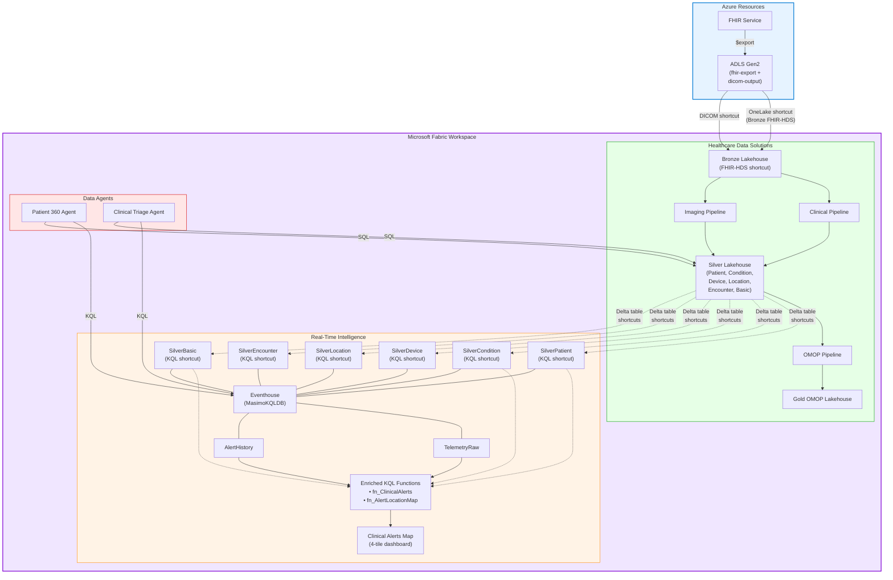
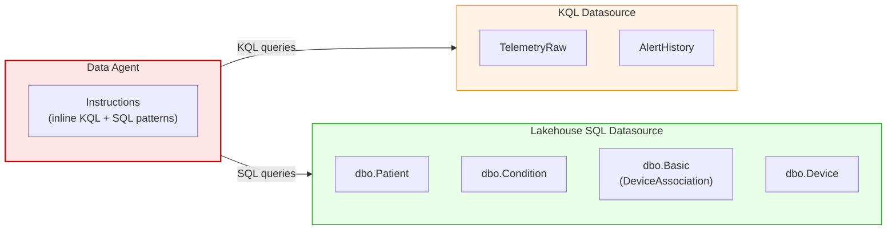

# Phase 2 — HDS Enrichment & Data Agents

Phase 2 bridges the real-time telemetry pipeline with FHIR clinical data by creating KQL shortcuts into the HDS Silver Lakehouse, deploying enriched clinical alert functions, and standing up AI Data Agents that federate queries across both data stores.

**Prerequisite:** [Phase 1](phase-1-infrastructure-and-ingestion.md) complete + Healthcare Data Solutions deployed manually in the Fabric portal (Bronze & Silver lakehouses populated).

**Typical duration:** ~35 minutes · **Steps:** 5 → 5b → 6

---

## Architecture



---

## Step 5 — Fabric RTI Phase 2

**Script:** `deploy-fabric-rti.ps1 -Phase2`

### 5a — Bronze Lakehouse Shortcut

Creates a OneLake shortcut named `FHIR-HDS` in the Bronze Lakehouse pointing to the FHIR `$export` data in ADLS Gen2. The shortcut name **must** be `FHIR-HDS` to match the HDS namespace path at `Files/Ingest/Clinical/FHIR-NDJSON/FHIR-HDS`.

### 5b — KQL Shortcuts to Silver Lakehouse

Creates 6 KQL external tables via OneLake shortcuts, connecting the Eventhouse to the Silver Lakehouse's delta tables:

| External Table | Silver Source | Key Fields |
|----------------|-------------|------------|
| `SilverPatient` | Patient | `idOrig`, `name`, `birthDate`, `gender`, `address` |
| `SilverCondition` | Condition | `code`, `subject`, `clinicalStatus` |
| `SilverDevice` | Device | `serialNumber`, `type`, `manufacturer` |
| `SilverLocation` | Location | `name`, `address`, `position` |
| `SilverEncounter` | Encounter | `subject`, `period`, `location`, `class` |
| `SilverBasic` | Basic (DeviceAssociation) | `code`, `subject`, `extension` (device ref) |

> **Note:** Silver Lakehouse columns like `code`, `subject`, `name`, `location`, `period`, `position`, `address` are **dynamic** type. The `extension` column is **string** type and requires `parse_json()`.

### 5c — Enriched KQL Functions

| Function | Purpose |
|----------|---------|
| `fn_ClinicalAlerts` | Joins telemetry with patient context via DeviceAssociation; adds severity escalation for COPD, CHF, asthma, hypertension |
| `fn_AlertLocationMap` | Joins alerts with Encounter → Location for hospital-level geolocation; defaults to Nashville, TN for unmapped patients |

### 5d — Clinical Alerts Map Dashboard

4-tile dashboard with 30-second auto-refresh:

| Tile | Visual | Data |
|------|--------|------|
| Alert Locations | Map (bubble) | `fn_AlertLocationMap(60)` — grouped by hospital, sized by count |
| Alerts by Hospital | Bar chart | Severity breakdown per hospital |
| Total Active Alerts | Card | Alert count |
| Alert Detail | Table | Device, patient, tier, vitals, location |

### 5e — DICOM Shortcut + HDS Pipelines

**Script:** `storage-access-trusted-workspace.ps1`

Creates the DICOM OneLake shortcut and triggers HDS pipelines:
1. **DICOM shortcut** — ADLS Gen2 `dicom-output` → Bronze Lakehouse `/Files/Ingest/Imaging/DICOM/DICOM-HDS/`
2. **Clinical pipeline** (includes imaging ingestion) — flows FHIR clinical data + DICOM metadata into Silver tables
3. **OMOP pipeline** — populates Gold OMOP CDM v5.4 tables from Silver data

> **Pipeline order matters:** Imaging (includes clinical) runs first → then OMOP (sequential, not parallel).

```powershell
# Standalone Phase 2
.\Deploy-All.ps1 -Phase2 `
    -ResourceGroupName "rg-medtech-rti-fhir" `
    -Location "eastus" `
    -FabricWorkspaceName "med-device-rti-hds" `
    -Tags @{SecurityControl='Ignore'}
```

---

## Step 6 — Data Agents

**Script:** `deploy-data-agents.ps1`

Deploys two AI-powered Data Agents with **dual-datasource architecture**:



### Patient 360 Agent

Unified patient view across FHIR clinical data and real-time telemetry:
- Latest vital signs per device (SpO2, pulse rate, perfusion index)
- Device status (online/stale/offline)
- Patient demographics, conditions, device assignments
- Cross-datasource lookups: *"Show patient info for device MASIMO-RADIUS7-0033"*

### Clinical Triage Agent

Rapid triage decisions with alert prioritization:
- Multi-metric alert detection (SpO2 + pulse rate combined)
- Severity tiers: CRITICAL / URGENT / WARNING
- Cross-datasource patient identification for alerting devices
- Sample queries: *"Run a clinical triage"*, *"Which devices have low SpO2? Look up the patients."*

### Key Data Patterns

| Table | Access | Key Fields |
|-------|--------|------------|
| `TelemetryRaw` | KQL | `device_id`, `timestamp` (string!), `telemetry.spo2`, `telemetry.pr` |
| `AlertHistory` | KQL | Historical alert records |
| `dbo.Basic` | SQL | Device-patient associations via `code_string`, `extension`, `subject_string` |
| `dbo.Condition` | SQL | Patient diagnoses via `code_string`, `subject_string` |
| `dbo.Patient` | SQL | Demographics via `name_string`, `idOrig` |

> **Critical:** Device associations in `dbo.Basic` use code `'device-assoc'` (not `'ASSIGNED'`). The `code_string` column is a JSON **object** (not array) — use `JSON_VALUE(code_string, '$.coding[0].code')`.

```powershell
# Deploy both agents
.\deploy-data-agents.ps1 -FabricWorkspaceName "med-device-rti-hds"

# Deploy individually
.\deploy-data-agents.ps1 -Patient360Only
.\deploy-data-agents.ps1 -TriageOnly

# Quick-update existing agent definitions
.\update-agents-inline.ps1
```

---

## Running Phase 2

```powershell
# Full Phase 2 (shortcuts + pipelines + agents)
.\Deploy-All.ps1 -Phase2 `
    -ResourceGroupName "rg-medtech-rti-fhir" `
    -Location "eastus" `
    -FabricWorkspaceName "med-device-rti-hds" `
    -Tags @{SecurityControl='Ignore'}

# With explicit Silver Lakehouse ID (auto-detected if omitted)
.\Deploy-All.ps1 -Phase2 `
    -SilverLakehouseId "<guid>" `
    -SilverLakehouseName "healthcare1_silver" `
    ...
```

---

**Previous:** [← Phase 1 — Infrastructure & Ingestion](phase-1-infrastructure-and-ingestion.md) · **Next:** [Phase 3 — Imaging & Cohorting →](phase-3-imaging-and-cohorting.md)
