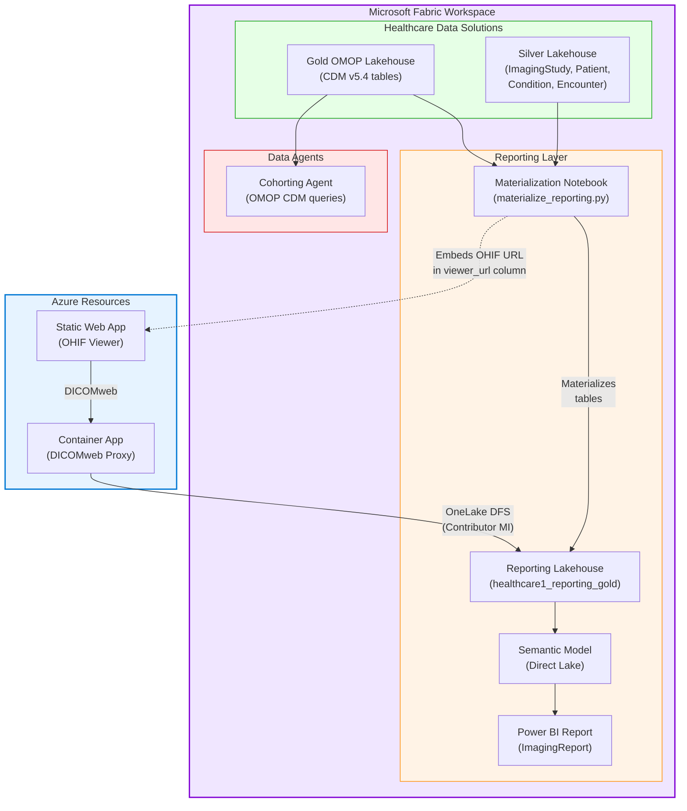

# Phase 3 — Imaging Report & Cohorting

Phase 3 deploys the clinical imaging layer: a DICOM Viewer (OHIF), a Cohorting Data Agent for querying OMOP CDM tables via natural language, a materialization notebook that builds reporting tables, and a Power BI Direct Lake report — all from the companion [FabricDicomCohortingToolkit](../../FabricDicomCohortingToolkit/) repo.

**Prerequisite:** [Phase 2](phase-2-hds-enrichment-and-agents.md) complete + Gold OMOP pipeline finished (Gold Lakehouse populated).

**Typical duration:** ~4 minutes · **Step:** 7

---

## Architecture



---

## Step 7a — Cohorting Data Agent

**Script:** `FabricDicomCohortingToolkit/Deploy-DataAgent.ps1`

Deploys the **HDS Multi-Layer Imaging Cohort Agent** — a natural-language agent that queries across the Gold OMOP CDM tables to answer cohorting questions like:
- *"Find all patients with COPD who had a chest CT in the last 6 months"*
- *"How many patients have both diabetes and imaging studies?"*
- *"Show me the imaging cohort for condition X"*

The agent uses few-shot prompts from `fewshots-gold-omop.json` and `fewshots-silver-fhir.json` to generate accurate SQL against the OMOP CDM schema.

---

## Step 7b — DICOM Viewer

**Script:** `FabricDicomCohortingToolkit/dicom-viewer/Deploy-DicomViewer.ps1`

Deploys the OHIF medical image viewer as an Azure Static Web App with a DICOMweb proxy:

```mermaid
flowchart LR
    USER["Clinician\n(Browser)"] --> SWA["Azure Static Web App\n(OHIF v3 Viewer)"]
    SWA -->|"DICOMweb\nWADO-RS"|  PROXY["Container App\n(DICOMweb Proxy)"]
    PROXY -->|"Managed Identity\n(Contributor on Workspace)"|  OL["OneLake\n(Bronze Lakehouse\nDICOM-HDS shortcut)"]

    style USER fill:#f5f5f5,stroke:#999
    style SWA fill:#e6f3ff,stroke:#0078d4
    style PROXY fill:#fff3e6,stroke:#ff8c00
    style OL fill:#f0e6ff,stroke:#8000d4
```

| Component | Azure Resource | Purpose |
|-----------|---------------|--------|
| OHIF Viewer | Static Web App | Open-source DICOM viewer UI (OHIF v3) |
| DICOMweb Proxy | Container App | Reads .dcm files from OneLake just-in-time, serves DICOMweb responses |
| OneLake | Bronze Lakehouse (DICOM-HDS shortcut) | Stores re-tagged TCIA DICOM files via ADLS Gen2 shortcut |

> **Permissions:** The DICOMweb Proxy Container App managed identity must have **`Contributor` role** on the Fabric workspace for OneLake DFS file reads. `Deploy-All.ps1` Step 3e handles this automatically.

The viewer must be deployed **before** the materialization notebook (Step 7c) so the OHIF URL can be embedded in the reporting data.

---

## Step 7c — Reporting Lakehouse & Materialization Notebook

**Script:** `FabricDicomCohortingToolkit/deploy-notebook.ps1`

1. Creates the `healthcare1_reporting_gold` lakehouse (if it doesn't exist)
2. Deploys `materialize_reporting.py` as a Fabric notebook
3. Auto-discovers the OHIF Viewer URL from Azure
4. Patches the URL into the notebook before upload
5. Runs the notebook to materialize reporting tables

The notebook uses `notebookutils` to dynamically resolve workspace and lakehouse IDs — no hardcoded GUIDs. It joins Silver + Gold lakehouse tables and adds a `viewer_url` column with deep links to the OHIF viewer for each imaging study.

---

## Step 7d — Power BI Imaging Report

**Script:** `FabricDicomCohortingToolkit/Deploy-ImagingReport.ps1`

Deploys a **Direct Lake** Power BI report (`ImagingReport.pbip`) connected to the reporting lakehouse semantic model. Direct Lake means Power BI reads directly from OneLake parquet files — no import or query overhead.

The report provides:
- Imaging study counts by modality, body part, and condition
- Patient demographics linked to imaging studies
- Clickable links to the OHIF DICOM Viewer for each study
- OMOP CDM cross-references

---

## Step 7e — Verify Proxy Permissions & DICOM Index

**Script:** Inline in `Deploy-All.ps1` (Step 3e)

After all Phase 3 components are deployed, the orchestrator automatically:

1. **Assigns proxy MI as Contributor** on the Fabric workspace (required for OneLake DFS file reads)
2. **Checks the DICOM index** via the proxy health endpoint (`/health` → `studies` count)
3. If the index is empty (0 studies), prints the rebuild command

> **Why Contributor?** Fabric's `Viewer` role only allows portal access — it does **not** grant OneLake DFS API read permissions. The proxy needs `Contributor` (or `Member`) to fetch `.dcm` files from the Bronze Lakehouse DICOM-HDS shortcut.

If the proxy shows 0 studies after deployment, rebuild the index:

```powershell
cd ..\FabricDicomCohortingToolkit\dicom-viewer
.\Deploy-DicomViewer.ps1 `
    -ResourceGroup "rg-medtech-rti-fhir" `
    -FabricWorkspaceName "med-device-rti-hds" `
    -Location "eastus" -SkipOhifBuild
```

---

## Running Phase 3

```powershell
# Via Deploy-All.ps1 (recommended — runs all sub-steps in order)
.\Deploy-All.ps1 -Phase3 `
    -FabricWorkspaceName "med-device-rti-hds" `
    -Location "eastus" `
    -ResourceGroupName "rg-medtech-rti-fhir" `
    -DicomToolkitPath "C:\git\FabricDicomCohortingToolkit"

# Or run each step individually from the toolkit repo:
cd ..\FabricDicomCohortingToolkit

# 1. Cohorting Agent
.\Deploy-DataAgent.ps1 -FabricWorkspaceName "med-device-rti-hds"

# 2. DICOM Viewer (must be before notebook)
.\dicom-viewer\Deploy-DicomViewer.ps1 `
    -ResourceGroup "rg-medtech-rti-fhir" `
    -FabricWorkspaceName "med-device-rti-hds" `
    -Location "eastus"

# 3. Materialization Notebook (auto-discovers OHIF URL)
.\deploy-notebook.ps1 `
    -FabricWorkspaceName "med-device-rti-hds" `
    -DicomViewerResourceGroup "rg-medtech-rti-fhir"

# 4. Power BI Report (Direct Lake)
.\Deploy-ImagingReport.ps1 -FabricWorkspaceName "med-device-rti-hds"
```

> **Order matters:** Deploy the DICOM Viewer (7b) before the notebook (7c) so the OHIF URL is available for embedding in the reporting tables.

---

## Companion Repo

Phase 3 resources live in the [FabricDicomCohortingToolkit](../../FabricDicomCohortingToolkit/) repo:

```
FabricDicomCohortingToolkit/
├── Deploy-DataAgent.ps1          # Cohorting agent deployment
├── Deploy-ImagingReport.ps1      # Power BI report deployment
├── deploy-notebook.ps1           # Materialization notebook deployment
├── materialize_reporting.py      # Spark notebook source
├── fewshots-gold-omop.json       # Agent few-shot examples (OMOP)
├── fewshots-silver-fhir.json     # Agent few-shot examples (FHIR)
├── ImagingReport.pbip            # Power BI project file
├── dicom-viewer/
│   └── Deploy-DicomViewer.ps1    # OHIF + DICOMweb proxy deployment
├── ImagingReport.Report/         # Power BI report definition
└── ImagingReport.SemanticModel/  # Direct Lake semantic model
```

---

**Previous:** [← Phase 2 — HDS Enrichment & Data Agents](phase-2-hds-enrichment-and-agents.md) · **Overview:** [← README](../README.md)
