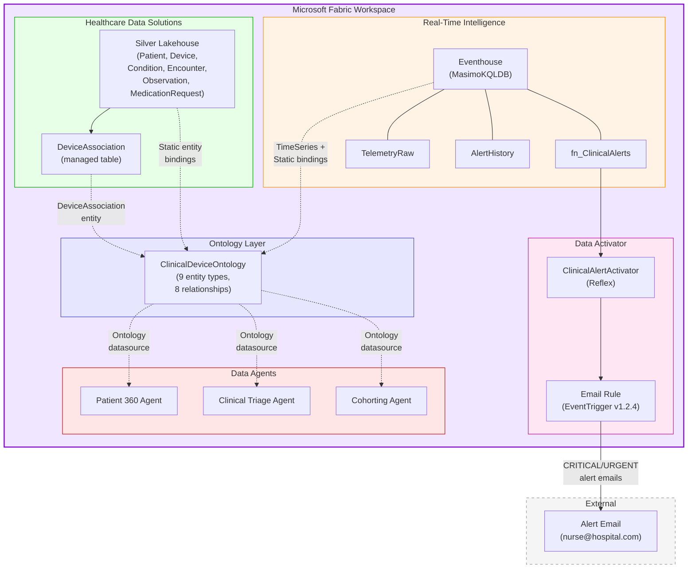
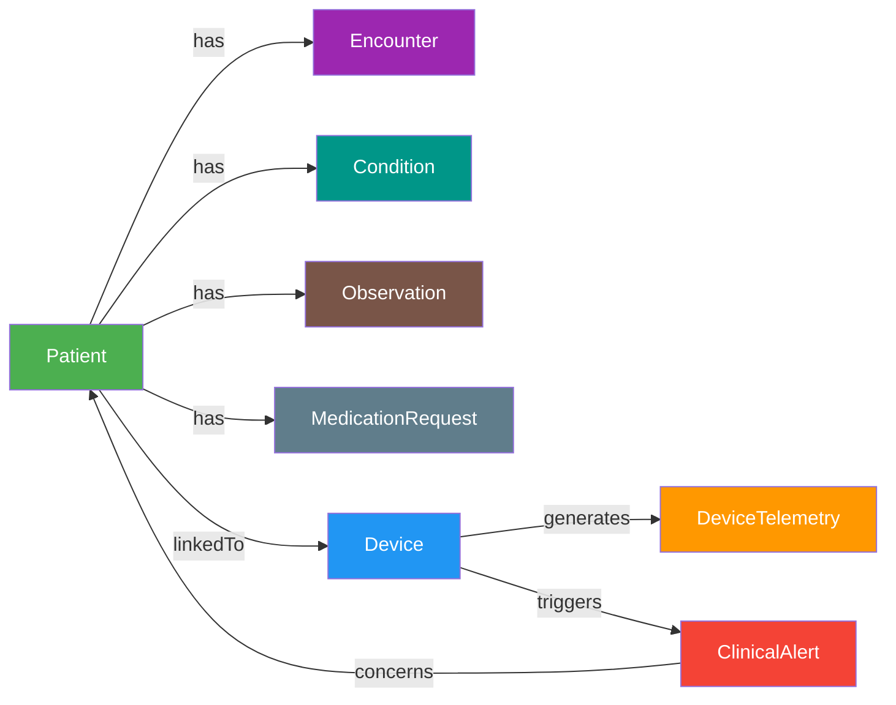
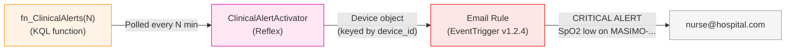

# Stage 4 & 5 — Connected Semantic Intelligence & Bedside Alerting

⏱️ **Typical Duration:** ~5 minutes | 🛠️ **Fabric Workloads:** Fabric IQ, Data Activator, Data Agents | 🔑 **Min Roles:** Azure Owner, Fabric Admin

---

> [!NOTE]
> **Deployment Prerequisites:**
> Before running this phase, ensure Stage 3 is complete, the Fabric tenant previews for Ontology & Data Activator are enabled, and the HDS Silver Lakehouse has OneLake security disabled (ontology limitation). Refer to the centralized [📋 Prerequisites & Requirements](file:///Users/joey/git/med-device-fabric-emulator/README.md#📋-prerequisites--requirements) in the root repository folder.

---

## Architecture



---

## Step 8 — Ontology Deployment

**Script:** `phase-4/deploy-ontology.ps1`

### 8a — DeviceAssociation Table

The `Basic` table contains multiple FHIR resource types. Since ontology requires one managed table per entity type, Deploy-All.ps1 creates a filtered `DeviceAssociation` table via a Spark SQL notebook:

```sql
CREATE OR REPLACE TABLE DeviceAssociation AS
SELECT
    id, idOrig,
    get_json_object(extension, '$[0].valueReference.reference') AS device_ref,
    get_json_object(subject_string, '$.display')                AS patient_name,
    get_json_object(subject_string, '$.idOrig')                 AS patient_id,
    get_json_object(code_string, '$.coding[0].code')            AS assoc_code,
    get_json_object(code_string, '$.coding[0].display')         AS assoc_display
FROM Basic
WHERE get_json_object(code_string, '$.coding[0].code') = 'device-assoc'
```

The notebook is uploaded to the workspace, attached to the Silver Lakehouse, executed, and the result verified automatically.

### 8b — ClinicalDeviceOntology

Creates the `ClinicalDeviceOntology` via the Fabric REST API with:

**9 Entity Types:**

| Entity Type | Binding | Data Source | Source Table |
|-------------|---------|------------|--------------|
| Patient | Static | Silver Lakehouse | `dbo.Patient` |
| Device | Static | Silver Lakehouse | `dbo.Device` |
| Encounter | Static | Silver Lakehouse | `dbo.Encounter` |
| Condition | Static | Silver Lakehouse | `dbo.Condition` |
| MedicationRequest | Static | Silver Lakehouse | `dbo.MedicationRequest` |
| Observation | Static | Silver Lakehouse | `dbo.Observation` |
| DeviceAssociation | Static | Silver Lakehouse | `DeviceAssociation` |
| DeviceTelemetry | **Time Series** | Eventhouse | `TelemetryRaw` |
| ClinicalAlert | Static | Eventhouse | `AlertHistory` |

**8 Relationships:**

| Relationship | Source → Target | Join Logic |
|-------------|----------------|------------|
| Patient **has** Encounter | Patient → Encounter | `Patient.idOrig = Encounter.patientRef` |
| Patient **has** Condition | Patient → Condition | `Patient.idOrig = Condition.patientRef` |
| Patient **has** Observation | Patient → Observation | `Patient.idOrig = Observation.patientRef` |
| Patient **has** MedicationRequest | Patient → MedicationRequest | `Patient.idOrig = MedicationRequest.patientRef` |
| Patient **linkedTo** Device | Patient → Device | via DeviceAssociation FK join |
| Device **generates** DeviceTelemetry | Device → DeviceTelemetry | `Device.deviceId = DeviceTelemetry.device_id` |
| Device **triggers** ClinicalAlert | Device → ClinicalAlert | `Device.deviceId = ClinicalAlert.device_id` |
| ClinicalAlert **concerns** Patient | ClinicalAlert → Patient | `ClinicalAlert.patient_id = Patient.idOrig` |



### 8c — Agent Ontology Binding

After creating the ontology, the script binds it as a datasource to all three Data Agents:
- **Patient 360** — gains entity relationship context for patient ↔ device ↔ telemetry queries
- **Clinical Triage** — uses ontology for device → alert → patient reasoning chains
- **Cohorting Agent** — enables cross-domain cohort queries with semantic entity awareness

The binding adds two files to each agent's definition:
- `Files/Config/draft/ontology-ClinicalDeviceOntology/datasource.json` — artifact ID, type, description
- `Files/Config/draft/ontology-ClinicalDeviceOntology/fewshots.json` — empty few-shot array (ontology is self-describing)

```powershell
# Standalone ontology deployment
.\phase-4\deploy-ontology.ps1 -FabricWorkspaceName "med-device-rti-hds"
```

---

## Step 9 — Data Activator (Reflex)

**Script:** Inline in `Deploy-All.ps1` (Step 9d)

Deploys a **Data Activator** (Reflex) item named `ClinicalAlertActivator` that sends email notifications when critical or urgent clinical alerts are detected.

### Data Pipeline



| Component | Detail |
|-----------|--------|
| **KQL Source** | `fn_ClinicalAlerts(N)` filtered to CRITICAL + URGENT tiers |
| **Object** | `Device` (keyed by `device_id`) |
| **Attributes** | `alert_tier`, `spo2`, `pr`, `patient_name`, `message` (6 total) |
| **Rule** | `EventTrigger v1.2.4` — fires on every alert event |
| **Action** | Email with subject, headline, and context fields |
| **Cooldown** | Configurable via `-AlertCooldownMinutes` (default: 15) |

### Email Content

| Field | Template |
|-------|----------|
| **Subject** | `CLINICAL ALERT - SpO2 low on {device_id}` |
| **Headline** | `{alert_tier} ALERT: {patient_name} - SpO2 {spo2}` |
| **Body** | `SpO2: {spo2}% \| PR: {pr} bpm \| {message}` |
| **Context** | `device_id`, `alert_tier`, `spo2`, `pr`, `patient_name`, `message` |

### Deployment Notes

The Reflex is created in two API calls due to a Fabric limitation:
1. **Create** the Reflex with KQL data pipeline only (entities without the rule)
2. **Update definition** to add the email rule (EventTrigger with KQL source is rejected on Create)

> **Requires:** `-AlertEmail` parameter. If omitted, the Activator step is skipped with a warning.


---

## Running Phase 4

```powershell
# Via Deploy-All.ps1 (recommended)
.\Deploy-All.ps1 -Phase4 `
    -FabricWorkspaceName "med-device-rti-hds" `
    -Location "eastus" `
    -AlertEmail "nurse@hospital.com" `
    -AlertTierThreshold "URGENT" `
    -AlertCooldownMinutes 15

# Without email alerts (ontology + binding only)
.\Deploy-All.ps1 -Phase4 `
    -FabricWorkspaceName "med-device-rti-hds" `
    -Location "eastus"

# Ontology only (standalone script)
.\phase-4\deploy-ontology.ps1 -FabricWorkspaceName "med-device-rti-hds"
```

### Parameters

| Parameter | Default | Description |
|-----------|---------|-------------|
| `-AlertEmail` | *(none)* | Email address for clinical alert notifications |
| `-AlertTierThreshold` | `URGENT` | Minimum tier to send email: `WARNING`, `URGENT`, or `CRITICAL` |
| `-AlertCooldownMinutes` | `15` | Suppress duplicate alerts per device within this window |

---

## What Gets Created

| Item | Type | Fabric Workload |
|------|------|-----------------|
| `create_device_association_table` | Notebook | Data Engineering |
| `DeviceAssociation` | Managed Table | Data Engineering (Silver Lakehouse) |
| `ClinicalDeviceOntology` | Ontology | Fabric IQ |
| `ClinicalAlertActivator` | Reflex | Data Activator |

---

## Troubleshooting

| Issue | Resolution |
|-------|-----------|
| Ontology creation fails with "OneLake security" error | Disable OneLake security on the Silver Lakehouse in Fabric portal |
| DeviceAssociation notebook fails | Verify `Basic` table exists in Silver Lakehouse; re-run clinical pipeline |
| Agent binding fails with 409 | Another operation is in progress; wait and re-run Phase 4 |
| No email alerts received | Verify `-AlertEmail` was provided and Data Activator is enabled in tenant settings |
| Reflex shows 0 data in portal | Check that `fn_ClinicalAlerts` returns results; emulator must be running |

---

### 🏁 Stage 4 & 5 Success Verification Checklist

Ensure all of the following components are verified before moving on to Stage 6:

> [!IMPORTANT]
> **Stage 4 & 5 Verification Checkpoints:**
> - [ ] **DeviceAssociation Table Active:** Verify that the Spark notebook successfully parsed the Silver Lakehouse `Basic` table and populated the `DeviceAssociation` table.
> - [ ] **Fabric IQ Ontology Online:** Verify that the `ClinicalDeviceOntology` semantic layer is visible and active in your Fabric workspace under the Fabric IQ tab.
> - [ ] **9 Entities & 8 Relations Validated:** Inspect the ontology in the Fabric portal to ensure it correctly binds `dbo.Patient`, `dbo.Device`, `TelemetryRaw` (time-series), `AlertHistory`, and others with active relationships.
> - [ ] **Agent Bindings Applied:** The draft definitions of **Patient 360**, **Clinical Triage**, and **Cohorting Agent** are updated to list the `ClinicalDeviceOntology` as an active datasource in their configurations.
> - [ ] **Reflex Alert Activator Created:** The `ClinicalAlertActivator` Reflex is visible and successfully maps dynamic fields from `fn_ClinicalAlerts`.
> - [ ] **Email Rule Configured:** The Reflex includes an active `EventTrigger` rule directed to your alert email with the requested cooldown window.
> - [ ] **E2E Alert Sim:** Let the Masimo oximeter emulator trigger a SpO2 drop (below 90% or 85%). Verify that a beautifully formatted clinical alert notification is successfully delivered to your designated email inbox.

---

**Previous:** [← Stage 3 — Multimodal Cohorting & Imaging](phase-3-imaging-and-cohorting.md) · **Overview:** [← README](../README.md)
