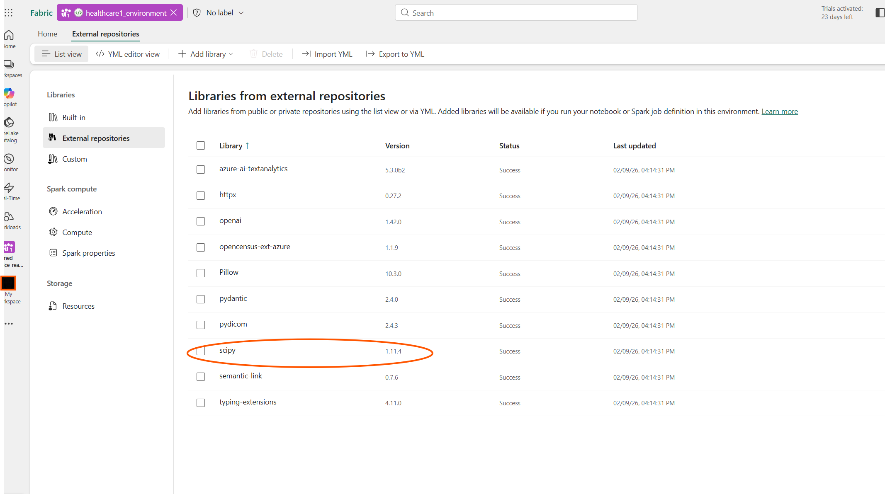

# Healthcare Data Solutions — Clinical Foundations Setup Guide

This guide walks through deploying **Healthcare Data Solutions (HDS) Clinical Foundations** in Microsoft Fabric and connecting it to the existing Azure FHIR Service for enriched clinical alerts.

## Deployment Order of Operations

The deployment follows a **two-phase approach** because HDS must be deployed manually through the Fabric portal before KQL shortcuts can be created:

```
Phase 1 (Automated)         Manual Steps              Phase 2 (Automated)
═══════════════════    ═══════════════════════    ═══════════════════════
.\deploy-fabric-rti.ps1    Fabric Portal              .\deploy-fabric-rti.ps1 -Phase2

┌──────────────────┐   ┌───────────────────────┐   ┌───────────────────────┐
│ ✓ Workspace      │   │ 1. Deploy HDS         │   │ ✓ SilverPatient       │
│ ✓ Eventhouse     │   │ 2. Deploy Data        │   │   shortcut            │
│ ✓ KQL Database   │──▶│    Foundations         │──▶│ ✓ SilverCondition     │
│ ✓ Eventstream    │   │ 3. Add scipy 1.11.4   │   │   shortcut            │
│ ✓ AlertHistory   │   │ 4. Create shortcut    │   │ ✓ SilverDevice        │
│ ✓ Base functions │   │    (Bronze → export)  │   │   shortcut            │
│   (01-03)        │   │ 5. Update config      │   │ ✓ Enriched            │
│ ✓ FHIR $export   │   │ 6. Run pipeline       │   │   fn_ClinicalAlerts   │
│   → ADLS Gen2    │   └───────────────────────┘   └───────────────────────┘
└──────────────────┘
```

> **Note:** The FHIR `$export` is called directly via the FHIR REST API in Phase 1.
> No Azure Marketplace offer or Fabric AHDS Data Export capability is needed.

## Prerequisites

| Requirement | Status |
|-------------|--------|
| Azure FHIR Service deployed | ✅ `deploy.ps1` / `deploy-fhir.ps1` |
| FHIR data loaded (Synthea patients + devices) | ✅ FHIR Loader job |
| Fabric workspace created | ✅ `deploy-fabric-rti.ps1` |
| Eventhouse + Eventstream created | ✅ `deploy-fabric-rti.ps1` |
| FHIR data exported to ADLS Gen2 | ✅ `deploy-fabric-rti.ps1` (Step 6.5) |
| Fabric capacity (trial or paid) | Required |

## Architecture

```
┌─────────────────────────────────────────────────────────┐
│ Azure                                                   │
│  FHIR Service ──($export)──▶ ADLS Gen2 (NDJSON files)  │
└───────────────────────────────────┬─────────────────────┘
                                    │
                        OneLake Shortcut (BYOS)
                                    │
┌───────────────────────────────────▼─────────────────────┐
│ Microsoft Fabric — Healthcare Data Solutions             │
│                                                         │
│  Bronze Lakehouse          Silver Lakehouse              │
│  ┌─────────────────┐       ┌──────────────────────────┐ │
│  │ ClinicalFhir    │──────▶│ Patient     (7,800 rows) │ │
│  │ (staging table)  │       │ Device      (100 rows)   │ │
│  │                  │       │ Condition   (244K rows)  │ │
│  │                  │       │ Observation (2.8M rows)  │ │
│  │                  │       │ Encounter   (363K rows)  │ │
│  │                  │       │ MedicationRequest (250K) │ │
│  └─────────────────┘       └──────────────────────────┘ │
│                                       │                  │
│                          External Table / Shortcut       │
│                                       │                  │
│  Eventhouse (MasimoKQLDB)             │                  │
│  ┌────────────────────────────────────▼─────┐           │
│  │ TelemetryRaw (real-time)                  │           │
│  │ + JOIN SilverPatient, SilverCondition     │           │
│  │ = Enriched Clinical Alerts                │           │
│  └──────────────────────────────────────────┘           │
└─────────────────────────────────────────────────────────┘
```

## Step 1: Deploy Healthcare Data Solutions

1. Sign in to the [Fabric portal](https://app.fabric.microsoft.com)
2. Navigate to your workspace (default: **med-device-real-time**)
3. Select **New item** → search for **Healthcare data solutions**
4. Complete the **Setup wizard**:
   - Accept the terms
   - Select your workspace
   - Click **Create**

This creates the HDS environment in your workspace.

## Step 2: Deploy Healthcare Data Foundations

Healthcare Data Foundations is the prerequisite capability that provides the medallion lakehouse architecture.

1. From the HDS home page, select **Healthcare data foundations**
2. Click **Deploy to workspace**
3. Wait for deployment to complete (a few minutes)

### Artifacts Created

| Artifact | Type | Purpose |
|----------|------|---------|
| `healthcare#_environment` | Environment | Spark 3.4 runtime with required libraries |
| `healthcare#_msft_config_notebook` | Notebook | Global configuration values |
| `healthcare#_msft_bronze_silver_flatten` | Notebook | Flattens ClinicalFhir → Silver tables |
| `healthcare#_msft_fhir_ndjson_bronze_ingestion` | Notebook | Ingests NDJSON files into Bronze |
| `healthcare#_msft_raw_process_movement` | Notebook | Moves processed files |
| `healthcare#_msft_fhir_flattening_sample` | Notebook | Sample flattening patterns |
| `healthcare#_msft_clinical_data_foundation_ingestion` | Pipeline | End-to-end ingestion pipeline |
| Admin Lakehouse | Lakehouse | Config + execution tracking |
| Bronze Lakehouse | Lakehouse | Raw/staged FHIR data |
| Silver Lakehouse | Lakehouse | Flattened FHIR R4 tables |

## Step 2b: Add scipy to HDS Spark Environment (REQUIRED)

> **⚠️ CRITICAL — Do this BEFORE running any HDS pipeline or notebook.**
>
> The HDS flattening notebooks depend on `scipy` but it is **not** included in the
> default HDS Spark environment. If you skip this step, the bronze-to-silver
> flattening will fail with an `ImportError`.

1. Open the **`healthcare#_environment`** item in your workspace
2. In the left sidebar, navigate to **Libraries** → **External repositories**
3. Click **+ Add library**
4. Search for **`scipy`** and select version **`1.11.4`**
5. Click **Add**
6. Click **Publish** at the top to save the environment
7. Wait for the environment to finish publishing (this may take a few minutes)

### Required Version

| Library | Version | Why |
|---------|---------|-----|
| `scipy` | `1.11.4` | Required by HDS flattening notebooks for statistical transformations |

### Screenshot — Adding scipy to External Repositories

The screenshot below shows the `healthcare1_environment` with `scipy 1.11.4` successfully added to **External repositories** alongside the other HDS libraries:



> **Note:** The HDS environment ships with libraries like `azure-ai-textanalytics`, `httpx`,
> `openai`, `pydantic`, `pydicom`, `semantic-link`, etc. — but `scipy` is missing and must
> be added manually. Without it, the flattening step will fail when processing FHIR bundles.

## Step 3: Create OneLake Shortcut (Bronze LH → FHIR Export Storage)

Phase 1 of `deploy-fabric-rti.ps1` already ran the FHIR `$export` to an ADLS Gen2 storage
account (Step 6.5). Now link that storage to the Bronze Lakehouse so HDS can ingest it.

> **No Marketplace offer needed.** We call the FHIR `$export` API directly rather than
> deploying the "Healthcare data solutions in Microsoft Fabric" Azure Marketplace offer.
> This avoids the Function App, Key Vault, and extra storage account that offer creates.

1. Open the **Bronze Lakehouse** in your workspace
2. Navigate to **Files** → right-click → **New shortcut**
3. Select **Azure Data Lake Storage Gen2**
4. Enter the storage account URL printed by Phase 1:
   ```
   https://<storage-account>.dfs.core.windows.net
   ```
5. Select the **`fhir-export`** container
6. Create the shortcut at this path:
   ```
   Files/Ingest/Clinical/FHIR-NDJSON/AHDS-FHIR
   ```

## Step 4: Update Configuration

1. Open **Admin Lakehouse** → `Files/system-configurations/deploymentParametersConfiguration.json`
2. Find the `source_path_pattern` under `healthcare#_msft_fhir_ndjson_bronze_ingestion`
3. Update it to use the shortcut path:
   ```
   abfss://<workspace_id>@onelake.dfs.fabric.microsoft.com/<bronze_lakehouse_id>/Files/Ingest/Clinical/FHIR-NDJSON/AHDS-FHIR
   ```

## Step 5: Run the Clinical Data Foundation Pipeline

1. Open **`healthcare#_msft_clinical_data_foundation_ingestion`** pipeline
2. Click **Run**
3. The pipeline will:
   - Ingest NDJSON files from the shortcut into Bronze `ClinicalFhir` table
   - Flatten data into Silver lakehouse FHIR R4 tables

### Expected Silver Lakehouse Data

| Table | Expected Rows | Description |
|-------|--------------|-------------|
| Patient | ~7,800 | Demographics, identifiers, names |
| Device | ~100 | Masimo Radius-7 pulse oximeters |
| Condition | ~244,800 | Diagnoses with SNOMED CT codes |
| Observation | ~2,801,600 | Vital signs, lab results |
| Encounter | ~363,600 | Admissions, visits |
| MedicationRequest | ~250,000 | Medication orders |
| Procedure | ~1,019,500 | Surgical/clinical procedures |
| Immunization | ~116,800 | Vaccination records |
| Basic | ~100 | Device-patient associations |

## Step 6: Connect Silver Lakehouse to Eventhouse (Phase 2)

> **This step is now automated.** Run Phase 2 of the deployment script:
>
> ```powershell
> .\deploy-fabric-rti.ps1 -Phase2
> ```
>
> Phase 2 will auto-discover the Silver Lakehouse, create external tables
> (OneLake shortcuts) in the KQL Database, and deploy the enriched
> `fn_ClinicalAlerts` function.

### What Phase 2 Creates

| KQL External Table | Silver Lakehouse Source | Purpose |
|--------------------|----------------------|---------|
| `SilverPatient` | `Tables/Patient` | Name, MRN, demographics for alert context |
| `SilverCondition` | `Tables/Condition` | COPD, CHF, Asthma diagnoses for severity escalation |
| `SilverDevice` | `Tables/Device` | Device-to-patient mapping |
| `SilverLocation` | `Tables/Location` | Hospital address + GPS coordinates for map dashboard |
| `SilverEncounter` | `Tables/Encounter` | Links patients to care locations |

### Manual Alternative

If Phase 2 is not available, create the external tables manually:

1. Open `MasimoKQLDB` in the Eventhouse
2. Get the Silver Lakehouse ID from its URL in the Fabric portal
3. Run the external table creation commands from:
   ```
   fabric-rti/kql/04-hds-enrichment-example.kql
   ```
   Replace `<workspace_id>` and `<silver_lakehouse_id>` with actual values.

4. Verify the external tables work:
   ```kql
   external_table('SilverPatient') | take 5
   external_table('SilverCondition') | take 5
   ```

5. Once verified, run the enriched `fn_ClinicalAlerts` function from the same file.

## Step 7: Verify Enriched Alerts

After everything is connected, run:

```kql
fn_ClinicalAlerts(5)
```

You should see alerts enriched with:
- ✅ Patient name and ID
- ✅ Qualifying conditions (COPD, CHF, Asthma, etc.)
- ✅ Severity escalation based on patient risk factors

## Troubleshooting

### FHIR Export Returns 401 Unauthorized
Ensure the FHIR service's managed identity has **Storage Blob Data Contributor** on the
export storage account. The deployment script (Step 6.5) assigns this automatically.

### FHIR Export Returns 409 Conflict
Only one `$export` can run at a time. Wait for the previous export to complete.

### Silver Lakehouse Tables Are Empty
1. Check the Bronze `ClinicalFhir` table for data
2. Verify the `source_path_pattern` configuration points to the correct shortcut
3. Check Admin Lakehouse `BusinessEvents` table for error details

### External Table Query Fails
1. Verify the `abfss://` path matches your workspace ID and lakehouse ID
2. Ensure the Eventhouse has permissions to read the Silver Lakehouse
3. Both items must be in the same workspace for cross-item queries

## Data Model Reference

The Silver Lakehouse uses the **FHIR R4** data model with these additions:

| Column | Description |
|--------|-------------|
| `msftCreatedDatetime` | When the record was first created in Silver |
| `msftModifiedDatetime` | Last modification timestamp |
| `msftFilePath` | Source file path in Bronze lakehouse |
| `msftSourceSystem` | Source system identifier |
| `idOrig` | Original FHIR resource ID (before SHA256 re-keying) |
| `identifierOrig` | Original identifiers preserved |
